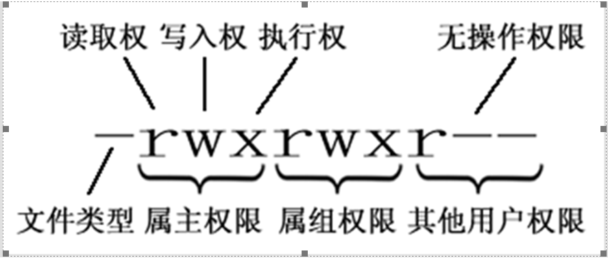

# Linux笔记_day01
## 1.1 今日知识点
```
认识linux 并熟悉基本命令
```

linux 教程

https://www.runoob.com/linux/linux-command-manual.html

## 1.2 今日目标

```
•	能够说出Linux操作系统的优势及用途
•	进行成功配置CentOS
•	能够成功完成CentOS初始化配置
•	记住使用cd命令
•	熟练使用ls命令的使用
•	能够使用linux进行目录操作
•	能够独立完成文件压缩和解压缩操作
•	能够独立完成文件的浏览
•	熟练使用vi或者vim操作文件
```
## 1.3课程内容
### 1.3.1 -今日内容(00:54)
**小节内容**


### 1.3.2 -Linux概述(08:18)
**小节内容**

```
1) Unix 是贝尔实验室开发的,收费
2) Linux 是仿照unix 开发的但是没有抄袭unix的源代码,而是借鉴了他的方式
3) windows 也是仿照unix 的思维开发的 收费
4) 苹果的操作系统OS 也是基于unix 开发的
```

我们为啥要放弃windows

```
1) windows 收费
2) windows 不稳定
3) windows 浪费系统资源
4) windows 用的人多,系统漏洞被发现的多,病毒多,不安全
```

 [linux 内核版本和发行版本区别](https://www.cnblogs.com/wxxjianchi/p/9424854.html)

内核: 是系统的心脏，是linux中最基层的代码

发行版本：在内核的基础上，开发不同应用程序，组成的一个完整的操作系统。

**Linux系统的应用**

```
服务器系统Web应用服务器、数据库服务器、接口服务器、DNS、FTP等等； 
嵌入式系统路由器、防火墙、手机、PDA、IP 分享器、交换器、家电用品的微电脑控制器等等，
高性能运算、计算密集型应用Linux有强大的运算能力。
桌面应用系统
移动手持系统
```

### 1.3.3 -虚拟机软件-VMware(06:08)

**小节内容**

虚拟化技术：

```
在计算机中，虚拟化（英语：Virtualization）是一种资源管理技术，是将计算机的各种实体资源，如服务器、网络、内存及存储等，予以抽象、转换后呈现出来，打破实体结构间的不可切割的障碍，使用户可以比原本的组态更好的方式来应用这些资源。这些资源的新虚拟部份是不受现有资源的架设方式，地域或物理组态所限制。一般所指的虚拟化资源包括计算能力和资料存储。

 在实际的生产环境中，虚拟化技术主要用来解决高性能的物理硬件产能过剩和老的旧的硬件产能过低的重组重用，透明化底层物理硬件，从而最大化的利用物理硬件对资源充分利用

 虚拟化技术种类很多，例如：软件虚拟化、硬件虚拟化、内存虚拟化、网络虚拟化(vip)、桌面虚拟化、服务虚拟化、虚拟机等等。

```

一个错误


之前装过没卸载干净。在C盘的驱动文件夹也就是“C:\Windows\System32\drivers”下 把hcmon.sys驱动文件删除，随后重启了一下电脑，就行了

### 1.3.4 -Linux安装(13:15)

**小节内容**
```
1)参考文档即可安装即可
```


### 1.3.5 -CRT使用(05:06)

**小节内容**

查看ip 命令

```
ifconfig
```

### 1.3.6 -Linux目录结构(02:51)
**小节内容**

```
Linux每个用户都有一个自己专属的目录：
root:系统管理员，系统根目录下有一个root目录，此目录只能root访问
home/用户:普通用户在home目录下都有一个自己专属的目录
usr:主要用于安装应用软件
```


### 1.3.7 -Linux命令-文件列表(03:52)

**小节内容**

```
ls  列出当前文件夹下文件名称
ls -l  列出当前文件夹下文件名称和详细信息
ll     列出当前文件夹下文件名称和详细信息( ls -l 的简写) 注意此命令属于扩展命令, 有些linux版本不支持
```
### 1.3.8 -Linux命令-目录切换(04:53)
**小节内容**

 cd:   change directory

```
cd ~  : 切换至当前用户的跟目录
cd /  : 切换至跟目录
cd ..  : 切换至上一级 (注意空格)
cd app	切换到app
```
pwd

`	pwd`是`Print Working Directory`的缩写

显示当前工作目录

### 1.3.9 -Linux命令-目录创建和删除(04:29)

**小节内容**
```
创建mkdir(make directory)命令可用来创建子目录。
	mkdir app  当前目录下创建 app 目录
	mkdir -p a/b/c 级联创建目录
rmdir(remove directory)命令可用来删除“空”的子目录：
	rmdir app   删除app目录
```
### 1.3.10 -Linux命令-文件查看(06:50)
**小节内容**

```
cat :  查看文件，会将文件内容在屏幕上全部罗列
cat -n a.txt    会将文件内容在屏幕上全部罗列(显示行号)
more: 查看文件   分页查看，只能向下翻，不能向上翻
more +100 a.txt 从a.txt 的第100行开始查看
less: 查看文件  分页查看，能向上也能向下 (上下箭头翻看)
tail -10 /etc/passwd  :  查看后10行数据
tail -f catalina.log  :  动态实时监控日志()   ctrl+c 结束查看
```
### 1.3.11 -Linux命令-文件删除、拷贝(09:30)
**小节内容**

```
cp(copy)命令可以将文件从一处复制到另一处。一般在使用cp命令时将一个文件复制成另一个文件或复制到某目录时，需要指定源文件名与目标文件名或目录。
    cp a.txt b.txt    将a.txt复制为b.txt文件
    cp a.txt ../    将a.txt文件复制到上一层目录中

mv 移动或者重命名
    mv a.txt ../    将a.txt文件移动到上一层目录中
    mv a.txt b.txt    将a.txt文件重命名为b.txt
```
```
rm a.txt    删除a.txt文件  (需要确认,输入yes 或y)
	rm -f a.txt    不询问，直接删除 a.txt
	rm -r app    删除app目录(需要确认,输入yes 或y,递归)
	rmdir app 删除app目录(必须为空否则无法删除)
	rm -rf  a    不询问递归删除a 及其子目录下的东西
	rm -rf  *     删除当前文件夹及其自目录
	rm -rf  /       格式化磁盘 (一些大型的公司为了避免程序员错误输入该命令,回将该命令重新,放置错误删除)
```

### 1.3.12 -Linux命令-压缩、解压缩(06:39)

**小节内容**

tar

```
tar命令位于/bin目录下，它能够将用户所指定的文件或目录打包成一个文件，但不做压缩。一般Linux上常用的压缩方式是选用tar将许多文件打包成一个文件，再以gzip压缩命令压缩成xxx.tar.gz(或称为xxx.tgz)的文件。常用参数：
-c：创建一个新tar文件
-v：显示运行过程的信息
-f：指定文件名
-z：调用gzip压缩命令进行压缩
-t：查看压缩文件的内容
-x：解开tar文件
打包：
	tar –cvf xxx.tar ./*
打包并且压缩：
	tar –zcvf xxx.tar.gz ./* 

解压 
     tar –xvf xxx.tar
	tar -zxvf xxx.tar.gz -C /usr/aaa
```
### 1.3.13 -Linux命令-查找文件、内容(04:33)
**小节内容**

```
find / -name “ins*” 从根目录查找文件名称是以ins开头的文件
find /root -name “ins*” 从/root 目录查找文件名称是以ins开头的文件
find / -name “ins*” –ls 
find / –user itcast –ls 查找用户itcast的文件
find / –user itcast –type d –ls 查找用户itcast的目录
find /-perm -777 –type d-ls 查找权限是777的文件
```
find详解

<https://www.cnblogs.com/bbox/p/9655776.html>

grep 

​	grep [选项]... PATTERN  [FILE]...

```
grep lang anaconda-ks.cfg  在文件中查找lang
grep lang anaconda-ks.cfg –color 高亮显示
grep lang anaconda-ks.cfg –color -A1 -B1 高亮显示 ,并向前一行和向后一行
grep -rn  lang anaconda-ks.cfg  在文件中查找lang 并显示行号
```

### 1.3.14 -Linux命令-其他常见命令(01:24)

**小节内容**
```
【pwd】
	显示当前所在目录
【touch】
    创建一个空文件
    * touch a.txt
【clear/ crtl + L】
	清屏
```
### 1.3.15 -Linux命令-VIM编辑器(07:23)
**小节内容**
```
 vi.vim:
       vi  文件名
      进入后默认是命令行模式，
      按I,a可以进入可编辑模式，按esc转换为命令行模式。
     切换到底行模式：按 :（冒号）进行底行模式，可以输入wq保存并退出，q 退出  q!表示强制退出.

打开文件：vim file
退出：esc  :q
修改文件：输入i进入插入模式
保存并退出：esc:wq

不保存退出：esc:q!

三种进入插入模式：
i:在当前的光标所在处插入
o:在当前光标所在的行的下一行插入
a:在光标所在的下一个字符插入

快捷键：
dd – 快速删除一行
yy - 复制当前行
nyy - 从当前行向后复制几行
p - 粘贴
R – 替换

:/8080   底行模式下搜索
```
### 1.3.16 -Linux命令-重定向输出&系统命令(04:29)
**小节内容**

```
cat /etc/passwd > a.txt  将输出定向到a.txt中
cat /etc/passwd >> a.txt  输出并且追加
-----------------------------------
ps –ef  查看所有进程
ps –ef | grep ssh 查找某一进程
kill 2868  杀掉2868编号的进程
kill -9 2868  强制杀死进程
```
### 1.3.17 -Linux命令-管道(02:08)
**小节内容**[ | ]

```
管道是Linux命令中重要的一个概念，其作用是将一个命令的输出用作另一个命令的输入。示例
ls --help | more  分页查询帮助信息
ps –ef | grep java  查询名称中包含java的进程

```
### 1.3.18 -Linux权限(12:25)
**小节内容**




r:对文件是指可读取内容 对目录是可以ls   

w:对文件是指可修改文件内容，对目录 是指可以在其中创建或删除子节点(目录或文件) 

x:对文件是指是否可以运行这个文件，对目录是指是否可以cd进入这个目录 


 u: user表示当前用户对此文件（文件夹）的操作权限

  g:  group 指的当前用户所在的组的权限

o: other 其它组的用户所拥有的权限

权限的表示：

​     A，字母表示权限：   r ;read  表示有查看文件的权限   w:write 表示有对文件进行修秘诀的权限   x; execute 表示有对此文件执行的权限 

​     B,数字表示方式：  4  表示的是读的权限（r）  2  表示的是写的权限(w)  1表示执行的权限（x）

chmod权限 文件:

```
chmod 755 a.txt 
chmod u=rwx,g=rx,o=rx a.txt
```

### 1.3.19 -Linux修改ip(12:34)

**小节内容**

```properties
1) 进入目录/etc/udev/rules.d/ 修改文件70-persitent-net.rules:
将eth0 和mac 地址绑定

2) 修改 /etc/sysconfig/network-scripts/ifcfg-eth0文件
DEVICE=eth0 #网卡名称 
BOOTPROTO=static #获取ip的方式(static/dhcp/bootp/none)
HWADDR=00:0C:29:B5:B2:69 #MAC地址
IPADDR=192.168.25.129 #IP地址
NETMASK=255.255.255.0 #子网掩码
NETWORK=192.168.177.0 #网络地址
BROADCAST=192.168.0.255 #广播地址
NBOOT=yes #  系统启动时是否设置此网络接口，设置为yes时，系统启动时激活此设备。

```
### 1.3.20 -Linux域名映射(04:29)
**小节内容**

```
/etc/hosts   注意不是host
```
