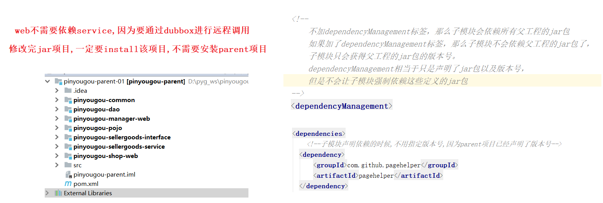

# PYG_Day01


# 第1节课
## 1.1 列表
```
新知识点
	Dubbox
```
## 1.2 本日目标
```
目标 1：了解电商行业特点以及理的模式 
目标 2：了解整体品优购的架构特点 ：
目标 3：能够运用 Dubbox+SSM 搭建分布式应用
目标 4：搭建工程框架，完成品牌列表后端代码 
```
## 1.3课程内容
### 1.3.1 .课程大纲
**视频信息**

```
视频名称: 01.课程大纲
视频时长: 08:01
```
**小节内容**
```
详见<<品优购_课程大纲_V1.3>>
```
**补充**

```
1) solor 比1.0多了一天,
2) 增加了跨域解决方案,跨域解决方案与提交订单
3) 秒杀
--移除了项目部署三天的课程--
```
### 1.3.2 .今日目标
**视频信息**
```
视频名称: 02.今日目标
视频时长: 01:51
```
**小节内容**

```
目标 1：了解电商行业特点以及理的模式 
目标 2：了解整体品优购的架构特点 ：
目标 3：能够运用 Dubbox+SSM 搭建分布式应用
目标 4：搭建工程框架，完成品牌列表后端代码 
```


### 1.3.3 .电商行业分析
**视频信息**

```
视频名称: 03.电商行业分析
视频时长: 06:23
```
**小节内容**
```
电商很火.各位好好学
```
**补充**
```
网易把旗下的二次元相关卖给了B 站,商业中心转向网易严选
微信公众号,微商,点餐小程序都属于电商
```
### 1.3.4 .电商行业技术特点
**视频信息**
```
视频名称: 04.电商行业技术特点
视频时长: 10:43
```
**小节内容**

技术新
技术范围广

分布式

	

集群


高并发

 	在同一时间,访问量比较高

负载均衡,


高可用


心跳检测:

​	像心脏一样,定时要跳动,备份机每隔几秒钟要向主机发送一条检测信息,用来判断主机是否存活.海量数据
 海量数据

​	

```
我们和老员工的差距就是
1)业务能力
2)解决问题的能力 
```
### 1.3.5 .主要电商模式
**视频信息**

```
视频名称: 05.主要电商模式
视频时长: 09:14
```
**小节内容**
```
B2B--企业对企业
C2C--个人对个人
B2C-- 企业对个人
C2B-- 个人对企业(个人把需求告诉企业,企业进行定制化开发)
O2O--线上到线下( 即 Online To Offline（在线离线/线上到线下） (Apple 体验店)
F2C--工厂到个人 (Apple直营)
B2B2C -企业-企业-个人
	淘宝,天猫
```
**补充**
```
 f: factory, 
 B: business ,
 C: customer ,
 O:online,offline
```
### 1.3.6 .品优购简介
**视频信息**

```
视频名称: 06.品优购简介
视频时长: 10:15
```
**小节内容**
```
品优购网上商城主要分
	网站前台: 消费者使用
	运营商后台: 平台管理人员使用
	商家管理后台: 第三方商家使用
```
### 1.3.7 .系统架构
**视频信息**
```
视频名称: 07.系统架构
视频时长: 09:13
```
**小节内容**
```
面向服务的架构:
   SOA 是 Service-Oriented Architecture 的首字母简称，它是一种支持面向服务的架构样式
   
传统架构与SOA架构的区别和特点：
传统架构：
    存在问题： 1.模块之间耦合度太高，其中一个升级其他都得升级
              2.开发困难，各个团队开发最后都要整合一起
              3.系统的扩展性差
              4.不能灵活的进行分布式部署
SOA:分布式系统架构--SOA服务体系架构
    分布式架构：（SOA:面向服务的体系结构，是一个组件模型，它将应用程序的不同功能单元（称为服务）通过这些服务之间定义良好的接口和契约联系起来）把系统按照模块拆分成多个子系统
        优点：1.把模块拆分，使用接口通信，降低模块之间的耦合度
              2.把项目拆分成若干个子项目，不同的团队负责不同的子项目
              3.增加功能时只需要在增加一个子项目，调用其它系统的接口就可以
              4.可以灵活的进行分布式部署
```


### 1.3.8 .表结构分析与框架组合

**视频信息**
```
视频名称: 08.表结构分析与框架组合
视频时长: 06:32
```
**小节内容**

```
tb_brand 品牌 
tb_specification 规格 
tb_specification_option 规格选项 
tb_type_template 类型模板：用于关联品牌和规格 
tb_item_cat 商品分类 
tb_seller 商家 
tb_goods 商品 
tb_goods_desc 商品详情 
tb_item 商品明细 
tb_content 内容（广告） 
tb_content_category 内容（广告）类型 
tb_user 用户 
tb_order 订单 
tb_order_item 订单明细 
tb_pay_log 支付日志
```

框架

```
品优购采用当前流行的前后端编程架构。 
后端框架采用 Spring +SpringMVC+mybatis +Dubbox 。前端采用 angularJS + Bootstrap
```
前后端分离


### 1.3.9 .Dubbox简介

**视频信息**
```
视频名称: 09.Dubbox简介
视频时长: 02:09
```
**小节内容**

```
Dubbox 是一个分布式服务框架，其前身是阿里巴巴开源项目 Dubbo ，被国内电商 及互联网项目中使用，后期阿里巴巴停止了该项目的维护，当当网便在 Dubbo 基础上进行 优化，并继续维护，为了与原有的 Dubbo 区分，故将其命名为 Dubbox。 
```

Dubbo  是alibaba的 后来捐献给了 Apache 

Dubbox 是当当网的


RPC主要是基于TCP/IP协议


### 1.3.10 .Dubbox运行原理图

**视频信息**
```
视频名称: 10.Dubbox运行原理图
视频时长: 07:19
```
**小节内容**


```
节点角色说明： 
Provider: 暴露服务的服务提供方。 
Consumer: 调用远程服务的服务消费方。  
Registry: 服务注册与发现的注册中心。  
Monitor: 统计服务的调用次调和调用时间的监控中心。  
 Container: 服务运行容器。 
```
### 1.3.11 .zookeeper安装前准备
**视频信息**

```
视频名称: 11.zookeeper安装前准备
视频时长: 09:50
```
**小节内容**

```
Zookeeper 介绍 
	官方推荐使用 zookeeper 注册中心

```
**补充**

```
1) 课堂中使用老师提供好的镜像
	用户名/密码 root/itcast
2) 本地网卡设置成 25 网段

```
### 1.3.12 .zookeeper安装与常用命令
**视频信息**
```
视频名称: 12.zookeeper安装与常用命令
视频时长: 09:04
```
**小节内容**
```
第一步: 安装jdk
第二步: 上传 zookeeper 并解压
   Alt+P 进入 SFTP ，输入 put d:\zookeeper-3.4.6.tar.gz 上传 
第三步: 解压
        tar -zxvf zookeeper-3.4.6.tar.gz 
            x : 从 tar 包中把文件提取出来
            z : 表示 tar 包是被 gzip 压缩过的，所以解压时需要用 gunzip 解压
            v : 显示详细信息
            f xxx.tar.gz : 指定被处理的文件是 xxx.tar.gz
第四步:进入 zookeeper-3.4.6 目录，创建 data 文件夹。 (用来存放数据)
	mkdir data  	
第五步:
	：进入 conf 目录 ，把 zoo_sample.cfg 改名为 zoo.cfg 
第六步：打开 zoo.cfg ,  修改 data 属性：dataDir=/root/zookeeper-3.4.6/data 

Zookeeper 服务启动  进入bin 目录
	 ./zkServer.sh start 
	./zkServer.sh stop 
	./zkServer.sh status
```
**补充**

```
可以使用软件自带的工具拖过去
```
### 1.3.13 .jar包本地安装与离线约束
**视频信息**

```
视频名称: 13.jar包本地安装与离线约束
视频时长: 04:04
```
**小节内容**
```
安装命令
	mvn install:install-file -Dfile=d:\setup\dubbo-2.8.4.jar -DgroupId=com.alibaba -DartifactId=dubbo -Dversion=2.8.4 -Dpackaging=jar 

```
idea 配置本地约束

​	 


### 1.3.14 .入门小demo服务提供方
**视频信息**
```
视频名称: 14.入门小demo服务提供方
视频时长: 14:13
```


```xml
<plugin>
  <groupId>org.apache.tomcat.maven</groupId>
  <artifactId>tomcat7-maven-plugin</artifactId>
  <configuration>
    <!-- 指定端口 -->
  	<port>8080</port>
    <!-- 请求路径 -->
    <path>/</path>
  </configuration>
</plugin>
```


### 1.3.15 .入门小demo服务消费方

**视频信息**
```
视频名称: 15.入门小demo服务消费方
视频时长: 07:21
```
**代码**

```
（1）创建 Maven 工程（WAR）dubboxdemo-web ，在 pom.xml 引入依赖 ，同“ dubboxdemoservice”工程。区别就是把 tomcat 插件的运行端口改为 8082 。 
（2）在 webapps 目录下创建 WEB-INF 目录，并创建 web.xml  
 (3)将“dubboxdemo-service”工程的 cn.itcast.dubboxdemo.service 包以及下面的接口拷贝至此 工程。
 (4)编写 Controller
 
```

```
<mvc:message-converters register-defaults="false">
<bean class="org.springframework.http.converter.StringHttpMessageConverter">
		<constructor-arg value="UTF-8" />
			</bean>
</mvc:message-converters>
的作用是当返回的数据是字符串的时候设置响应数据的编码格式
```


```
<plugin>
  <groupId>org.apache.tomcat.maven</groupId>
  <artifactId>tomcat7-maven-plugin</artifactId>
  <configuration>
    <!-- 指定端口 -->
    <port>8082</port>
    <!-- 请求路径 -->
    <path>/</path>
  </configuration>
</plugin>
```


### 1.3.16 .入门小demo测试

**视频信息**
```
视频名称: 16.入门小demo测试
视频时长: 01:46
```
**小节内容**
```
1) 先启动服务端
2) 后启动客户端
注意测试时要加.do 结尾,
```


### 1.3.17 .管理中心

**视频信息**

```
视频名称: 17.管理中心
视频时长: 09:24
```
**小节内容**
```
1) 如果自己打包war  命令 需要加引号
	mvn package '-Dmaven.skip.test=true'
2) 注意
 1)dubbo-admin 要和zookeper 部署在同一台机器
 2) 管理中心 项目部署后要保证zookeeper 服务是启动状态,否则管理中心无法访问
```

### 1.3.18 .工程结构分析与建库建表
**视频信息**

```
视频名称: 18.工程结构分析与建库建表
视频时长: 06:05
```
**小节内容**
```
工程说明： 
pinyougou-parent 聚合工程 
pinyougou-pojo 通用实体类层 
pinyougou-dao 通用数据访问层 
pinyougou-xxxxx-interface  某服务层接口 
pinyougou-xxxxx-service   某服务层实现 
pinyougou-xxxxx-web     某 web 工程 
---
建表
	执行资源文件夹中\品优购资源V1.3\建库语句\pinyougoudb-v1.3.sql
```
**补充**

```

```
### 1.3.19 .品优购框架搭建
**视频信息**
```
视频名称: 19.品优购框架搭建
视频时长: 26:10
```
**小节内容**

```xml
classpath:  和classpath:* 的区别
1) 在web.xml 中
	<context-param>
		<param-name>contextConfigLocation</param-name>
		<param-value>classpath*:spring/applicationContext*.xml</param-value>
	</context-param>
	classpath: 加载claspath下所有的配置文件,如果有同名文件,只加载第一个
	classpath*: 加载claspath下所有的配置文件,并且加载jar包中的配置文件,如果有同名文件,都加载
2) 在spring配置文件中引入外部资源文件
	<context:property-placeholder location="classpath*:properties/*.properties" />
	classpath: 加载claspath下所有的配置文件,并且加载jar包中的配置文件,如果有同名文件,只加载第一个
	classpath*: 加载claspath下所有的配置文件,并且加载jar包中的配置文件,如果有同名文件,都加载
```


```
1)pinyougou-parent (pom)父工程,用于整合
2)pinyougou-pojo (jar)实体类  (修改每个实体类，让其实现 Serializable 接口 )
3)pinyougou-dao  (jar)数据访问模块 
	<依赖 pojo>
4)pinyougou-common (jar)  创建通用工具类模块 
5) pinyougou-sellergoods-interface(jar) 商家商品服务接口模块 
  <依赖 pojo>
6) pinyougou-sellergoods-service(war)  商家商品服务模块 
	依赖 <pojo,dao,interface>
7) pinyougou-manager-web(war)  运营商管理后台
	依赖 <pojo ,interface>(war)
8) pinyougou-shop-web  商家管理后台 
```




### 1.3.20 .品优购-实体类和数据访问层
**视频信息**
```
视频名称: 20.品优购-实体类和数据访问层
视频时长: 05:49
```
**小节内容**
```
使用逆向工程生成pojo 和mybatis 实体类文件
	品优购资源V1.3\配套软件\配套软件\逆向工程
别忘记修改配置文件 中数据库名称和用户名及 密码
```
### 1.3.21 .品牌列表-需求与表结构
**视频信息**
```
视频名称: 21.品牌列表-需求与表结构
视频时长: 01:42
```
**小节内容**
```
完成品牌管理的后端代码，在浏览器可查询品牌的数据（json 格式） 
tb_brand  品牌表 
```
### 1.3.22 .品牌列表-代码编写
**视频信息**
```
视频名称: 22.品牌列表-代码编写
视频时长: 10:31
```
**小节内容**
```
dao 
```
### 1.3.23 .品牌列表-测试
**视频信息**
```
视频名称: 23.品牌列表-测试
视频时长: 01:49
```
**小节内容**

### 1.3.24 .常见问题
**视频信息**
```
视频名称: 24.常见问题
视频时长: 01:11
```
**小节内容**
```
补充: 如果确认配置没有问题 则依旧包timeout 错误,可能是电脑性能较低,配置客户端和服务端都配置timeout 即可
```

maven 插件 安装

