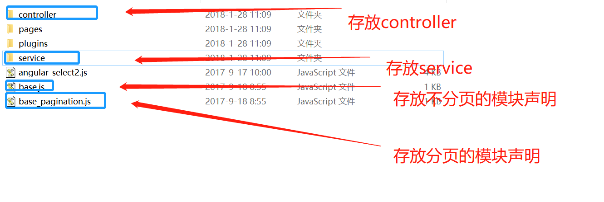
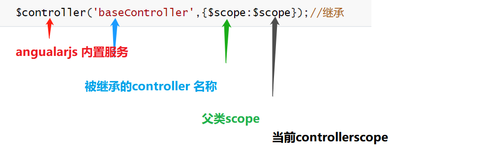

# PYG笔记_Day03
## 1.1 本节知识点
```
1)angularJS的service、
2)angularJS继承
3)select2下拉列表框组件
```
## 1.2 今日目标
```
1)理解前端分层开发
2)实现控制器继承
3)完成规格管理功能
4)掌握代码生成器的使用
5)掌握select2的使用方式
6)实现优化模板列表显示
```
## 1.3课程内容
### 1.3.1 .今日目标
**视频信息**
```
视频名称: 01.今日目标
视频时长: 01:40
```
**今日内容**

```
目标1：理解和运用angularJS的service
目标2：理解和运用控制器继承
目标3：掌握代码生成器的使用
目标4：实现规格管理
目标5：实现模板管理
```
### 1.3.2 .前端分层开发
**视频信息**
```
视频名称: 02.前端分层开发
视频时长: 14:50
```
**小节内容**
```
自定义服务:
	在 AngularJS 中，服务是一个函数或对象，可在你的 AngularJS 应用中使用。我们在上次课中使用了内置服务$http .其实我们也可以自己来定义服务，而服务会封装一些操作。我们在不同的控制器中可以调用同一个服务，这样服务的代码将会被重用。
```
代码
```js
// 定义一个service
app.service('brandService',function($http){
	    	
	//读取列表数据绑定到表单中
	this.findAll=function(){
		return $http.get('../brand/findAll.do');		
	}
    // 其他方法略,详见代码
})	
```
使用Service

```js
app.controller('brandController' ,function($scope,brandService){
    $scope.findAll=function(){
		brandService.findAll().success(
			function(response){
				$scope.list=response;
			}			
		);
	}  
}
```

### 1.3.3 .代码分离JS

**视频信息**
```
视频名称: 03.代码分离JS
视频时长: 05:06
```
为了使得代码更加的通用我们对代码进行抽取



```
<script type="text/javascript" src="../js/base_pagination.js"></script>
<script type="text/javascript" src="../js/service/brandService.js"></script>
<script type="text/javascript" src="../js/controller/brandController.js"></script>
```
### 1.3.4 .控制器继承

**视频信息**
```
视频名称: 04.控制器继承
视频时长: 10:15
```
**小节内容**
```
有些功能是每个页面都有可能用到的，比如分页，复选等等，如果我们再开发另一个功能，还需要重复编写。怎么能让这些通用的功能只写一次呢？我们通过继承的方式来实现。
	1) 把分页,复选等抽取出来
	2) 继承
```
baseController.js
```js
app.controller('baseController' ,function($scope){	
	
    //重新加载列表 数据
    $scope.reloadList=function(){
    	//切换页码  
    	$scope.search( $scope.paginationConf.currentPage,		     $scope.paginationConf.itemsPerPage);	   	
    }
    
	//分页控件配置 
	$scope.paginationConf = {
         currentPage: 1,
         totalItems: 10,
         itemsPerPage: 10,
         perPageOptions: [10, 20, 30, 40, 50],
         onChange: function(){
        	 $scope.reloadList();//重新加载
     	 }
	}; 
	
	$scope.selectIds=[];//选中的ID集合 

	//更新复选
	$scope.updateSelection = function($event, id) {		
		if($event.target.checked){//如果是被选中,则增加到数组
			$scope.selectIds.push( id);			
		}else{
			var idx = $scope.selectIds.indexOf(id);
            $scope.selectIds.splice(idx, 1);//删除 
		}
	}
});	
```
继承brandController.js

```js
 //控制层 
app.controller('brandController' ,function($scope,$controller   ,brandService){	
    
	$controller('baseController',{$scope:$scope});//继承
    
 第一个$scpoe 是父类的
 第二个$scope 是当前controller的
  这句话的作用:
    将 父类 baseController 中的$scope 赋值给当前 $scope 属性 
```



### 1.3.5 .代码生成

**视频信息**
```
视频名称: 05.代码生成
视频时长: 13:48
```
**小节内容**
```
代码生成器的本质
	1)先将公共的代码抽取,将公共的部分定义成一个通用的字符串
	2)循环遍历数据库表,将通用的字符串替换 	
----------
	会生成interface,service ,controller,前端额代码
```


### 1.3.6 .规格管理-需求与表结构分析
**视频信息**
```
视频名称: 06.规格管理-需求与表结构分析
视频时长: 04:48
```
```
表结构
tb_specification规格表 ---------1------------N--- tb_specification_option  规格选项表
```

```
{
specification{specName:"电视屏幕尺寸"},
specificationOptionList:[{optionName:"14存",orders:1},{optionName:"14存",orders:1},{optionName:"14存",orders:1}]
};
```


### 1.3.7 .规格管理-列表

**视频信息**
```
视频名称: 07.规格管理-列表
视频时长: 10:55
```
**小节内容**
```
列表的findAll方法调试
```
### 1.3.8 .规格管理-增加规格-增加行
**视频信息**
```
视频名称: 08.规格管理-增加规格-增加行
视频时长: 12:05
```
**小节内容**
```
//直接定义会报错,因为
$scope.entity.specificationOptionList.push({});	
原因:
	一个对象或属性在调用 " .方法 " 之前,必须进行初始化赋值,
		1) 使用等于号初始化
		2) 或者用ng-init() 初始化
		3) 在触发动作前 初始化,例如 在点击时调用
        	ng-click="entity={specificationOptionList:[]}"
```
**补充**
```

```
### 1.3.9 .规格管理-增加规格-删除行
**视频信息**
```
视频名称: 09.规格管理-增加规格-删除行
视频时长: 05:25
```
**小节内容**
```html
在ng-repeat 中
$index 获取当前索引
<tr ng-repeat="entity in list">
  <td><input  type="checkbox" ng-click="updateSelection($event, entity.id)" ></td>
  <td>{{entity.id}}</td>
  <td>{{entity.specName}}</td>
  <td class="text-center">                                           
	  <button type="button"  ng-click="findOne(entity.id)">修改</button>                 </td>
</tr>
```
### 1.3.10 .规格管理-新增规格-保存
**视频信息**
```
视频名称: 10.规格管理-新增规格-保存
视频时长: 21:09
```
**小节内容**
```
1) 前端把  specificationOption 和 specification 对象一起传递到了后台,因此需要定义一个对象接收
2) 因为新定义的对象要从Controller 层传递到Service 层经过了 网络传输,因此需要实现 Serializable 接口
3) 保存 tb_specificationOption 前需要拿到tb_specification 的主键id ,因此需要在mapper.xml 中增加<selectKey> 属性,获取插入的主键id
```

### 1.3.11 .规格管理-修改规格-获取数据
**视频信息**
```
视频名称: 11.规格管理-修改规格-获取数据
视频时长: 07:22
```
**小节内容**
```
查询保存返回的也是封装后的对象,因此findOne 返回值需要修改
```
### 1.3.12 .规格管理-修改规格-保存数据
**视频信息**
```
视频名称: 12.规格管理-修改规格-保存数据
视频时长: 07:19
```
**小节内容**
```
因为我们修改后的数据不知时新增还是修改,故,处理业务逻辑如下:
	先删除所有分类再保存
```
### 1.3.13 .规格管理-删除规格
**视频信息**
```
视频名称: 13.规格管理-删除规格
视频时长: 04:24
```
**小节内容**
```
删除规格应该保证规格和规格选项的级联删除
```


### 1.3.14 .模板管理-需求与表结构分析
**视频信息**
```
视频名称: 14.模板管理-需求与表结构分析
视频时长: 05:04
```
**小节内容**
```
首选我们需要理解模板的作用。模板主要有两个：
	1是用于关联品牌与规格
	2定义扩充属性
tb_type_template  模板表
```

### 1.3.15 .模板管理-列表
**视频信息**
```
视频名称: 15.模板管理-列表
视频时长: 04:41
```
**小节内容**
```
展示商品列表: 直接展示json ,待后续优化显示效果
```


### 1.3.16 .认识select2
**视频信息**
```
视频名称: 16.认识select2
视频时长: 05:06
```
**小节内容**
```html
1)select2 是一个单独的插件
2)angularJS 和 select2 整合我们需要导入一个中间整合的js 文件
3) 如果要分析源代码,原生的demo 中.数据来源在 js/index.js 中


标签属性说明
	<input select2  //表示是 select2 控件
    ng-model="c"    //angularJS 源生标签
    select2-model="cS2" //  select2扩展标签
    config="config3"   // 下拉数据来源 可以使用 $scope=config3={data:[{id:1,text'1'}]} 格式指定
    multiple  // 支持多选
    placeholder="html5 支持的  灰色初始化提示信息" 
    type="text"/>

```
### 1.3.17 .品牌下拉列表(静态)
**视频信息**
```
视频名称: 17.品牌下拉列表(静态)
视频时长: 11:56
```
**小节内容**
```html
导入js 的顺序问题
	js 加载是由上到下加载的,每个变量都应该保证:使用时已经加载完毕
```
**补充**
```

```
### 1.3.18 .品牌下拉列表-后端数据支撑
**视频信息**
```
视频名称: 18.品牌下拉列表-后端数据支撑
视频时长: 06:16
```
**小节内容**
```
这里使用了一个map 集合进行数据的封装,
	实际上可以在service 进行处理数据后返回而不必在修改Dao接口和xml 文件
```
**补充** serviceimpl 代码

```java
@Override
	public List<Map> selectOptionList() {
		List<TbBrand> tbBrands = brandMapper.selectByExample(null);
		List<Map> list= new ArrayList<>();
		for (TbBrand tbBrand : tbBrands) {
			Map map=new HashMap();
			map.put("id",tbBrand.getId());
			map.put("text",tbBrand.getName());
			list.add(map);
		}
		return list;
	}
```
### 1.3.19 .品牌下拉列表-前端
**视频信息**
```
视频名称: 19.品牌下拉列表-前端
视频时长: 07:08
```
**小节内容**
```js
$scope.brandList={data:[]};//品牌列表
	//读取品牌列表
	$scope.findBrandList=function(){
		brandService.selectOptionList().success(
			function(response){
				$scope.brandList={data:response};	
			}
		);		
	}

```
### 1.3.20 .规格下拉列表
**视频信息**
```
视频名称: 20.规格下拉列表
视频时长: 09:17
```
**小节内容**
```

```
### 1.3.21 .增加和删除扩展属性行
**视频信息**
```
视频名称: 21.增加和删除扩展属性行
视频时长: 06:35
```
**小节内容**
```
//新增扩展属性行
	$scope.addTableRow=function(){	
		$scope.entity.customAttributeItems.push({});		
	}

```
**补充**
```

```
### 1.3.22 .新增模板
**视频信息**
```
视频名称: 22.新增模板
视频时长: 02:41
```
**小节内容**
```

```
**补充**
```

```
### 1.3.23 .修改模板
**视频信息**
```
视频名称: 23.修改模板
视频时长: 06:16
```
**小节内容**
```js
//查询实体 
$scope.findOne=function(id){				
    typeTemplateService.findOne(id).success(
        function(response){
            $scope.entity= response;		

            //转换字符串为json对象（集合）
            $scope.entity.brandIds=  JSON.parse( $scope.entity.brandIds);
            $scope.entity.specIds= JSON.parse($scope.entity.specIds);
            $scope.entity.customAttributeItems = 	JSON.parse($scope.entity.customAttributeItems);

        }
);				
}
```
**提示**
```

```
### 1.3.24 .删除模板
**视频信息**
```
视频名称: 24.删除模板
视频时长: 01:13
```
**小节内容**
```

```
**补充**
```

```
### 1.3.25 .优化模板列表显示
**视频信息**
```
视频名称: 25.优化模板列表显示
视频时长: 07:50
```
**小节内容**
```

```
**代码**

```
	$scope.jsonToString=function(jsonString,key){
		var json= JSON.parse(jsonString);
		var value="";
		for(var i=0;i<json.length;i++){
			if(i>0){
				value+=",";
			}			
			value +=json[i][key];			
		}
		return value;
	}
```

##  补充

```
服务器端代码
	1) 前端要传递什么格式的数据
	2) 如何处理
	3) 如何响应
前端代码
	1) 服务器端需要什么
	2) 如何处理
```

