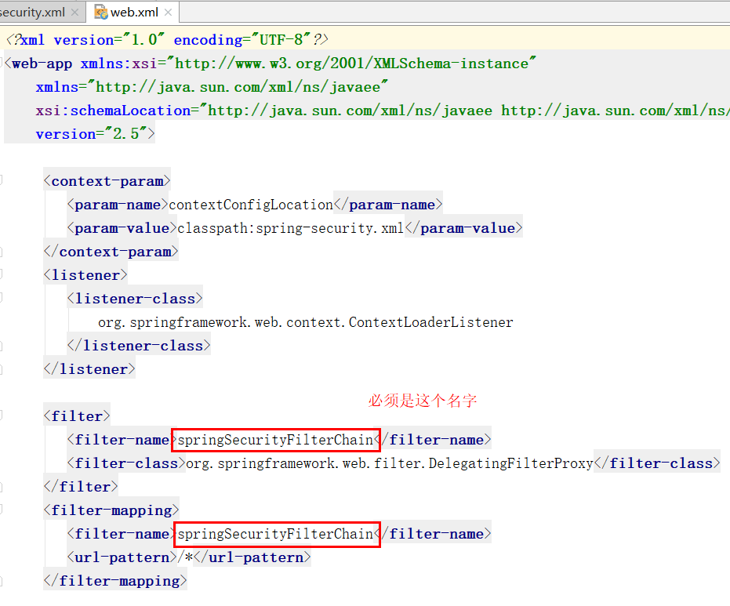
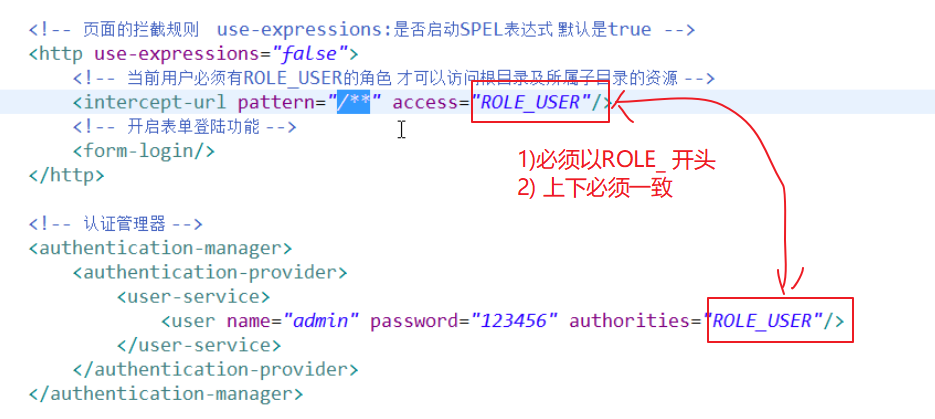
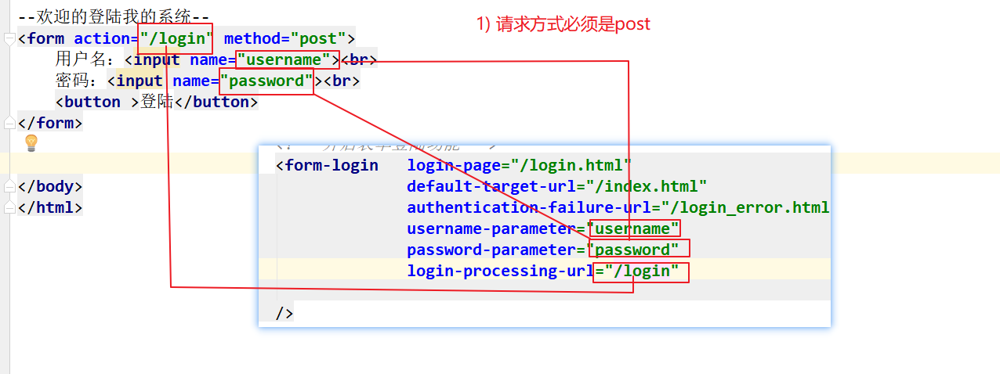
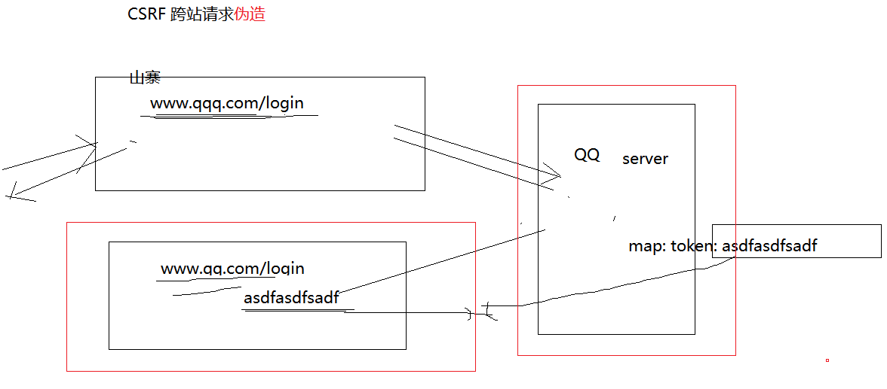
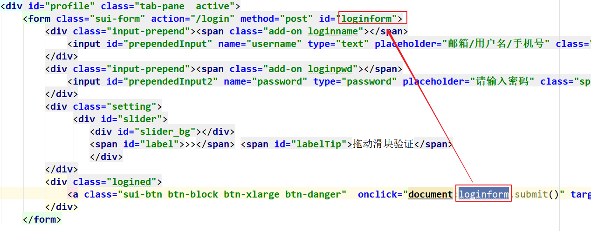
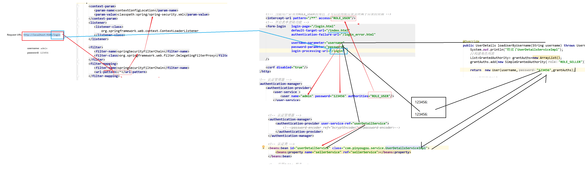
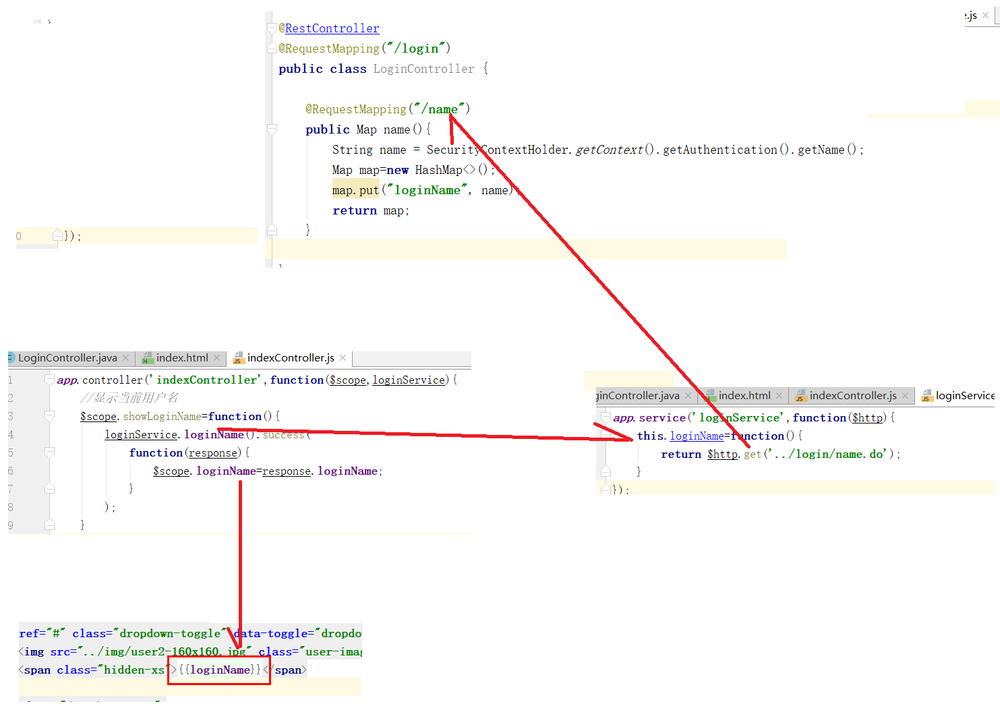
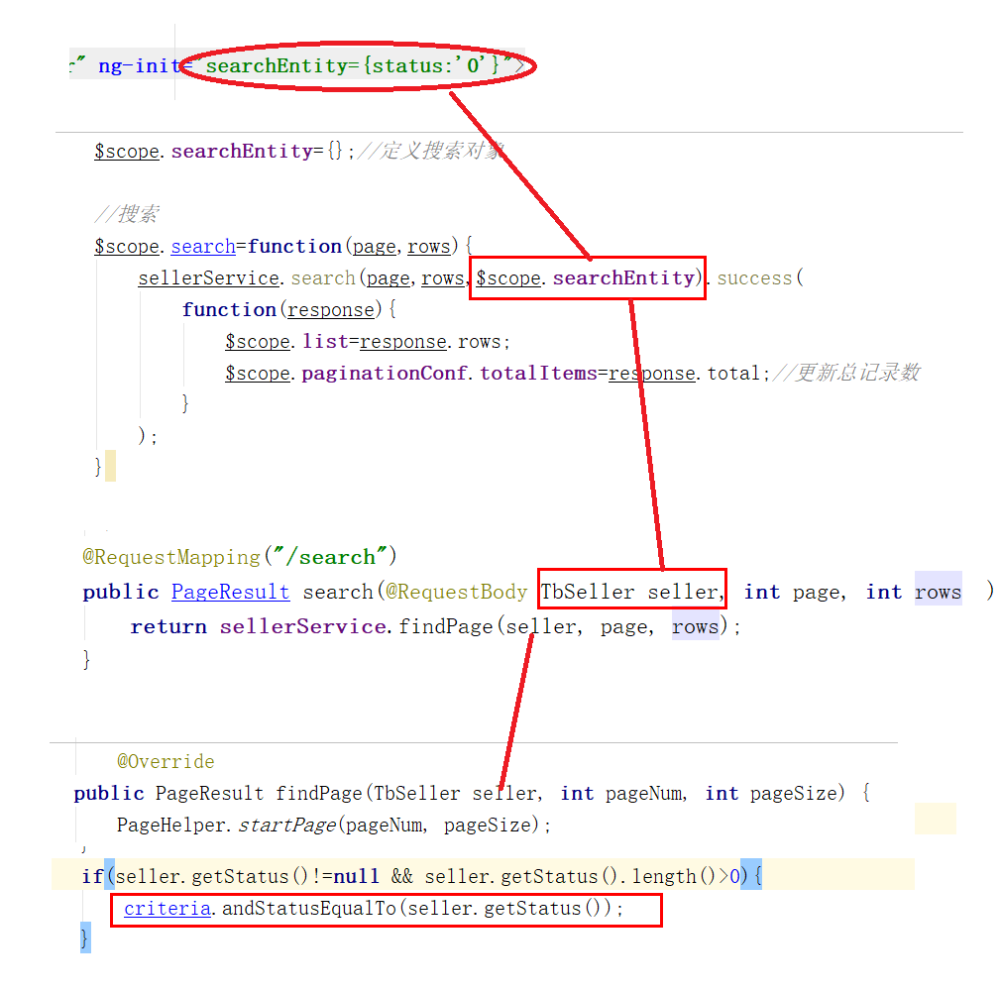
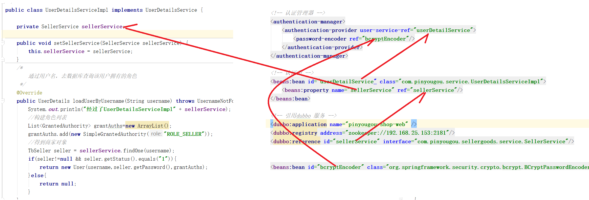

# PYG笔记_Day04
# 第1节课
## 1.1 今日知识点
```
Spring Security
```
## 1.2 今日目标
```
1) 为什么 Spring Security?
2) Spring Security 认证流程?
3) 看懂代码
```
## 1.3课程内容
### 1.3.1 .今日目标
**视频信息**
```
视频名称: 01.今日目标
视频时长: 01:34
```
**小节内容**
```
目标1：实现SpringSecurity入门小Demo
目标2：完成运营商登陆与安全控制功能
目标3：完成商家入驻
目标4：完成商家审核
目标5：完成商家系统登陆与安全控制功能
```
### 1.3.2 .SpringSecutiry简介

**视频信息**
```
视频名称: 02.SpringSecutiry简介
视频时长: 04:35
```
**小节内容**

```
   Spring Security是一个能够为基于Spring的企业应用系统提供声明式的安全访问控制解决方案的安全框架。它提供了一组可以在Spring应用上下文中配置的Bean，充分利用了Spring IoC，DI（控制反转Inversion of Control ,DI:Dependency Injection 依赖注入）和AOP（面向切面编程）功能，为应用系统提供声明式的安全访问控制功能，减少了为企业系统安全控制编写大量重复代码的工作。
```
**补充**
```
1) 资源拦截
2) 登陆功能
3) 用户权限角色
4) 黑客攻击
.....
5) 集成其他技术
```
### 1.3.3 .入门小demo-最简单案例
**视频信息**
```
视频名称: 03.入门小demo-最简单案例
视频时长: 23:18
```
**小节内容**



**spring-security.xml**



说明

```
use-expressions="false" 是否启用SPEL 表达式
pattern="/**" : 
	/* 表示拦截跟目录
	/** 拦截根目录及其子目录
	
```


### 1.3.4 .入门小demo-自定义登录页

**视频信息**
```
视频名称: 04.入门小demo-自定义登录页
视频时长: 14:39
```
**小节内容**




注意: 此处的action要和配置文件中的一致

### 1.3.5 .运营商系统-登陆

**视频信息**

```
视频名称: 05.运营商系统-登陆
视频时长: 19:18
```
**小节内容**
```html
1)web层的 web.xml 增加配置
2)securty
3) 登陆按钮
	<a class="sui-btn btn-block btn-xlarge btn-danger"  onclick="document:loginform.submit()" target="_blank">登&nbsp;&nbsp;录</a>
```
**xml**
```xml
<!-- 设置不拦截的页面   -->
   <http pattern="/*.html" security="none"></http>
	<http pattern="/css/**" security="none"></http>
	<http pattern="/img/**" security="none"></http>
	<http pattern="/js/**" security="none"></http>
	<http pattern="/plugins/**" security="none"></http>

	<!-- 页面的拦截规则    use-expressions:是否启动SPEL表达式 默认是true -->
	<http use-expressions="false">
		<!-- 当前用户必须有ROLE_USER的角色 才可以访问根目录及所属子目录的资源 -->
		<intercept-url pattern="/**" access="ROLE_ADMIN"/>
		<!-- 开启表单登陆功能 -->
		<form-login  login-page="/login.html" 
                    default-target-url="/admin/index.html" 
                    authentication-failure-url="/login.html" 
                    always-use-default-target="true"/>
		<csrf disabled="true"/>
		<headers>
			<frame-options policy="SAMEORIGIN"/>
		</headers>
		<logout/>
	</http>
```
说明

```xml
1)always-use-default-target：
	指定了是否在身份验证通过后总是跳转到default-target-url属性指定的URL。
	如果不配置,则跳转到登陆之前的页面
2) 可以使用 login-processing-url="/login" 指定登陆页面的提交路径
	
3)配置允许iframe 框架叶的使用
<headers>
	<frame-options policy="SAMEORIGIN"/>
</headers>
4) document:loginform.submit()
	document: 声明是一段dom代码  
		loginform.submit() : 这个是dom 源声的东西 格式"form表单Id.方法名" 可以直接调用
```

```xml
<!DOCTYPE html>
<html>
<head>
	<script >
		alert(fm.myid.value);
	</script>
</head>
<form id="fm">
  <input  name="myid" value="2">
<form>
	<script >
		alert(fm.myid.value);
	</script>
<body>
```


frameset 标签学习网址:

<http://www.w3school.com.cn/tags/tag_frameset.asp>

```

frameset 的布局案例
index.html
<frameset rows="25%,75%">
  <frame src="top.html" scrolling="no">
  <frameset cols="25%,75%">
	<frame src="left.html">
	<frame src="right.html"/>
  </frameset>
</frameset>


```




思考:

​	那些页面不需要拦截



Spring-security 登陆流程




### 1.3.6 .运营商系统-显示登陆名

**视频信息**
```
视频名称: 06.运营商系统-显示登陆名
视频时长: 10:34
```
**小节内容**



### 1.3.7 .运营商系统-退出登录
**视频信息**
```
视频名称: 07.运营商系统-退出登录
视频时长: 04:55
```
**小节内容**
```
<logout/>
	/logout 是默认的推出地址,退出后默认的url 是登陆页面
```
### 1.3.8 .商家入驻审核业务分析
**视频信息**
```
视频名称: 08.商家入驻审核业务分析
视频时长: 05:47
```
**小节内容**
```
商家申请入驻，需要填写商家相关的信息。待运营商平台审核通过后即可使用使用。
```

### 1.3.9 .商家申请入驻-准备工作
**视频信息**
```
视频名称: 09.商家申请入驻-准备工作
视频时长: 03:58
```
**小节内容**
```
准备前端js 代码
```
**补充**

```

```
### 1.3.10 .商家申请入驻-代码实现
**视频信息**

```
视频名称: 10.商家申请入驻-代码实现
视频时长: 12:39
```
**小节内容**
```
基本的保存功能实现
	这里只不过属性多一些,其他功能一样

```

### 1.3.11 .商家审核-待审核列表
**视频信息**

```
视频名称: 11.商家审核-待审核列表
视频时长: 10:14
```
**小节内容**
```
审核功能在运营商后台管理实现
查询所有未审核的代码
```



### 1.3.12 .商家审核-商家详情

**视频信息**
```
视频名称: 12.商家审核-商家详情
视频时长: 03:18
```
**小节内容**
```
详情展示: 绑定页面数据
```


### 1.3.13 .商家审核-修改状态
**视频信息**
```
视频名称: 13.商家审核-修改状态
视频时长: 11:01
```
**小节内容**

```
点击不同的按钮修改为不同的状态,动态传递参数,然后更新
@Override
	public void updateStatus(String sellerId, String status) {
		
		TbSeller seller = sellerMapper.selectByPrimaryKey(sellerId);
		seller.setStatus(status);
		sellerMapper.updateByPrimaryKey(seller);
	}
注意:
	此处只修改 状态,其他信息不修改,所以更新前要先查询
```

### 1.3.14 .商家系统登陆-自定义认证类
**视频信息**

```
视频名称: 14.商家系统登陆-自定义认证类
视频时长: 21:10
```
**小节内容**
```xml
商家系统登陆与安全控制，
	1) 商家入驻(注册)功能需要配置URL不拦截
	2) 登陆验证功能写在了web层没有必要配置在Service 层,因为功能不通用,例如可能由手机端的登陆验证,但是手机端使用的安全框架不一定是Spring-security
	<authentication-manager>
		<authentication-provider user-service-ref="userDetailService">	
		</authentication-provider>	
	</authentication-manager>
		
```


### 1.3.15 .商家系统登陆-认证类调用服务方法
**视频信息**

```
视频名称: 15.商家系统登陆-认证类调用服务方法
视频时长: 10:10
```
**小节内容**
```xml
<!-- 引用dubbo 服务 -->
	<dubbo:application name="pinyougou-shop-web" />
	<dubbo:registry address="zookeeper://192.168.25.135:2181"/>	
	<dubbo:reference id="sellerService" interface="com.pinyougou.sellergoods.service.SellerService"></dubbo:reference>
	
```
**补充**
```
dubbo:application 告诉zoopeeper 是那个服务在向它要资源
dubbo:registry : 告诉程序注册中心的位置
dubbo:reference: 从注册中心要访问的服务
```
### 1.3.16 .Bcrypt加密算法简介
**视频信息**

```
视频名称: 16.Bcrypt加密算法简介
视频时长: 08:03
```
**小节内容**
```
   用户表的密码通常使用MD5等不可逆算法加密后存储，为防止彩虹表破解更会先使用一个特定的字符串（如域名）加密，然后再使用一个随机的salt（盐值）加密。 特定字符串是程序代码中固定的，salt是每个密码单独随机，一般给用户表加一个字段单独存储，比较麻烦。 BCrypt算法将salt随机并混入最终加密后的密码，验证时也无需单独提供之前的salt，从而无需单独处理salt问题。
```
```
import org.apache.commons.codec.digest.Md5Crypt;
import org.springframework.security.authentication.encoding.Md5PasswordEncoder;
import org.springframework.security.crypto.bcrypt.BCryptPasswordEncoder;
//对称加密 可以解密
// 但是MD5 加密不可以用数学算法解密
public class PassEncoder {
    public static void main(String[] args) {
        String salt="*&^^%%";
        String password="123456";
        password= password+salt;

        Md5PasswordEncoder Md5 =new  Md5PasswordEncoder();
        String encodePassword = Md5.encodePassword(password, "");

        //System.out.println(encodePassword);

        // loging

      salt="!@#$%^$#";
      String password2="123456"+salt;

        String encodePassword3 = Md5.encodePassword(password2, "");
       // System.out.println(encodePassword3);
        BCryptPasswordEncoder encoder = new BCryptPasswordEncoder();
        String encode = encoder.encode("123456");
        String encode1 = encoder.encode("123456");
        String encode2 = encoder.encode("123456");
        System.out.println(encode);
        System.out.println(encode1);
        System.out.println(encode2);


        System.out.println(encoder.matches("1234567","$2a$10$h8tBrINMSD5vXUQ9jxzpRuP7x/oQ/MRiptFmCyYuwyxqC9LxdElDm"));
    }
    //zhangsan ,b79b68b85cb502005a056b9b3781c8a8,!@#$%^$#
    //lisi ,16d6214189594ded88c9866407cdf26d,*&^^%%
    //b79b68b85cb502005a056b9b3781c8a8
    //b79b68b85cb502005a056b9b3781c8a8
}


// 可逆 ssh
// 不可逆

```


### 1.3.17 .商家登陆加密配置

**视频信息**

```
视频名称: 17.商家登陆加密配置
视频时长: 13:07
```
**小节内容**
```java
@RequestMapping("/add")
	public Result add(@RequestBody TbSeller seller){
		//密码加密
		BCryptPasswordEncoder passwordEncoder=new BCryptPasswordEncoder();
		String password = passwordEncoder.encode(seller.getPassword());//加密
		seller.setPassword(password);
		
		try {
			sellerService.add(seller);
			return new Result(true, "增加成功");
		} catch (Exception e) {
			e.printStackTrace();
			return new Result(false, "增加失败");
		}
	}
```
xml 中声明加密器
```xml
<beans:bean id="bcryptEncoder" class="org.springframework.security.crypto.bcrypt.BCryptPasswordEncoder"></beans:bean>

<!-- 认证管理器 -->
	<authentication-manager>
		<authentication-provider user-service-ref="userDetailService">	
			<password-encoder ref="bcryptEncoder"></password-encoder>
		</authentication-provider>	
	</authentication-manager>
		
```

