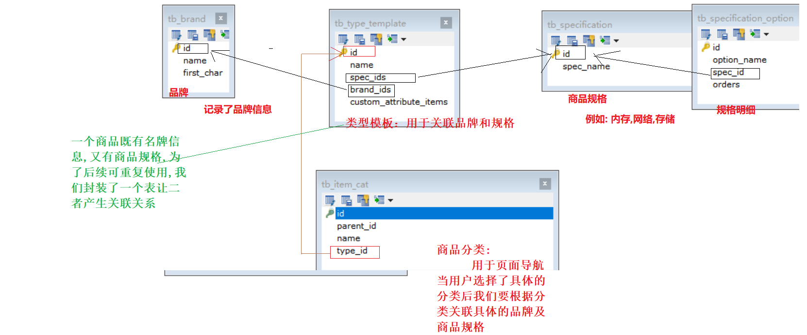

# PYG笔记_Day05
## 1.1 今日知识点
```
1)Kindeditor 
2)FastDFS
3)angularJS上传
```
## 1.2 今日目标
```
理解SPU和SKU
完成商品录入-基本功能
完成商品录入-商品分类
完成商品录入-商品介绍
掌握FastDFS的基本理论
掌握富文本编辑器的使用
```
## 1.3课程内容
### 1.3.1 .今日目标
**视频信息**
```
视频名称: 01.今日目标
视频时长: 01:44
```
```
1)Kindeditor 
2)FastDFS
3)angularJS上传
----
4) 业务模块围绕商品信息录入展开
```

### 1.3.2 .需求与表结构分析
**视频信息**
```
视频名称: 02.需求与表结构分析
视频时长: 09:30
```
**小节内容**


1)进入页面首先显示所以一级分类，

2)点击列表行的查询下级按钮，进入下级分类列表，同时更新面包屑导航

3)再次点击表行的查询下级按钮，进入三级分类列表，因为三级分类属于最后一级，所以在列表中不显示查询下级按钮，同时更新面包屑导航

**补充**

```
面包屑导航
	面包屑导航(BreadcrumbNavigation)这个概念来自童话故事"汉赛尔和格莱特"，当汉赛尔和格莱特穿过森林时，不小心迷路了，但是他们发现在沿途走过的地方都撒下了面包屑，让这些面包屑来帮助他们找到回家的路。所以，面包屑导航的作用是告诉访问者他们目前在网站中的位置以及如何返回。

    ----童话故事------
    很久很久以前，在大森林的边上住着一个贫穷的樵夫，他与妻子和两个孩子相依为命。他的儿子名叫汉赛尔，女儿名叫格莱特。后来樵夫的妻子去世了，他又给孩子们娶了一个后母。后母计划把两个孩子带到森林的深处，然后趁他们睡着的时候跑掉。汉赛尔无意中知道了后母的计划，于是偷偷地把一块面包藏在了口袋里。在去森林的路上，汉赛尔悄悄地捏碎了他的面包，并不时地停下脚步，把碎面包屑撒在路上。后母顺利地趁孩子们睡着的时候溜掉了，汉赛尔和格莱特醒来已是一片漆黑。汉赛尔安慰他的妹妹说：“等太阳一出来，我们就看得见我撒在地上的面包屑了，它一定会指给我们回家的路。”但是当太阳升起来时，他们在地上却怎么也找不到一点面包屑了，原来它们都被那些在树林里、田野上飞来飞去的鸟儿一点点地啄食了，兄妹俩在森林中迷了路。不停的寻路，让他们饥饿难忍，腿脚无力，来到了一个用面包做屋顶，糖果做窗户的小屋。饥饿让他们忘记了疲惫，及潜在的危险，啃起了屋子。结果在巫婆的诱骗下，哥哥被锁屋中，妹妹被迫做劳力，就在巫婆要吃掉哥哥之时，妹妹借向巫婆学习添柴之机。将巫婆推入炉中，兄妹俩带着巫婆的财宝，回到了家中。后母己经去世，兄妹俩和父亲一起过上了幸福的生活。
```
**表结构分析**



### 1.3.3 .商品分类-列表-后端

**视频信息**

```
视频名称: 03.商品分类-列表-后端
视频时长: 07:26
```
**小节内容**
```
1)修改pinyougou-sellergoods-interface工程ItemCatService接口，新增方法定义
	public List<TbItemCat> findByParentId(Long parentId);
2)修改pinyougou-sellergoods-interface工程ItemCatServiceImpl ，实现方法
	使用条件查询即可
3)修改pinyougou-manager-web的ItemCatController.java

```
### 1.3.4 .商品分类-列表-前端
**视频信息**
```
视频名称: 04.商品分类-列表-前端
视频时长: 08:22
```
**小节内容**
```js
//1)修改itemCatService.js
this.findByParentId=function(parentId){
		return $http.get('../itemCat/findByParentId.do?parentId='+parentId);	
	}
//2)修改itemCatController.js
//3)修改 item_cat.html
  	3.1)引入JS (注意先后顺序)
	3.2)使用指令 初始化,
    3.3)遍历查询结果展示
```


### 1.3.5 .商品分类-面包屑
**视频信息**
```
视频名称: 05.商品分类-面包屑
视频时长: 19:48
```
**小节内容**

```
思路分析:
	1)顶级分类固定,可以写死 代码,点击调用固定的代码
	2) 二,三级分类可以分别定义一个变量进行绑定
	entity_1,entity_2
	3) 当点的是 一级目录时
		entity_1 =null,
		entity_2 =null,
	   当点的是 二级级目录时
		entity_1 =传递过来的p_entity,
		entity_2 =null,
		当点获的是 三级级级目录时
		//entity_1 不处理,此时 entity_1 的值时上次调用后内存中的值
		entity_2 =传递过来的p_entity,	
知识点:
	ng-if="表达式"
	 当表达式为false时不显示元素
```


### 1.3.6 .商品分类-增删改实现思路
**视频信息**
```
视频名称: 06.商品分类-增删改实现思路
视频时长: 05:02
```
**小节内容**
```
1) 增加时需传递parentid ; 可以定义一个全局变量,每次查询时记录一下
2) 修改时逻辑类似
3) 删除
	删除时注意,当一个分类有子元素时不应该删除,(可以看作是电商后台使用的业务部门人员的具体要求)
```
### 1.3.7 .理解SPU与SKU
**视频信息**
```
视频名称: 07.理解SPU与SKU
视频时长: 04:47
```
**小节内容**
```
SPU = Standard Product Unit （标准产品单位）
SKU=stock keeping unit(库存量单位)
	一个spu 对应多个sku 的
	
	SPU :{
        是一类商品的统一描述, 有id =,name=,desc=.... 等等描述
	}
	SKU :{
        是一类商品的某一款商品的描述, 有id =,name=,desc=.... 等等描述
	}
	
```


### 1.3.8 .商品表结构分析
**视频信息**
```
视频名称: 08.商品表结构分析
视频时长: 09:41
```
**小节内容**
```
Tb_goods 商品表 (SPU 表)
tb_goods_desc 商品信息描述表
tb_item(tb_goods_item): SKU 表 // 
	
```
**补充**
```
思考:
	1)商品的添加应该是那个前端项目的功能?
	2)商家负责商品信息的录入
	3)运营商负责商品信息的审核
```
### 1.3.9 .商品录入-基本功能-后端
**视频信息**
```
视频名称: 09.商品录入-基本功能-后端
视频时长: 12:05
```
**小节内容**
```
在商家后台实现商品录入功能。包括商品名称、副标题、价格、包装列表、售后服务
1) 由于我们需要在商品表添加数据后可以得到自增的ID,所以我们需要在TbGoodsMapper.xml
2) 定义一个组合实体类封装要存储的数据
```
**补充**
```

```
### 1.3.10 .商品录入-基本信息录入
**视频信息**
```
视频名称: 10.商品录入-基本信息录入
视频时长: 11:30
```
**小节内容**
```
1)修改goodsController.js ，在增加成功后弹出提示，并清空实体（因为编辑页面无列表）
2)修改goods_edit.html 
	引入 js
	定义控制器：
	修改表单 ng-model
```
**补充**
```

```
### 1.3.11 .富文本编辑器简介
**视频信息**
```
视频名称: 11.富文本编辑器简介
视频时长: 10:45
```
**小节内容**
```
使用富文本编辑器录入基本信息
	KindEditor    http://kindeditor.net/
	UEditor      http://ueditor.baidu.com/website/
	CKEditor     http://ckeditor.com/
下载的包里有已经集成好的demo,我们可以按照demo 的方法使用
```


### 1.3.12 .商品录入-商品介绍
**视频信息**
```
视频名称: 12.商品录入-商品介绍
视频时长: 05:49
```
**小节内容**
```
实际存入的是html 信息
```


### 1.3.13 .fastDFS介绍
**视频信息**
```
视频名称: 13.fastDFS介绍
视频时长: 10:44
```
**小节内容**

```
FastDFS
	海量数据
	数据备份
```


```
FastDFS 是用 c 语言编写的一款开源的分布式文件系统
	Tracker server :管理服务
	Storage server: 存储服务
服务端两个角色：
Tracker：
	管理集群，tracker 也可以实现集群。每个 tracker 节点地位平等。收集 Storage 集群的状态。
Storage：实际保存文件  
	Storage 分为多个组，每个组之间保存的文件是不同的。每个组内部可以有多个成员，组成员内部保存的内容是一样的，组成员的地位是一致的，没有主从的概念。
```


流程图


/fastdfs/storageData/fdfs_storage/data

### 1.3.14 .文件上传及下载的流程
**视频信息**
```
视频名称: 14.文件上传及下载的流程
视频时长: 09:40
```
**小节内容**


```
fastFDFS 路径
1)组名：文件上传后所在的 storage 组名称，在文件上传成功后有 storage 服务器返回，需要客户端自行保存。
2)虚拟磁盘路径：storage 配置的虚拟路径，与磁盘选项 store_path*对应。如果配置了store_path0 则是 M00，如果配置了 store_path1 则是 M01，以此类推。
3)数据两级目录：storage 服务器在每个虚拟磁盘路径下创建的两级目录，用于存储数据文件。
4) 文件名：与文件上传时不同。是由存储服务器根据特定信息生成，文件名包含：源存储
服务器 IP 地址、文件创建时间戳、文件大小、随机数和文件拓展名等信息。

```


### 1.3.15 .fastDFS环境安装
**视频信息**

```
视频名称: 15.fastDFS环境安装
视频时长: 08:10
```
**小节内容**
```
1) 解压到无中文无空格目录
2) 用wmware 打开镜像
3) 配置网卡为仅主机模式(和zookeeper 同一个网卡即可)
4) 启动 选择"我已移动" (不会改变ip)
	root/itcast
```
**补充**
```

```
### 1.3.16 .fastDFS入门小demo
**视频信息**
```
视频名称: 16.fastDFS入门小demo
视频时长: 15:06
```
**小节内容**
```
可以不用安装使用如下 坐标
	1) 导入坐标
<dependency>
    <groupId>org.csource</groupId>
    <artifactId>fastdfs-client-java</artifactId>
    <version>1.27-RELEASE</version>
</dependency>
2) 添加配置文件
3) 编写demo
```
java
```java
  // 1、加载配置文件，配置文件中的内容就是 tracker 服务的地址。
		ClientGlobal.init("D:/maven_work/fastDFS-demo/src/fdfs_client.conf");
		// 2、创建一个 TrackerClient 对象。直接 new 一个。
		TrackerClient trackerClient = new TrackerClient();
		// 3、使用 TrackerClient 对象创建连接，获得一个 TrackerServer 对象。
		TrackerServer trackerServer = trackerClient.getConnection();
		// 4、创建一个 StorageServer 的引用，值为 null
		StorageServer storageServer = null;
		// 5、创建一个 StorageClient 对象，需要两个参数 TrackerServer 对象、StorageServer 的引用
		StorageClient storageClient = new StorageClient(trackerServer, storageServer);
		// 6、使用 StorageClient 对象上传图片。
		//扩展名不带“.”
		String[] strings = storageClient.upload_file("D:/pic/benchi.jpg", "jpg",
				null);
		// 7、返回数组。包含组名和图片的路径。
		for (String string : strings) {
			System.out.println(string);
		}
    	trackerServer.close();

```
```java
// 模拟删除文件
	public static void main(String[] args) throws FileNotFoundException, IOException, Exception {
		// 1)加载配置文件
		ClientGlobal.init("D:\\develop\\IdeaWorkSpace\\pyg\\day-05\\fastDFSdemo\\src\\main\\resources\\fdfs_client.conf");

		//2构建一个管理者客户端
		TrackerClient trackerClient= new TrackerClient();
		// 3管理者服务端 
		TrackerServer trackerServer= trackerClient.getConnection();
		// 4) 声明一个存储服务端
		StorageServer storageServer = null;
		StorageClient storageClient = new StorageClient(trackerServer,storageServer);
		// 存储数据
		int group1 = storageClient.delete_file("group1", "M00/00/00/wKgZhVwxr8uAK0wAAAPB4mpVZW4984.jpg");
		//0:文件删除成功，2：文件不存在 ，22 路径错误  其它：文件删除出错；
		trackerServer.close();
		System.out.println(group1);
	}
```

发给大家的153 的服务中图片存储路径如下

```
/fastdfs/storageData/fdfs_storage/data
```


### 1.3.17 .商品录入-图片上传-后端

**视频信息**
```
视频名称: 17.商品录入-图片上传-后端
视频时长: 19:05
```
**小节内容**
```xml
1) 上传功能放置到comm 层 方便代码的重用
2) 将“资源/fastDFS/配置文件”文件夹中的 fdfs_client.conf 拷贝到pinyougou-shop-web工程config文件夹
3) 在pinyougou-shop-web工程application.properties添加配置
	FILE_SERVER_URL=http://192.168.25.133/
4) 在pinyougou-shop-web工程springmvc.xml添加配置
	<bean id="multipartResolver" class="org.springframework.web.multipart.commons.CommonsMultipartResolver">
		<property name="defaultEncoding" value="UTF-8"></property>
		<!-- 设定文件上传的最大值5MB，5*1024*1024 -->
		<property name="maxUploadSize" value="5242880"></property>
</bean>

```
### 1.3.18 .商品录入-上传图片
**视频信息**
```
视频名称: 18.商品录入-上传图片
视频时长: 15:26
```
**小节内容**
```js
在pinyougou-shop-web工程创建uploadService.js
app.service("uploadService",function($http){
	this.uploadFile=function(){
		var formData=new FormData();
	    formData.append("file",file.files[0]);   
		return $http({
            method:'POST',
            url:"../upload.do",
            data: formData,
            headers: {'Content-Type':undefined},
            transformRequest: angular.identity // 序列化页面元素
        });		
	}	
});

```
**补充**
```
1)angularJS 发送请求的几种方式
	$http.get('')
	$http.post('',data)
	$http({
        参数
	});
2) springmvc 上传文件要求的三要素
	1) 上传方式必须为post
	2) 上传的类型必须为multipart/form-data
	3) 页面input type属性必须为file
	4) 提交的属性,必须和controller 参数名称一样
4) formData.append("file",file.files[0]);   
	第一个"file" 对应的是controller 参数的名称
	第二个file 对应的是 input id 属性
		file.files[0] 是js 支持的格式可以直接使用
		这种方式这个最初是 IE 里面的，后来 firefox chrome 好像也支持了。
```
注意 

​	formData.append("file",file.files[0]);  

​	第一个"file" 对应的是controller 参数的名称
​	第二个file 对应的是 input id 属性


### 1.3.19 .商品录入-图片列表

**视频信息**
```
视频名称: 19.商品录入-图片列表
视频时长: 12:55
```
**小节内容**
```

```
**补充**
```

```
### 1.3.20 .商品录入-图片删除
**视频信息**
```
视频名称: 20.商品录入-图片删除
视频时长: 03:33
```
**小节内容**
```
删除功能只是从前端删除,可以增加从服务fastFDFS 删除

```
**补充**

