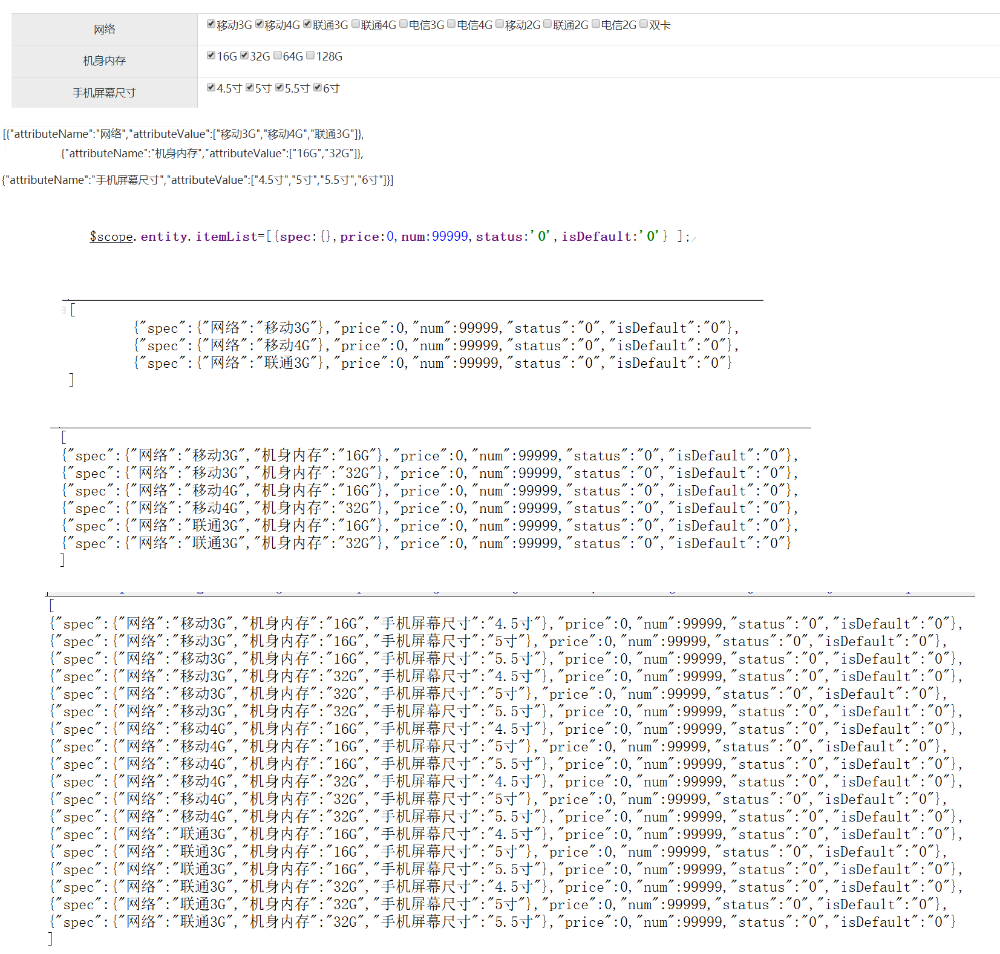

# PYG笔记_Day06
# 第1节课
## 1.1 今日知识点
```
1)下拉框三级联动/变量监控
2)JS对象深克隆
```
## 1.2 今日目标
```
目标1：完成选择商品分类功能
目标2：完成品牌选择功能
目标3：完成扩展属性功能
目标4：完成规格选择功能
目标5：完成SKU商品信息功能
目标6：完成是否启用规格功能
```
## 1.3课程内容
### 1.3.1 .今日目标
**视频信息**
```
视频名称: 01.今日目标
视频时长: 03:11
```
**小节内容**
```
目标1：完成选择商品分类功能
目标2：完成品牌选择功能
目标3：完成扩展属性功能
目标4：完成规格选择功能
目标5：完成SKU商品信息功能
目标6：完成是否启用规格功能
```
### 1.3.2 .选项商品分类-需求分析和准备工作
**视频信息**
```
视频名称: 02.选项商品分类-需求分析和准备工作
视频时长: 05:09
```
### 1.3.3 .选择商品分类-一级分类下拉列表
**视频信息**
```
视频名称: 03.选择商品分类-一级分类下拉列表
视频时长: 09:05
```
**小节内容**
```html
ng-options="item.id as item.name for item in itemCat1List">
	ng-options属性可以在表达式中使用数组或对象来自动生成一个select中的option列表。ng-options与ng-repeat很相似，很多时候可以用ng-repeat来代替ng-options。但是ng-options提供了一些好处，例如减少内存提高速度，以及提供选择框的选项来让用户选择。	
```


### 1.3.4 .选择商品分类-二级分类与三级分类下拉列表
**视频信息**

```
视频名称: 04.选择商品分类-二级分类与三级分类下拉列表
视频时长: 07:27
```
angularJS 的变量监控

==$watch==方法，它可以帮助我们在每个scope中监视其中的变量。

```js
//读取二级分类
$scope.$watch('entity.goods.category1Id', function(newValue, oldValue) {          
    	//根据选择的值，查询二级分类
    	itemCatService.findByParentId(newValue).success(
    		function(response){
    			$scope.itemCat2List=response; 	    			
    		}
    	);    	
}); 

```


### 1.3.5 .选择商品分类-显示模板ID
**视频信息**

```
视频名称: 05.选择商品分类-显示模板ID
视频时长: 04:51
```
**小节内容**

```
通过绑定第三级分类的变量触发获取模板ID 的方法
```
### 1.3.6 .品牌下拉列表
**视频信息**
```
视频名称: 06.品牌下拉列表
视频时长: 13:39
```
**小节内容**
```
通过绑定模板ID 根据id查询相关品牌
```


### 1.3.7 .扩展属性
**视频信息**
```
视频名称: 07.扩展属性
视频时长: 09:54
```
**小节内容**
```
通过绑定模板ID 根据id查询 tb_type_template 表的扩展属性
```


### 1.3.8 .规格选择-显示规格面板-后端代码

**视频信息**
```
视频名称: 08.规格选择-显示规格面板-后端代码
视频时长: 13:59
```
**小节内容**
```
后端使用list<map> 处理数据
	往每一个map 中put 一个新的options
后端返回的是一个数组
```

```json
##  返回值 是一个二维数组
[
	{
		"options":[{"id":98,"optionName":"移动3G","orders":1,"specId":27}],
		"id"     :32,
		"text"   :"机身内存"
	}

	{
		"options":[{"id":118,"optionName":"16G","orders":1,"specId":32},],
		"id":32,
		"text":"机身内存"
	}
]

```

### 1.3.9 .规格选择-显示规格面板-前端

**视频信息**
```
视频名称: 09.规格选择-显示规格面板-前端
视频时长: 07:36
```
**小节内容**
```
嵌套 ng-repeat
```

### 1.3.10 .规格选择-保存选择的规格选项-思路分析
**视频信息**
```
视频名称: 10.规格选择-保存选择的规格选项-思路分析
视频时长: 07:07
```
**小节内容**
```
方案: 通过遍历变量的方式循环判断处理数据
```
**补充**
```

```
### 1.3.11 .规格选择-保存选择的选项-代码实现
**视频信息**
```
视频名称: 11.规格选择-保存选择的选项-代码实现
视频时长: 25:54
```
**小节内容**


### 1.3.12 .SKU商品列表-思路分析与表结构
**视频信息**

```
视频名称: 12.SKU商品列表-思路分析与表结构
视频时长: 14:45
```
**小节内容**
```
 var newRow= JSON.parse( JSON.stringify( oldRow )  );//深克隆
 1)基本数据类型无需克隆
 2)深克隆: 所有引用类型都会被克隆
 3)浅克隆:只有对象的基本属性被clone,引用类型没有被克隆
```
JAVA 深克隆

```java
// FastJson

User user = new User();
        user.setName("哇哈哈");
        Role role = new Role();
        role.setName("Admin");
        user.setRole(role);


        //User user2=user.clone();// 浅克隆, 引用对象值不发生改变
        User user2 =JSON.parseObject(JSON.toJSONString(user),User.class);// 深克隆,引用类型发生改变
        user2.getRole().setName("none");
        System.out.println(user.getRole().getName());

```

对象的克隆-地址引用


### 1.3.13 .SKU列表-变量构建

**视频信息**
```
视频名称: 13.SKU列表-变量构建
视频时长: 26:49
```
**小节内容**
```js
//创建SKU列表
	$scope.createItemList=function(){
		$scope.entity.itemList=[{spec:{},price:0,num:99999,status:'0',isDefault:'0'} ];//列表初始化
		var items= $scope.entity.goodsDesc.specificationItems;
		for(var i=0;i<items.length;i++){
            //{spec:{},price:0,num:99999,status:'0',isDefault:'0'}
			$scope.entity.itemList= addColumn( $scope.entity.itemList, items[i].attributeName,items[i].attributeValue );			
		}
	}
	/* list =[
    {"attributeName":"网络","attributeValue":["移动3G","移动4G"]},
    {"attributeName":"机身内存","attributeValue":["16G","32G"]}
	]
	columnName=attributeName
	columnValues=attributeValue
	*/
	addColumn=function(list,columnName,columnValues){
		var newList=[];		
		for(var i=0;i< list.length;i++){
			var oldRow=  list[i];
			// 循环的是 attributeValue
			for(var j=0;j<columnValues.length;j++){
				var newRow=  JSON.parse( JSON.stringify(oldRow)  );//深克隆
				newRow.spec[columnName]=columnValues[j];
				newList.push(newRow);
			}			
		}		
		return newList;
	}
```



### 1.3.14 .SKU列表-表格绑定

**视频信息**
```
视频名称: 14.SKU列表-表格绑定
视频时长: 07:33
```
### 1.3.15 .SKU列表保存-后端-1
**视频信息**
```
视频名称: 15.SKU列表保存-后端-1
视频时长: 08:53
```
### 1.3.16 .SKU列表保存-后端-2

**视频信息**
```
视频名称: 16.SKU列表保存-后端-2
视频时长: 10:41
```
**小节内容**
```

```
**补充**
```

```
### 1.3.17 .是否启用规格-前端
**视频信息**
```
视频名称: 17.是否启用规格-前端
视频时长: 03:07
```
**小节内容**
```html
<input type="checkbox" ng-model="entity.goods.isEnableSpec" ng-true-value="1" ng-false-value="0" >
<div ng-if="entity.goods.isEnableSpec=='1'">
</div>
```


### 1.3.18 .是否启用规格-后端
**视频信息**
```
视频名称: 18.是否启用规格-后端
视频时长: 09:43
```
思路

```

```
