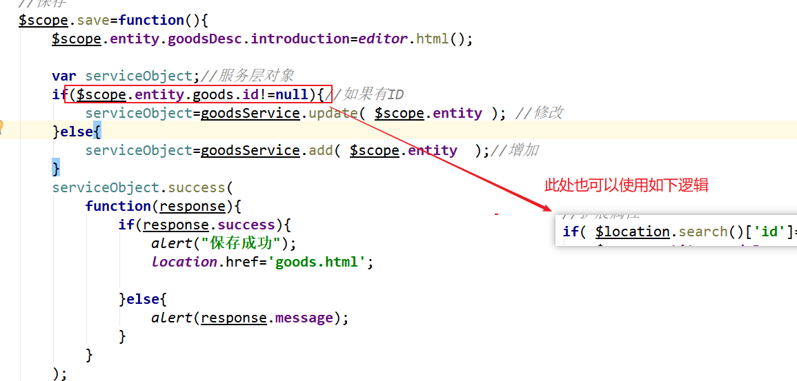

# PYG笔记_Day07
# 第1节课
## 1.1 今日知识点
```
1)angularJS页面跳转  url#?id=123
----
2)angularJS 两个新功能
 $location.serach()['id'] 
 ng-checked// true 表示选中,false 表示不选中
```
## 1.3课程内容
### 1.3.1 .今日目标
**视频信息**
```
视频时长: 01:09
```
**小节内容**
```
目标1：完成商家后台商品列表的功能
目标2：完成商家后台商品修改的功能
目标3：完成运营商后台商品审核的功能
目标4：完成运营商后台商品删除的功能
目标5：掌握注解式事务的配置
```
### 1.3.2 .商品列表-查询商家商品列表
**视频信息**
```
视频名称: 02.商品列表-查询商家商品列表
视频时长: 13:14
```
**小节内容**
```
1)因为限制商家ID查询的功能只有商家页面才会用到,所以逻辑放到controller 中 控制
	修改pinyougou-shop-web工程的GoodsController.java的search方法
2) 需要将商家的serviceIMpl 中模糊匹配改为精确匹配
    
```
**补充**
```
获取用户登陆信息
User user 
= (User)SecurityContextHolder.getContext().getAuthentication().getPrincipal();
		System.out.println(user.getUsername());
		System.out.println(user.getPassword());// 密码获取不到 null
		System.out.println(user.getAuthorities());
```
```
SELECT goods_Name ,audit_status,
CASE audit_status 
	WHEN  1 THEN '已通过'
	WHEN  0 THEN '未通过'
	ELSE '未审核'
END 
 FROM  tb_goods a
```


### 1.3.3 .商品列表-显示状态

**视频信息**
```
视频名称: 03.商品列表-显示状态
视频时长: 03:37
```
**小节内容**
```
$scope.status=['未审核','已审核','审核未通过','关闭'];//商品状态
修改列表显示
{{status[entity.auditStatus]}}
```
**补充**

```
这里用到了一个技巧, 数据库中数据的状态值要和 数组中的角标对应
注意:
	如果后续有一条数据状态是 'a' 则该处代码将会由问题, 需要用 ng-if  重写
```


### 1.3.4 .商品列表-显示分类

**视频信息**
```
视频名称: 04.商品列表-显示分类
视频时长: 07:03
```
**小节内容**
```
方案一：在后端代码写关联查询语句，返回的数据中直接有分类名称。
方案二：在前端代码用ID去查询后端，异步返回商品分类名称。
```
**补充**
```
技巧:
	定义一个数据 让下角标和 数据库数据对应	
```


### 1.3.5 .商品列表-条件查询

**视频信息**

```
视频名称: 05.商品列表-条件查询
视频时长: 03:52
```
**小节内容**


**补充**
```

```
### 1.3.6 .商品修改-基本信息读取
**视频信息**

```
视频名称: 06.商品修改-基本信息读取
视频时长: 14:25
```
**小节内容**


### 1.3.7 .商品修改-读取商品介绍
**视频信息**
```
视频名称: 07.商品修改-读取商品介绍
视频时长: 01:36
```
**小节内容**


### 1.3.8 .商品修改-读取商品图片
**视频信息**

```
视频名称: 08.商品修改-读取商品图片
视频时长: 02:33
```


### 1.3.9 .商品修改-读取扩展属性

**视频信息**
```
视频名称: 09.商品修改-读取扩展属性
视频时长: 05:19
```
**小节内容**


**补充**
```

```
### 1.3.10 .商品修改-读取规格属性
**视频信息**
```
视频名称: 10.商品修改-读取规格属性
视频时长: 12:04
```
**小节内容**
```
ng-checked="" : 方法返回值为true 则选中
```


### 1.3.11 .商品修改-读取SKU列表数据
**视频信息**
```
视频名称: 11.商品修改-读取SKU列表数据
视频时长: 08:44
```
**小节内容**


### 1.3.12 .商品修改-保存数据-后端
**视频信息**

```
视频名称: 12.商品修改-保存数据-后端
视频时长: 10:42
```
**小节内容**
```
修改只能修改该商家自己的商品,否则提示操作异常
```

### 1.3.13 .商品修改-保存数据-前端
**视频信息**
```
视频名称: 13.商品修改-保存数据-前端
视频时长: 06:17
```
**小节内容**



### 1.3.14 .商品修改-页面跳转
**视频信息**
```
视频名称: 14.商品修改-页面跳转
视频时长: 05:39
```
**小节内容**


### 1.3.15 .运营商后台-商品审核-待审核列表
**视频信息**
```
视频名称: 15.运营商后台-商品审核-待审核列表
视频时长: 07:49
```
**小节内容**


### 1.3.16 .运营商后台-商品审核-审核与驳回
**视频信息**
```
视频名称: 16.运营商后台-商品审核-审核与驳回
视频时长: 11:54
```
**小节内容**

### 1.3.17 .运营商后台-商品删除
**视频信息**
```
视频名称: 17.运营商后台-商品删除
视频时长: 07:47
```
**小节内容**

### 1.3.18 .商家后台-上下架-思路分析
**视频信息**
```
视频名称: 18.商家后台-上下架-思路分析
视频时长: 03:13
```
**小节内容**

### 1.3.19 .注解式事务
**视频信息**
```
视频名称: 19.注解式事务
视频时长: 07:49
```

```
 <!---->
    <tx:advice transaction-manager="transactionManager" id="txAdvicer">
        <tx:attributes>
            <tx:method name="*" read-only="false" propagation="REQUIRED"/>
            <tx:method name="find*" read-only="true" propagation="SUPPORTS"/>
        </tx:attributes>
    </tx:advice>
    
      <aop:config>
          <aop:advisor advice-ref="txAdvicer" pointcut="execution(* com.pinyougou.sellergoods.service.impl.*.*(..))"/>
      </aop:config>
```

