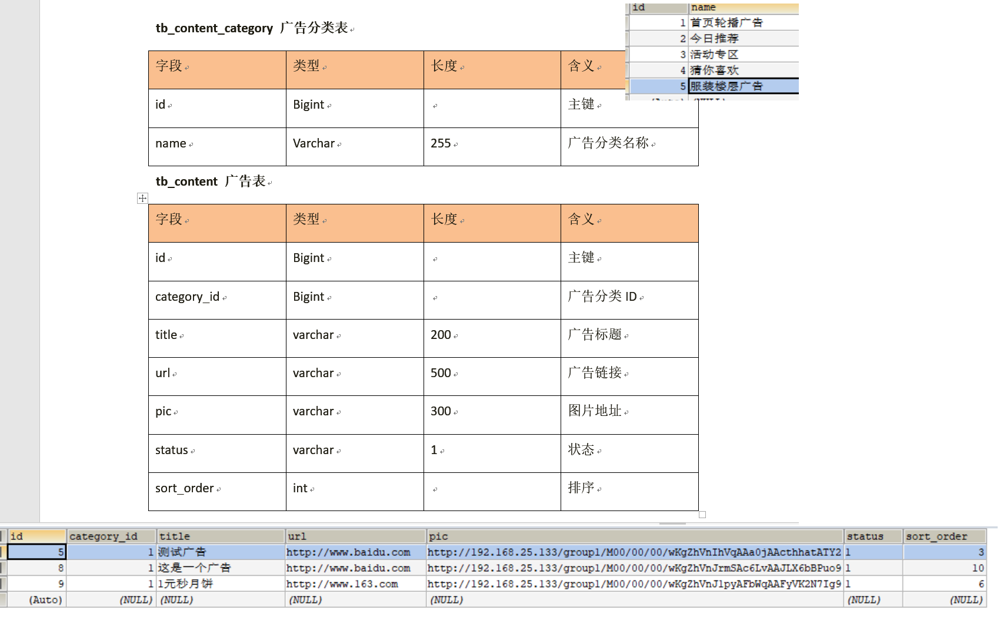
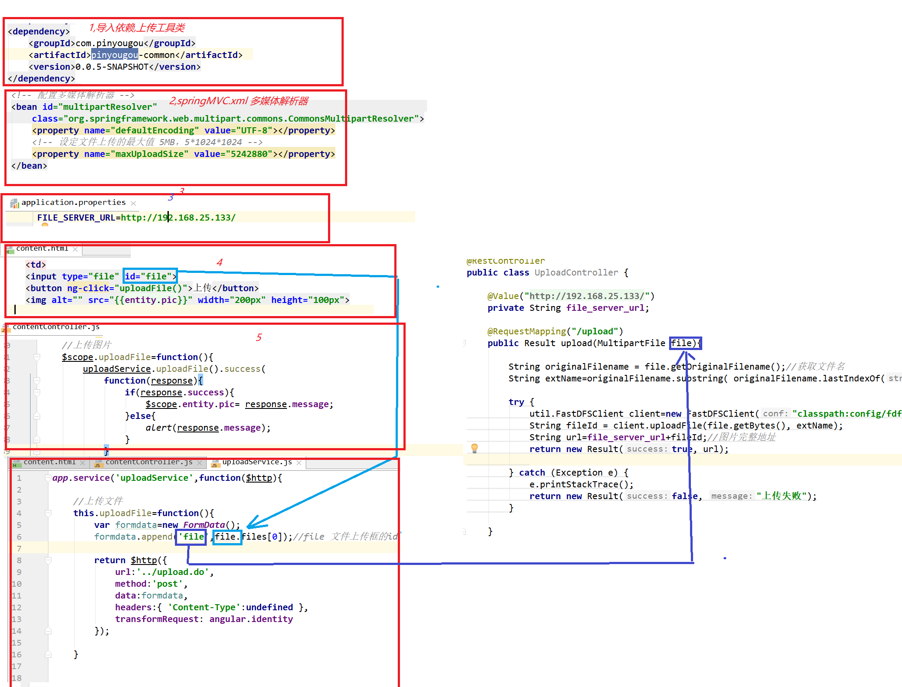
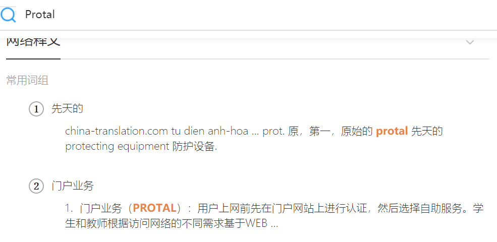
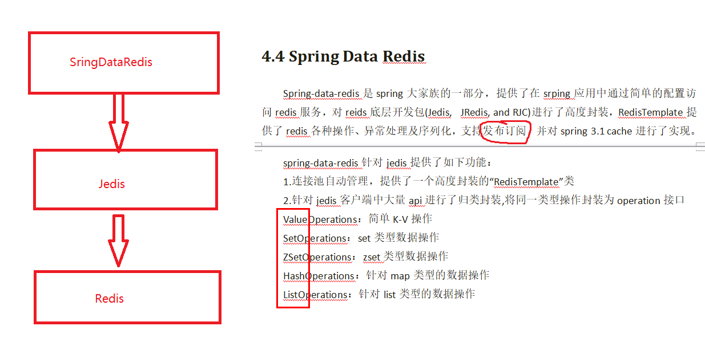
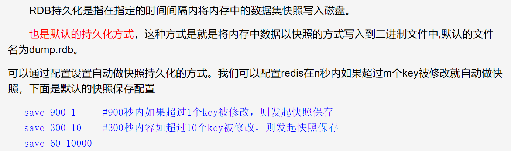
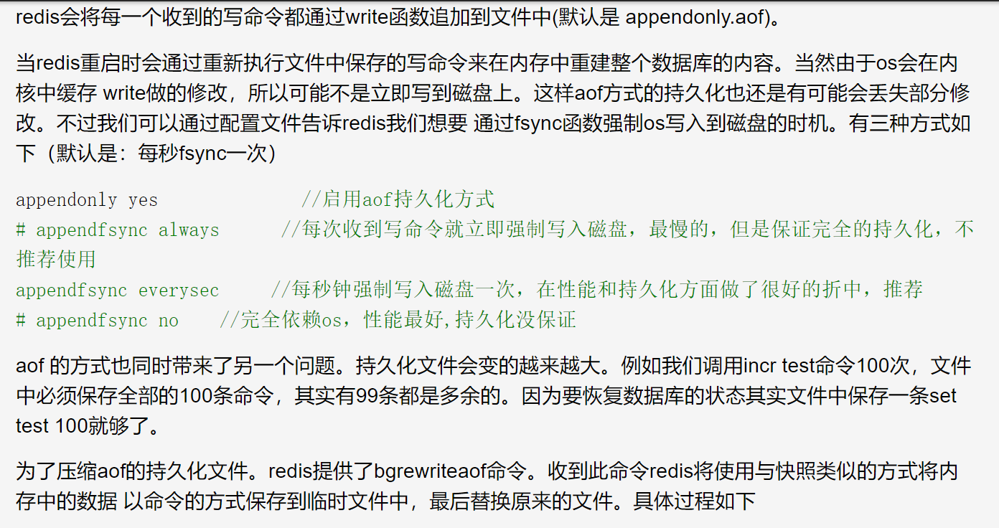
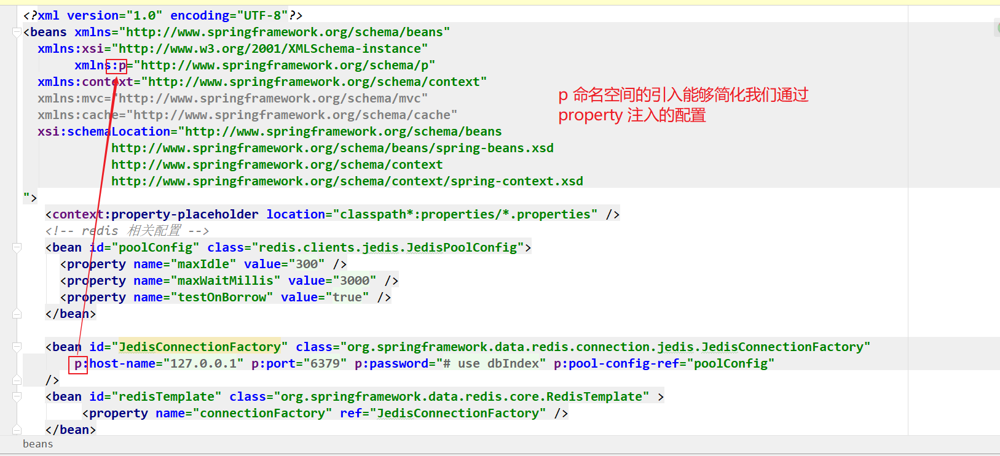

# PYG笔记_Day08
# 第1节课
## 1.1 今日知识点
```
springDataRedis
```
## 1.2 今日目标
```

```
## 1.3课程内容
### 1.3.1 .今日目标
**视频信息**
```
视频名称: 01.今日目标
视频时长: 02:50
```
**小节内容**
```
目标1：了解网站前台的页面以及广告相关表结构
目标2：完成运营商后台广告类型管理与广告管理
目标3：完成前台工程广告轮播图的展示
目标4：使用SpringDataRedis操作字符串、set、List、hash等类型缓存
目标5：使用SpringDataRedis实现广告数据的缓存

```
### 1.3.2 .网站前台分析数据库表分析
**视频信息**
```
视频名称: 02.网站前台分析数据库表分析
视频时长: 12:38
```
**小节内容**
```
网站前台有哪些页面:
（1）网站首页
（2）商家（店铺）首页
（3）商品详细页
（4）商品搜索页
（5）购物车列表页
（6）购物选项选择页
（7）支付页
（8）用户注册页
（9）用户登陆页
（10）用户中心页等
网站首页广告:
（1）首页海报（轮播图）
（2）今日推荐
（3）猜你喜欢
（4）楼层广告
```
表结构



### 1.3.3 .工程构建与生成代码
**视频信息**

```
视频名称: 03.工程构建与生成代码
视频时长: 18:35
```
**小节内容**

```
注意:
	1) 注意端口冲突
```


### 1.3.4 .广告管理-图片上传
**视频信息**

```
视频名称: 04.广告管理-图片上传
视频时长: 12:05
```
**小节内容**



### 1.3.5 .广告管理-广告类目选择
**视频信息**
```
视频名称: 05.广告管理-广告类目选择
视频时长: 07:18
```
**小节内容**
```html
 <td>
<select  class="form-control" ng-model="entity.categoryId" ng-options="item.id as item.name for item in contentCategoryList" ></select>
 </td>
```
### 1.3.6 .广告管理-广告状态
**视频信息**
```
视频名称: 06.广告管理-广告状态
视频时长: 02:36
```
### 1.3.7 .网站首页-工程搭建
**视频信息**
```
视频名称: 07.网站首页-工程搭建
视频时长: 09:54
```
**小节内容**



搭建门户前端

  注意tomcat修改端口避免冲突


### 1.3.8 .网站首页-广告展示-后端

**视频信息**
```
视频名称: 08.网站首页-广告展示-后端
视频时长: 07:39

排序
example.setOrderByClause("sort_order asc");

```
**小节内容**

### 1.39 .网站首页-广告展示-前端
**视频信息**
```
视频名称: 09.网站首页-广告展示-前端
视频时长: 17:08
```
**小节内容**

### 1.3.10 .SpringDataRedis简介
**视频信息**

```
视频名称: 10.SpringDataRedis简介
视频时长: 09:08
```
**小节内容**



Redis 远程连接命令

```
redis-cli -h 192.168.25.153 -p 6379
```

##### Redis 教程

```
http://www.runoob.com/redis/redis-tutorial.html
http://doc.redisfans.com/

```

##### Redis 数据类型5 种

```
String: 字符串
Hash: 散列
List: 列表
Set: 集合
ZSet: 有序集合
```

##### Redis key 操作

```
flushdb
	清空当前库所有key

SET key value  
	设置值
DEL key
	该命令用于在 key 存在时删除 key。
DUMP key 
	序列化给定 key ，并返回被序列化的值。
EXPIRE key seconds
	为给定 key 设置过期时间，以秒计。
TTL key 
	以秒为单位，返回给定 key 的剩余生存时间(TTL, time to live)。
PERSIST key 
	移除 key 的过期时间，key 将持久保持。
```

##### Redis string 操作

```
INCR key
	将 key 中储存的数字值增一。
INCRBY key increment
	将 key 所储存的值加上给定的增量值（increment） 。
INCRBYFLOAT key increment
	将 key 所储存的值加上给定的浮点增量值（increment） 。
DECR key
	将 key 中储存的数字值减一。
DECRBY key decrement
	key 所储存的值减去给定的减量值（decrement） 。
APPEND key value
	如果 key 已经存在并且是一个字符串， APPEND 命令将指定的 value 追加到该 key 原来值（value）的末尾。
```

##### Reis list

```
LPOP key 
	移出并获取列表的第一个元素
LPUSH key value1 [value2] 
	将一个或多个值插入到列表头部 (如果列表不存在则创建一个列表)
LPUSHX key value 
	将一个值插入到已存在的列表头部 (如果列表不存在则失败)
LRANGE key start stop 
	获取列表指定范围内的元素
LREM key count value 
	移除列表元素
LSET key index value 
	通过索引设置列表元素的值
```

##### Redis 事务

```
Redis 事务可以一次执行多个命令， 并且带有以下两个重要的保证：
 	1)批量操作在发送 EXEC 命令前被放入队列缓存。
 	2)收到 EXEC 命令后进入事务执行，事务中任意命令执行失败，其余的命令依然被执行。
 	3)在事务执行过程，其他客户端提交的命令请求不会插入到事务执行命令序列中。
 一个事务从开始到执行会经历以下三个阶段：
 	开始事务。
	命令入队。
	执行事务。
例子
以下是一个事务的例子， 它先以 MULTI 开始一个事务， 然后将多个命令入队到事务中， 最后由 EXEC 命令触发事务， 一并执行事务中的所有命令：
>MULTI
 >SET book-name "Mastering C++ in 21 days"
 > GET book-name
 > SADD tag "C++" "Programming" "Mastering Series"
 > EXEC
```

Redis的持久化方案

RDB



AOF



##### Redis 有多少个数据库

​    Redis有16个数据库,数据库的名字从0-15,默认是0,数据库的名字不能改.

### 1.3.11 .springDataRedis入门小demo

**视频信息**
```
视频名称: 11.springDataRedis入门小demo
视频时长: 07:42
```
SpringData Redis 教程

```
https://blog.csdn.net/u012888052/article/details/70432506
```

小节内容**



注意:

​	配置文件jdk 1.8 需要把空格移除

### 1.3.12 .入门小demo-值类型操作
**视频信息**
```
视频名称: 12.入门小demo-值类型操作
视频时长: 07:49
```
### 1.3.13 .入门小demo-set集合类型操作
**视频信息**
```
视频名称: 13.入门小demo-set集合类型操作
视频时长: 07:04
```
### 1.3.14 .入门小demo-list集合
**视频信息**
```
视频名称: 14.入门小demo-list集合
视频时长: 09:21
```
### 1.3.15 .入门小demo-list集合-删除值
**视频信息**
```
视频名称: 15.入门小demo-list集合-删除值
视频时长: 03:03
```
```
redisTemplate.boundListOps("namelist1").remove(0, "刘备");
0: 全部删除
整数: 从左侧删除指定个数的元素
负数: 从右侧删除指定个数的元素
```


### 1.3.16 .入门小demo-hash集合

**视频信息**
```
视频名称: 16.入门小demo-hash集合
视频时长: 08:13
```
**小节内容**

### 1.3.17 .广告数据的缓存
**视频信息**
```
视频名称: 17.广告数据的缓存
视频时长: 10:01
```
```
Spring配置文件<context:property-placeholder>标签使用注意事项

<context:property-placeholder>标签提供了一种优雅的外在化参数配置的方式，不过该标签在Spring配置文件中只能存在一份！！！

众所周知，Spring容器是采用反射扫描的发现机制，通过标签的命名空间实例化实例，当Spring探测到容器中有一个org.springframework.beans.factory.config.PropertyPlaceholderCVonfigurer的Bean就会停止对剩余PropertyPlaceholderConfigurer的扫描，即只能存在一个实例！
```


小节内容**

### 1.3.18 .广告数据缓存更新
**视频信息**
```
视频名称: 18.广告数据缓存更新
视频时长: 13:58
```
**小节内容**
```

```
**补充**
```

```
