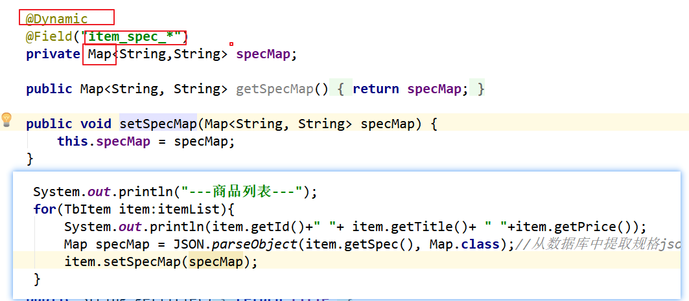

# PYG笔记_Day09

# 第1节课
## 1.1 今日知识点
```
solr
springDataSolr
```
## 1.2 今日目标

```
目标1：完成solr环境安装、中文分析器和业务域的配置
目标2：会使用Spring Data Solr完成增删改查操作
目标3：完成批量数据导入功能
目标4：完成按关键字搜索功能
```

## 1.3课程内容
### 1.3.1 .今日目标
**视频信息**
```
视频名称: 01.今日目标
视频时长: 01:42
```
### 1.3.2 .什么是solr
**视频信息**
```
视频名称: 02.什么是solr
视频时长: 02:40
```
**小节内容**
```
Lucene: 基于java 开发的搜索工具

Solr:是一个流行的开源搜索服务器 
	底层是 Lucene ,跨平台
	
Solr可以和Hadoop一起使用。由于Hadoop处理大量数据，Solr帮助我们从这么大的源中找到所需的信息。不仅限于搜索，Solr也可以用于存储目的。像其他NoSQL数据库一样，它是一种非关系数据存储和处理技术。
```
### 1.3.3 .solr安装
**视频信息**
```
视频名称: 03.solr安装
视频时长: 10:23
```
```
1：安装 Tomcat，解压缩即可。
2：解压 solr。
3：把 solr 下的dist目录solr-4.10.3.war部署到 Tomcat\webapps下(去掉版本号)。
4：启动 Tomcat解压缩 war 包
5：把solr下example/lib/ext 目录下的所有的 jar 包，添加到 solr 的工程中(\WEB-INF\lib目录下)。
6：创建一个 solrhome 。solr 下的/example/solr 目录就是一个 solrhome。复制此目录到D盘改名为solrhome  
7：关联 solr 及 solrhome。需要修改 solr 工程的 web.xml 文件。
    <env-entry>
       <env-entry-name>solr/home</env-entry-name>
       <env-entry-value>d:\solrhome</env-entry-value>
       <env-entry-type>java.lang.String</env-entry-type>
    </env-entry>
8：启动 Tomcat
http://IP:8080/solr/
```


#### solor 查询参数

```

q - 查询字符串，必须的。
fl - 指定返回那些字段内容，用逗号或空格分隔多个。
start - 返回第一条记录在完整找到结果中的偏移位置，0开始，一般分页用。
rows - 指定返回结果最多有多少条记录，配合start来实现分页。
sort - 排序，格式：sort=<field name>+<desc|asc>[,<field name>+<desc|asc>]。示例：（inStock desc, price asc）表示先 "inStock" 降序, 再 "price" 升序，默认是相关性降序。
wt - (writer type)指定输出格式，可以有 xml, json, php, phps。
fq - （filter query）过虑查询，作用：在q查询符合结果中同时是fq查询符合的，例如：q=mm&fq=date_time:[20081001 TO 20091031]，找关键字mm，并且date_time是20081001到20091031之间的
```

solr  语法(java 代码可用,但是solr 控制台不可用)

```
: 指定字段查指定值，如返回所有值:
? 表示单个任意字符的通配
* 表示多个任意字符的通配（不能在检索的项开始使用*或者?符号）
~ 表示模糊检索，如检索拼写类似于"roam"的项这样写：roam~将找到形如foam和roams的单词；roam~0.8，检索返回相似度在0.8以上的记录。 邻近检索，如检索相隔10个单词的"apache"和"jakarta"，"jakarta apache"~10
^ 控制相关度检索，如检索jakarta apache，同时希望去让"jakarta"的相关度更加好，那么在其后加上""符号和增量值，即jakarta4 apache
布尔操作符AND、||
布尔操作符OR、&&
布尔操作符NOT、!、-（排除操作符不能单独与项使用构成查询）
+ 存在操作符，要求符号"+"后的项必须在文档相应的域中存在
() 用于构成子查询
[] 包含范围检索，如检索某时间段记录，包含头尾，date:[200707 TO 200710]
{}不包含范围检索，如检索某时间段记录，不包含头尾，date:{200707 TO 200710}
" 转义操作符，特殊字符包括+ - && || ! ( ) { } [ ] ^ " ~ * ? : "
```


### 1.3.4 .solr中文分析器

**视频信息**

```
视频名称: 04.solr中文分析器
视频时长: 13:22
```
**小节内容**

```
步骤：
1、把IKAnalyzer2012FF_u1.jar 添加到 solr 工程的 lib 目录下
2、创建WEB-INF/classes文件夹  把扩展词典、停用词词典、配置文件放到 solr 工程的 WEB-INF/classes 目录下。
3、修改 Solrhome 的 schema.xml 文件，配置一个 FieldType，使用 IKAnalyzer
<fieldType name="text_ik" class="solr.TextField">
     <analyzer class="org.wltea.analyzer.lucene.IKAnalyzer"/>
</fieldType>
```

**补充**

### 1.3.5 .solr域-1
**视频信息**
```
视频名称: 05.solr域-1
视频时长: 15:14
```
**小节内容**


### 1.3.6 .solr域-2
**视频信息**
```
视频名称: 06.solr域-2
视频时长: 03:57
```
**小节内容**

```xml
<fieldType name="text_ik" class="solr.TextField">
		<analyzer class="org.wltea.analyzer.lucene.IKAnalyzer"/>
</fieldType
```


```xml
<field name="item_goodsid" type="long" indexed="true" stored="true"/>
<field name="item_title" type="text_ik" indexed="true" stored="true"/>
<field name="item_price" type="double" indexed="true" stored="true"/>
<field name="item_image" type="string" indexed="false" stored="true" />
	<field name="item_category" type="string" indexed="true" stored="true" />
	<field name="item_seller" type="text_ik" indexed="true" stored="true" />
	<field name="item_brand" type="string" indexed="true" stored="true" />

```

### 1.3.7 .solr域-3
**视频信息**
```
视频名称: 07.solr域-3
视频时长: 03:52
```
**小节内容**
```xml
<field name="item_keywords" type="text_ik" indexed="true" stored="false" multiValued="true"/>
<copyField source="item_title" dest="item_keywords"/>
<copyField source="item_category" dest="item_keywords"/>
<copyField source="item_seller" dest="item_keywords"/>
<copyField source="item_brand" dest="item_keywords"/>

```
**补充**

复制域的作用:

​	未来我们搜索的时候只需要所搜 item_keywords 这一个字段即可,item_keywords  字段的值包含了其他字段的值

### 1.3.8 .solr域-4
**视频信息**
```
视频名称: 08.solr域-4
视频时长: 03:58
```
**小节内容**


```
动态域,我们可以动态的指定域的字段名称
```

```xml
 <dynamicField name="item_spec_*" type="string" indexed="true" stored="true" />	
```


### 1.3.9 .SpringDataSolr简介

**视频信息**
```
视频名称: 09.SpringDataSolr简介
视频时长: 08:41
```
**小节内容**
```
solrJ :(http 请求响应的封装)
Spring Data Solr :(对solrJ 的封装)
```
### 1.3.10 .springdataSolr入门-准备
**视频信息**
```
视频名称: 10.springdataSolr入门-准备
视频时长: 05:34
```


### 1.3.11 .springdataSolr入门-注解

**视频信息**
```
视频名称: 11.springdataSolr入门-注解
视频时长: 05:45
```
```
@Field
private Long id;//在solr 的schema 中配置文件中已经 line:123 已经定义了一个 字段为id  必须传递
@Field("item_title")
```


### 1.3.12 .springdataSolr入门-增加修改

**视频信息**
```
视频名称: 12.springdataSolr入门-增加修改
视频时长: 08:14
```
### 1.3.13 .springdataSolr入门-根据主键查询删除
**视频信息**
```
视频名称: 13.springdataSolr入门-根据主键查询删除
视频时长: 03:15
```
### 1.3.14 .springdataSolr入门-批量插入数据
**视频信息**

```
视频名称: 14.springdataSolr入门-批量插入数据
视频时长: 05:09
```
### 1.3.15 .springdataSolr入门-分页查询
**视频信息**
```
视频名称: 15.springdataSolr入门-分页查询
视频时长: 08:02
```
**小节内容**
```
　“:”  指定字段查指定值，如返回所有值*:*

　　“?”  表示单个任意字符的通配

　　“*”  表示多个任意字符的通配（不能在检索的项开始使用*或者?符号）

　　“~”  表示模糊检索，如检索拼写类似于”roam”的项这样写：roam~将找到形如foam和roams的单词；roam~0.8，检索返回相似度在0.8以上的记录。

　　AND、||  布尔操作符

　　OR、&&  布尔操作符

　　NOT、!、-（排除操作符不能单独与项使用构成查询）

　　“+”  存在操作符，要求符号”+”后的项必须在文档相应的域中存在²

　　( )  用于构成子查询

　　[]  包含范围检索，如检索某时间段记录，包含头尾，date:[201507 TO 201510]

　　{}  不包含范围检索，如检索某时间段记录，不包含头尾date:{201507 TO 201510}
```
### 1.3.16 .springdataSolr入门-条件查询
**视频信息**
```
视频名称: 16.springdataSolr入门-条件查询
视频时长: 05:24
```
```
criteria=criteria.is("item_keywords").contains("黑炭");

criteria=criteria.and("item_keywords").contains("黑炭");
注意:
and 和 is 的区别
 is: 会将案例中的 黑炭 进行分词,然后会根据分开的词语模糊查询返回
 and 不会分词 直接查询

如果 查询条件中含有空格,则报错
```


### 1.3.17 .springdataSolr入门-全部删除

**视频信息**
```
视频名称: 17.springdataSolr入门-全部删除
视频时长: 02:14
```
### 1.3.18 .批量数据导入-商品列表数据
**视频信息**
```
视频名称: 18.批量数据导入-商品列表数据
视频时长: 15:42
```
### 1.3.19 .批量数据导入-批量导入
**视频信息**
```
视频名称: 19.批量数据导入-批量导入
视频时长: 04:56
```
### 1.3.20 .批量数据导入-规格数据
**视频信息**
```
视频名称: 20.批量数据导入-规格数据
视频时长: 09:09
```


### 1.3.21 .关键字搜索-后端-准备工作

**视频信息**
```
视频名称: 21.关键字搜索-后端-准备工作
视频时长: 08:01
```
**小节内容**
```

```
**补充**
```

```
### 1.3.22 .关键字搜索-后端-服务接口
**视频信息**
```
视频名称: 22.关键字搜索-后端-服务接口
视频时长: 04:03
```
**小节内容**
```

```
**补充**
```

```
### 1.3.23 .关键字搜索-后端-服务实现层
**视频信息**
```
视频名称: 23.关键字搜索-后端-服务实现层
视频时长: 07:12
```


### 1.3.24 .关键字搜索-后端-控制层
**视频信息**
```
视频名称: 24.关键字搜索-后端-控制层
视频时长: 06:38
```
**小节内容**
```

```
**补充**
```

```
### 1.3.25 .关键字搜索-后端-控制层-2
**视频信息**
```
视频名称: 25.关键字搜索-后端-控制层-2
视频时长: 07:46
```
timeout 配置优先级(由高到底)


### 1.3.26 .关键字搜索-前端-服务层和控制层
**视频信息**
```
视频名称: 26.关键字搜索-前端-服务层和控制层
视频时长: 05:38
```
**小节内容**
```

```
**补充**
```

```
### 1.3.27 .关键字搜索-前端-页面
**视频信息**
```
视频名称: 27.关键字搜索-前端-页面
视频时长: 06:17
```
**小节内容**
```

```
**补充**
```

```
### 1.3.28 .关键字搜索-测试
**视频信息**
```
视频名称: 28.关键字搜索-测试
视频时长: 03:05
```
**小节内容**
```

```
**补充**
```

```
### 1.3.29 答疑
**视频信息**
```
视频名称: 问题答疑
视频时长: 04:44
```
## 今日内容容

```
1) solr 安装
2) springdatasolr 操作
3) 把mysql 数据导入solr
4) 商品搜索
```
