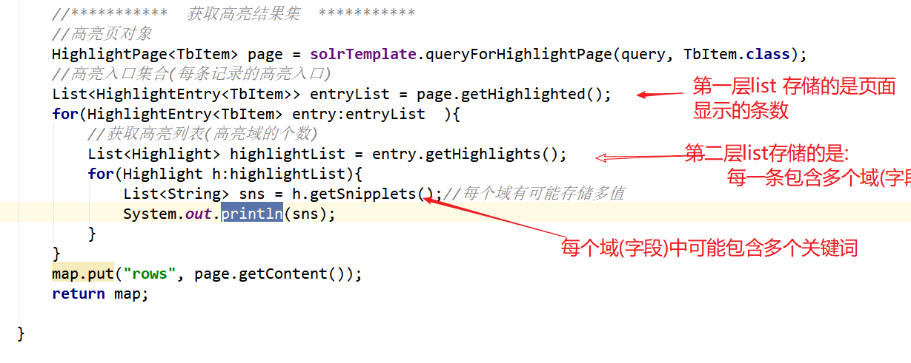
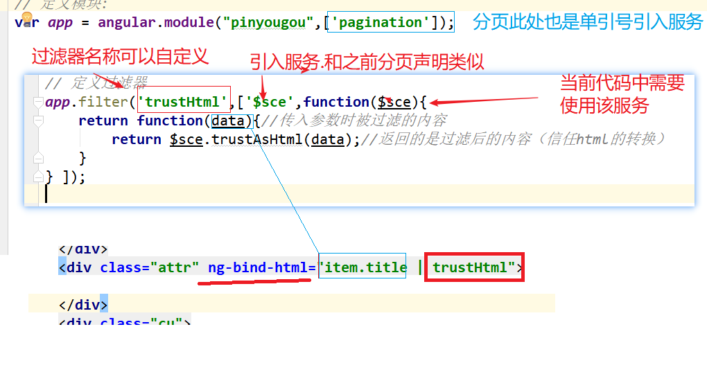
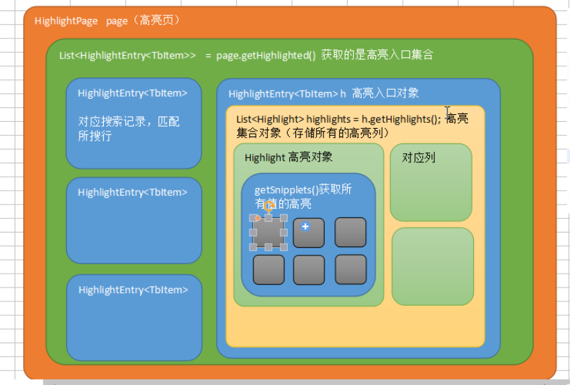

# PYG笔记_Day10
# 第1节课
## 1.1 今日知识点
```
 springDataSolr
  1)高亮显示
  2)分组查询
 angularJs
  1) 过滤器
  2) $sce 服务
  3) ng-bind-html="item.title | trustHtml" 调用过滤器
```
## 1.2 今日目标
## 1.3课程内容
### 1.3.1 .今日目标
**视频信息**
```
视频名称: 01.今日目标
视频时长: 03:32
```
**小节内容**
```
目标1：实现品优购搜索结果高亮显示功能
目标2：说出品优购搜索的业务规则和实现思路
目标3：完成查询分类列表的功能
目标4：完成缓存品牌和规格数据的功能
目标5：完成显示品牌和规格数据的功能
目标6：完成过滤条件构建的功能
目标7：完成过滤查询的功能
```
### 1.3.2 .高亮显示-后端
**视频信息**

```
视频名称: 02.高亮显示-后端
视频时长: 23:52
```
**小节内容**

```java
HighlightQuery query=new SimpleHighlightQuery();	
//高亮域
HighlightOptions highlightOptions=new HighlightOptions().addField("item_title");
		highlightOptions.setSimplePrefix("<em style='color:red'>");//前缀
		highlightOptions.setSimplePostfix("</em>");		
		query.setHighlightOptions(highlightOptions);//为查询对象设置高亮选项
```


      

### 1.3.3 .高亮显示-前端
**视频信息**
```
视频名称: 03.高亮显示-前端
视频时长: 14:07
```
**小节内容**

```
思考>:前端为何不显示样式?
	angular js 安全机制自动拦截了
	
关于 $sce 的一个详细讲解
https://www.cnblogs.com/lyy-2016/p/7928728.html
	
```


### 1.3.4 .业务规则-需求分析

**视频信息**
```
视频名称: 04.业务规则-需求分析
视频时长: 08:47
```
**小节内容**
```
业务规则这里我们参考了京东的搜索页的业务逻辑
```
### 1.3.5 .实现思路与代码结构优化
**视频信息**
```
视频名称: 05.实现思路与代码结构优化
视频时长: 10:47
```
**小节内容**
```

```
**补充**
```

```
### 1.3.6 .商品分类列表-后端（分组查询）
**视频信息**
```
视频名称: 06.商品分类列表-后端（分组查询）
视频时长: 17:25
```
**小节内容**

**补充**

### 1.3.7 .商品分类列表-前端
**视频信息**
```
视频名称: 07.商品分类列表-前端
视频时长: 04:38
```
**小节内容**
```

```
**补充**
```

```
### 1.3.8 .缓存品牌和规格数据的整体思路
**视频信息**
```
视频名称: 08.缓存品牌和规格数据的整体思路
视频时长: 07:46
```
**小节内容**
```

```
**补充**
```

```
### 1.3.9 .缓存模板ID
**视频信息**
```
视频名称: 09.缓存模板ID
视频时长: 06:18
```
**小节内容**
```

```
**补充**
```

```
### 1.3.10 .缓存品牌列表和规格列表
**视频信息**
```
视频名称: 10.缓存品牌列表和规格列表
视频时长: 08:45
```
**小节内容**
```

```
**补充**
```

```
### 1.3.11 .缓存数据测试
**视频信息**
```
视频名称: 11.缓存数据测试
视频时长: 03:23
```
**小节内容**
```

```
**补充**
```

```
### 1.3.12 .显示品牌和规格列表-后端
**视频信息**
```
视频名称: 12.显示品牌和规格列表-后端
视频时长: 09:16
```
**小节内容**
```

```
**补充**
```

```
### 1.3.13 .显示品牌和规格列表-前端
**视频信息**
```
视频名称: 13.显示品牌和规格列表-前端
视频时长: 12:18
```
**小节内容**
```

```
**补充**
```

```
### 1.3.14 .搜索条件构建-需求与实现思路
**视频信息**
```
视频名称: 14.搜索条件构建-需求与实现思路
视频时长: 07:14
```
**小节内容**
```

```
**补充**
```

```
### 1.3.15 .搜索条件构建-增加查询条件
**视频信息**
```
视频名称: 15.搜索条件构建-增加查询条件
视频时长: 16:02
```
**小节内容**
```

```
**补充**
```

```
### 1.3.16 .搜索条件构建-撤销查询条件
**视频信息**
```
视频名称: 16.搜索条件构建-撤销查询条件
视频时长: 04:26
```
**小节内容**
```
delete 是js 提供的语法 
delete 操作符用于删除对象的某个属性；如果没有指向这个属性的引用，那它最终会被释放。
```

```js
补充:
	js 中如果一个变量被 var 声明了则不能删除,如果没有加var 则可以删除
var i =1;
delete i; // 不能删除
alert(i);// 结果为 1
j =1;
delete j; // 可以删除
alert(j);// 结果后台报错: 变量未定义

```

js补充: == 和 === 的区别

```

alert(1=="1");// true    == 表示 值相等即可
alert(1==="1"); // false === 要求值和类型都相同才是true
alert(1===1); //true
```


### 1.3.17 .搜索条件构建-隐藏查询面板

**视频信息**
```
视频名称: 17.搜索条件构建-隐藏查询面板
视频时长: 06:07
```
**小节内容**
```
delete 移除js 中的对象
注意:
	var i=0 ;
	delete i ; 可以移除
	但是如果一个变量没有使用var 
	i=0;
	则无法移除,delete 失效
```
**补充**
```

```
### 1.3.18 .过滤查询-分类过滤
**视频信息**
```
视频名称: 18.过滤查询-分类过滤
视频时长: 07:33
```
**小节内容**
```

```
**补充**
```

```
### 1.3.19 .过滤查询-品牌过滤
**视频信息**
```
视频名称: 19.过滤查询-品牌过滤
视频时长: 02:08
```
**小节内容**
```

```
**补充**
```

```
### 1.3.20 .过滤查询-规格过滤
**视频信息**
```
视频名称: 20.过滤查询-规格过滤
视频时长: 05:53
```
**小节内容**
```

```
**补充**
```

```
### 1.3.21 .过滤查询-根据分类查询品牌和规格列表
**视频信息**
```
视频名称: 21.过滤查询-根据分类查询品牌和规格列表
视频时长: 04:05
```
**小节内容**
```

```
**补充**
```

```
### 1.3.22 答疑
**视频信息**
```
视频名称: 问题答疑
视频时长: 06:26
```



```

```

