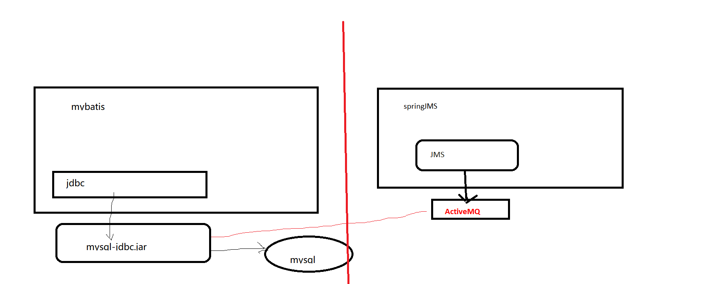
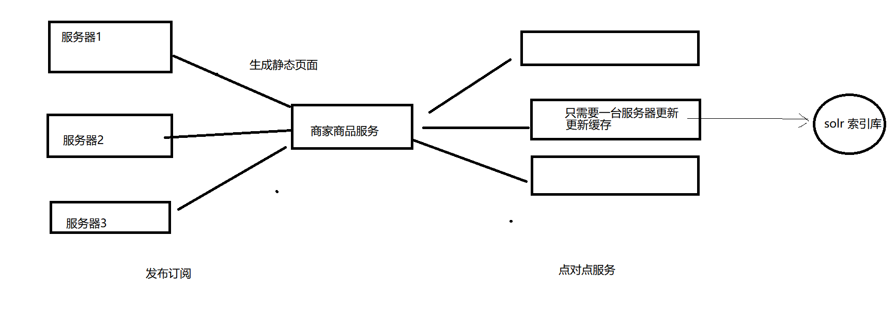
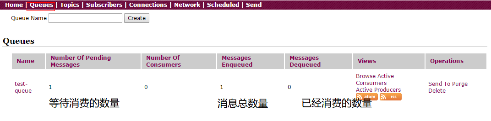

# PYG笔记_Day13
# 第1节课
## 1.1 今日知识点
```
1)ActiveMQ
2)springJMS
```
## 1.2 今日目标
```
目标1：理解消息中间件、JMS等概念
目标2：掌握JMS点对点与发布订阅模式的收发消息
目标3：掌握SpringJms
目标4：完成商品审核导入索引库
目标5：完成商品删除移除索引库
目标6: 完成商品审核生成商品详细页
目标7: 完成商品删除完成删除商品详细页

```
## 1.3课程内容
### 1.3.1 .今日目标 01:06
### 1.3.2 .系统模块分析 04:05(理解)
**小节内容**

```
系统之间模块之间的耦合性较强
```
**补充**
```
MQ的使用场景
  https://www.cnblogs.com/HigginCui/p/6478613.html
```
### 1.3.3 .消息中间件(了解)
**视频信息**
```
视频名称: 03.消息中间件
视频时长: 11:22
```
**小节内容**
```
1)ActiveMQ
	ActiveMQ 是Apache出品，最流行的，能力强劲的开源消息总线。ActiveMQ 是一个完全支持JMS1.1和J2EE 1.4规范的 JMS Provider实现。我们在本次课程中介绍 ActiveMQ的使用。
	
2)Kafka
	Apache下的一个子项目 。特点：高吞吐，在一台普通的服务器上既可以达到10W/s的吞吐速率；完全的分布式系统。适合处理海量数据。

```
**补充**(理解)

```
消息中间件的优势
	1) 服务解耦
    2) 提升效率
什么样的场景适合消息中间件
	1) 不需要返回结果
	2) 调用时间相对较长

```

### 1.3.4 .JMS介绍(理解)
**视频信息**

```
视频名称: 04.JMS介绍
视频时长: 06:05
```
**小节内容**

JMS（Java Messaging Service）是Java平台上有关面向消息中间件的技术规范
JMS本身只定义了一系列的<font color='#FF4500'>**接口规范**</font>，是一种与厂商无关的 API，

**消息正文格式**

```
· TextMessage--一个字符串对象
· MapMessage--一套名称-值对
· ObjectMessage--一个序列化的 Java 对象
· BytesMessage--一个字节的数据流
· StreamMessage -- Java 原始值的数据流

```



### 1.3.5 .JMS消息传递的类型(: 05:01)

**视频信息**

**小节内容**

```
点对点 
	
发布/ 订阅模式
	广播
```
**补充**



### 1.3.6 .activeMQ安装与使用
**视频信息**
```
视频名称: 06.activeMQ安装与使用
视频时长: 08:54
```
**小节内容**
```
安装步骤参考word文档
```
**补充**
```
linux 命令chmod 755的意思
chmod是Linux下设置文件权限的命令，后面的数字表示不同用户或用户组的权限。
一般是三个数字：
第一个数字表示文件所有者的权限
第二个数字表示与文件所有者同属一个用户组的其他用户的权限
第三个数字表示其它用户组的权限。
      权限分为三种：读（r=4），写（w=2），执行（x=1） 。 综合起来还有可读可执行（rx=5=4+1）、可读可写（rw=6=4+2）、可读可写可执行(rwx=7=4+2+1)。
      所以，chmod 755 设置用户的权限为： 
      	1.文件所有者可读可写可执行                                    --7
		2.与文件所有者同属一个用户组的其他用户可读可执行 --5 
		3.其它用户组可读可执行                                          --5


```



### 1.3.7 .点对点模式-消息生产者

**视频信息**
```
视频名称: 07.点对点模式-消息生产者
视频时长: 18:25
```
**小节内容**
```

```
**补充**
```
程序使用的端口号是61616 协议是tcp
	tcp://192.168.25.135:61616
管理控制台使用的端口是8161,协议是http
	http://192.168.25.135:8161
```
### 1.3.8 .点对点模式-消息消费者
**视频信息**
```
视频名称: 08.点对点模式-消息消费者
视频时长: 11:41
```
**小节内容**
```

```
**补充**
```

```
### 1.3.9 .发布订阅模式-消息生产者
**视频信息**
```
视频名称: 09.发布订阅模式-消息生产者
视频时长: 02:58
```
**小节内容**
```

```
**补充**
```

```
### 1.3.10 .发布订阅模式-消息消费者
**视频信息**
```
视频名称: 10.发布订阅模式-消息消费者
视频时长: 05:20
```
如果消息发布的时候订阅者宕机,则接受不到消息

为了保证一定能收到消息,则需要使用 持久化订阅模式,如下

注意:

```
持久化订阅模式要先启动客户端,让 MQ 知道客户端的存在,之后关闭客户端才能接收到客户端断开连接时间的消息
```


**持久化订阅模式**

```
public static void main(String[] args) throws JMSException, IOException {
		//1.创建连接工厂
		ConnectionFactory connectionFactory=new ActiveMQConnectionFactory("tcp://192.168.25.135:61616");
		//2.创建连接
		Connection connection = connectionFactory.createConnection();
		// 持久化订阅模式
		connection.setClientID("clientID_001");

		//3.启动连接
		connection.start();
		//4.获取session(会话对象)  参数1：是否启动事务  参数2：消息确认方式
		Session session = connection.createSession(false, Session.AUTO_ACKNOWLEDGE);
		//5.创建主题对象
		Topic topic = session.createTopic("test-topic");		
		//6.创建消息消费者对象
		//MessageConsumer consumer = session.createConsumer(topic);
		//注意 持久化订阅模式 要先启动 客户端,让 MQ 知道客户端的存在,之后关闭客户端才能接收到客户端断开连接时间的消息
		MessageConsumer consumer = session.createDurableSubscriber(topic,"clientID_001");
		//7.设置监听
		consumer.setMessageListener(new MessageListener() {
			
			public void onMessage(Message message) {
				TextMessage textMessage=(TextMessage)message;
				try {

					System.out.println("提取的消息："+ textMessage.getText() );
				} catch (JMSException e) {					
					e.printStackTrace();
				}
				
			}
		});
		//8.等待键盘输入
		System.in.read();
		
		//9.关闭资源
		consumer.close();
		session.close();
		connection.close();


	}
```
### 1.3.11 .springJMS-点对点-消息生产者
**视频信息**
```
视频名称: 11.springJMS-点对点-消息生产者
视频时长: 18:02
```
**小节内容**
```

```
**补充**
```
spring 头报错 使用如下头
<?xml version="1.0" encoding="UTF-8"?>
<beans xmlns="http://www.springframework.org/schema/beans"
	   xmlns:context="http://www.springframework.org/schema/context"
	   xmlns:xsi="http://www.w3.org/2001/XMLSchema-instance"
	   xmlns:amq="http://activemq.apache.org/schema/core"

	xmlns:jms="http://www.springframework.org/schema/jms"
	xsi:schemaLocation="http://www.springframework.org/schema/beans   
		http://www.springframework.org/schema/beans/spring-beans.xsd
		http://www.springframework.org/schema/context   
		http://www.springframework.org/schema/context/spring-context.xsd
	http://activemq.apache.org/schema/core
	http://activemq.apache.org/schema/core/activemq-core-5.13.4.xsd
">
```
### 1.3.12 .springJMS-点对点-消息消费者
**视频信息**
```
视频名称: 12.springJMS-点对点-消息消费者
视频时长: 08:29
```
**小节内容**
```

```
**补充**
```

```
### 1.3.13 .springJMS-发布订阅-消息生产者
**视频信息**
```
视频名称: 13.springJMS-发布订阅-消息生产者
视频时长: 03:55
```
**小节内容**
```

```
**补充**
```

```
### 1.3.14 .springJMS-发布订阅-消息消费者
**视频信息**
```
视频名称: 14.springJMS-发布订阅-消息消费者
视频时长: 03:28
```
**小节内容**
```
持久化消息订阅模式
```
**补充**
```xml
<?xml version="1.0" encoding="UTF-8"?>
<beans xmlns="http://www.springframework.org/schema/beans" xmlns:context="http://www.springframework.org/schema/context" xmlns:xsi="http://www.w3.org/2001/XMLSchema-instance" xmlns:amq="http://activemq.apache.org/schema/core"
	xmlns:jms="http://www.springframework.org/schema/jms"
	xsi:schemaLocation="http://www.springframework.org/schema/beans   
		http://www.springframework.org/schema/beans/spring-beans.xsd
		http://www.springframework.org/schema/context   
		http://www.springframework.org/schema/context/spring-context.xsd">
	
    <!-- 真正可以产生Connection的ConnectionFactory，由对应的 JMS服务厂商提供-->  
	<bean id="targetConnectionFactory" class="org.apache.activemq.ActiveMQConnectionFactory">  
	    <property name="brokerURL" value="tcp://192.168.25.135:61616"/>  
	</bean>
	   
    <!-- Spring用于管理真正的ConnectionFactory的ConnectionFactory -->  
	<bean id="connectionFactory" class="org.springframework.jms.connection.SingleConnectionFactory">  
	<!-- 目标ConnectionFactory对应真实的可以产生JMS Connection的ConnectionFactory -->  
	    <property name="targetConnectionFactory" ref="targetConnectionFactory"/>
		<!--<property name="clientId" value="clientId_001"/>-->
	</bean>  
	
    <!--这个是队列目的地，点对点的  文本信息-->
	<bean id="topicTextDestination" class="org.apache.activemq.command.ActiveMQTopic">  
	    <constructor-arg value="topic_text"/>  
	</bean>    
	
	<!-- 我的监听类 -->
	<bean id="myMessageListener" class="cn.itcast.demo.MyMessageListener"></bean>
	
	
	<!-- 消息监听容器 -->
	<bean class="org.springframework.jms.listener.DefaultMessageListenerContainer">
		<property name="connectionFactory" ref="connectionFactory" />
		<property name="destination" ref="topicTextDestination" />
		<property name="messageListener" ref="myMessageListener" />
		<!-- 持久啊订阅模式 -->
		<!-- 发布订阅模式 -->
		<property name="pubSubDomain" value="true" />
		<!-- 消息持久化值设置为true -->
		<property name="subscriptionDurable" value="true" />
		<!--消息接收超时 -->
		<property name="receiveTimeout" value="10000" />
		<!-- 接收者ID -->
		<property name="clientId" value="clientId_001" />
		<property name="durableSubscriptionName" value="clientId_001" />

	</bean>
	
</beans>
```
### 1.3.15 .商品审核导入索引库-消息生产者-1
**视频信息**
```
视频名称: 15.商品审核导入索引库-消息生产者-1
视频时长: 10:48
```
**小节内容**
```

```
**补充**
```

```
### 1.3.16 .商品审核导入索引库-消息生产者-2
**视频信息**
```
视频名称: 16.商品审核导入索引库-消息生产者-2
视频时长: 08:33
```
**小节内容**
```

```
**补充**
```

```
### 1.3.17 .商品审核导入索引库-消息消费者
**视频信息**
```
视频名称: 17.商品审核导入索引库-消息消费者
视频时长: 08:49
```
**小节内容**
```

```
**补充**
```

```
### 1.3.18 .商品删除移除索引库记录
**视频信息**
```
视频名称: 18.商品删除移除索引库记录
视频时长: 13:00
```
**小节内容**
```

```
**补充**
```

```
### 1.3.19 .商品审核执行网页静态化-架构分析
**视频信息**
```
视频名称: 19.商品审核执行网页静态化-架构分析
视频时长: 08:47
```
**小节内容**
```

```
**补充**
```

```
### 1.3.20 .商品审核生成详细页-消息生产者
**视频信息**
```
视频名称: 20.商品审核生成详细页-消息生产者
视频时长: 07:16
```
**小节内容**
```

```
**补充**
```

```
### 1.3.21 .商品审核生成详细页-消息消费者
**视频信息**
```
视频名称: 21.商品审核生成详细页-消息消费者
视频时长: 09:44
```
**小节内容**
```

```
**补充**
```

```
### 1.3.22 .商品审核生成详细页-测试
**视频信息**
```
视频名称: 22.商品审核生成详细页-测试
视频时长: 02:12
```
**小节内容**
```

```
**补充**
```

```
### 1.3.23 .商品删除-删除商品详细页
**视频信息**
```
视频名称: 23.商品删除-删除商品详细页
视频时长: 12:42
```
**小节内容**
```

```
**补充**
```

```
### 1.3.24 .总结
**视频信息**
```
视频名称: 24.总结
视频时长: 06:54
```
**小节内容**
```

```
**补充**
```

```
