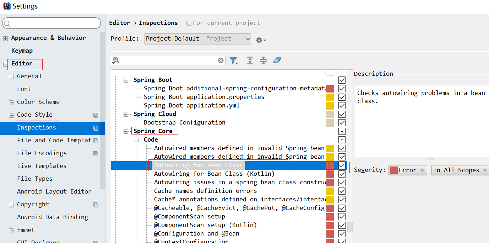

# PYG笔记_Day14
# 第1节课
## 1.1 今日知识点
```
新技术
1.springBoot入门
2.阿里大于短信发送(理解)
业务功能:
	用户注册(附带验证码)
```
## 1.2 今日目标
```

```
## 1.3课程内容
### 1.3.1 .今日目标
**视频信息**
```
视频名称: 01.今日目标
视频时长: 09:00
```
**小节内容**
```
目标1：掌握Spring Boot框架的搭建方法
目标2：能够使用阿里大于发送短信
目标3：运用SpringBoot、阿里大于和ActiveMQ 开发短信微服务
目标4：完成品优购用户注册功能（短信验证码认证）

```
### 1.3.2 .springBoot简介
**视频信息**
```
视频名称: 02.springBoot简介
视频时长: 06:23
```
**小节内容**
```
传统spring 的缺点
	1) 配置繁琐
	2) jar 依赖管理麻烦

```
springBoot 是spring 的一个项目,它把我们使用spring的过程进行了进一步的封装,是开发者更快速的使用spring

<font color=red>Spring Boot 并不是不对 Spring 功能上的增强，而是提供了一种快速使用 Spring 的方式。</font >

```
Spring Boot 具有如下特性：
	1)为基于 Spring 的开发提供更快的入门体验
	2)开箱即用，没有代码生成，也无需 XML 配置。同时也可以修改默认值来满足特定的需求。
	3)提供了一些大型项目中常见的非功能性特性，如嵌入式服务器、安全、指标，健康检测、外部配置等。
```

### 1.3.3 .入门小DEMO-起步依赖
**视频信息**
```
视频名称: 03.入门小DEMO-起步依赖
视频时长: 08:01
```
**小节内容**
```
<parent>
    <groupId>org.springframework.boot</groupId>
    <artifactId>spring-boot-starter-parent</artifactId>
<version>1.4.0.RELEASE</version>
</parent>  
  <dependencies>
    <dependency>
        <groupId>org.springframework.boot</groupId>
        <artifactId>spring-boot-starter-web</artifactId>
    </dependency>
  </dependencies>

```
**补充: 什么是springboot起步依赖**

```
父坐标
```
spring 两大特征

1) 起步依赖

```
通俗的理解
	springboot起步依赖指的就是springboot 想要正常使用必须配置一个坐标
     即springboot 启动依赖于一个(每种功能需依赖一个)maven 坐标,同时spring boot 的启动依赖于一个
     父类坐标和启动坐标内部已经帮我们封装好了我们项目中使用的jar包和版本号
  
```

2) 约定优于配置

```xml
通俗的理解
	我们使用springboot 不能再想之前spring 那样配置文件随意写,必须按照spingboot 的约定来
我们打开 pom 文件的父坐标的pom 能找到如下的配置
<resource>
    <directory>${basedir}/src/main/resources</directory>
    <filtering>true</filtering>
    <includes>
        <include>**/application*.yml</include>
        <include>**/application*.properties</include>
    </includes>
</resource>
这个配置就规定了 
	1) 配置文件的目录必须放在 src/main/resources
    2) 配置文件必须以 application 开头 
    3) 配置文件必须是yml 格式或者是properties 格式
备注
  yml (yaml)是另外一种常用的文件格式,和我们xml,json或者是properties 一样,有指定的格式,其实就是一种普通的文本文件格式,常用于linux 环境的配置文件中
yml 语法教程
https://blog.csdn.net/luanpeng825485697/article/details/79478338
```

### 1.3.4 .入门小Demo-web开发

**视频信息**

```
视频名称: 04.入门小Demo-web开发
视频时长: 12:17
```
**小节内容**

```java
@SpringBootApplication
public class Application {
	public static void main(String[] args) {		
		SpringApplication.run(Application.class, args);
	}
}
1)我们只需要启动一个启动器就ok 了,springboot 内部已经配置了一个tomcat
2)spring boot 会自动扫描带@SpringBootApplication注解的类下所有的包及其子包
	
```
**补充**
```properties
#修改tomcat 默认端口和项目路径的方法
server.port=8088
server.context-path=/springboot-demo
```
静态资源

```
我们的的demo 中并没有静态资源如果想要定义静态资源(html/js/css ) 也必须 按照springBoot 的约定来
约定如下
src/main/resource
          |__________static
                        |_________js
                        |_________images
                        |_________css
                 .....   index.html
```

### 1.3.5 .入门小Demo-读取配置文件和热部署

**视频信息**
```
视频名称: 05.入门小Demo-读取配置文件和热部署
视频时长: 06:51
```
热部署修改配置

1)


1) ctrl_shift+A

 输入 Registry


小节内容**

### 1.3.6 .与activeMQ整合-1(默认点对点模式)
**视频信息**
```
视频名称: 06.与activeMQ整合-1
视频时长: 08:45
```
**小节内容**
```xml
<dependency>
    <groupId>org.springframework.boot</groupId>
    <artifactId>spring-boot-starter-activemq</artifactId>
</dependency>
只要加入上述配置,无需复杂的配置, 可以直接再程序中注入JmsMessagingTemplate 对象(点对点)
@Autowired
	private JmsMessagingTemplate jmsMessagingTemplate;

```
**消息的发送于接受*收

```java
发送
jmsMessagingTemplate.convertAndSend("itcast", text);
接受

@Component
public class Consumer {
	@JmsListener(destination="itcast")
	public void readMessage(String text){
		System.out.println("接收到消息："+text);
	}	
}

```
如果想要使用发布订阅模式需要特殊配置

```
https://blog.csdn.net/jia_costa/article/details/79354478
```

注入报红

​	


### 1.3.7 .与activeMQ整合-2(指定activeMQ 地址)

**视频信息**
```
视频名称: 07.与activeMQ整合-2
视频时长: 02:22
```
**小节内容**
```
spring.activemq.broker-url=tcp://192.168.25.135:61616*
```
### 1.3.8 .与activeMQ整合-3
**视频信息**
```
视频名称: 08.与activeMQ整合-3
视频时长: 04:26
```
**小节内容**
```
传递map 直接传递即可,注意如果map 中存放的是java对象 别忘记序列化(实现Serializable 接口)
```
**补充**

### 1.3.9 .阿里大于-介绍
**视频信息**

```
视频名称: 09.阿里大于-介绍
视频时长: 15:45
```
**小节内容**
```
阿里大于已经被重新划分到阿里云下的短信服务 访问如下地址 今日短信服务控制台
https://dayu.aliyun.com/product/sms
网易云信
https://netease.im/sms
```
**补充**


### 1.3.10 .短信测试
**视频信息**

```
视频名称: 10.短信测试
视频时长: 13:28
```
**小节内容**

```
static final String accessKeyId = "LTAI4c2iz2BtplTn";
    static final String accessKeySecret = "6POPVgnmoGU8GqwdfcT1AzmV2JO88c";
```


****


### 1.3.11 .短信微服务-1
**视频信息**
```
视频名称: 11.短信微服务-1
视频时长: 22:42
```
**小节内容**
```
我们把短信服务单独抽取出一个独立的服务,也叫微服务
```
#### soa和微服务的区别

> | 功能     | SOA                  | 微服务                       |
> | -------- | -------------------- | ---------------------------- |
> | 组件大小 | 大块业务逻辑         | 单独任务或小块业务逻辑       |
> | 耦合     | 通常松耦合           | 总是松耦合                   |
> | 公司架构 | 任何类型             | 小型、专注于功能交叉团队     |
> | 管理     | 着重中央管理         | 着重分散管理                 |
> | 目标     | 确保应用能够交互操作 | 执行新功能、快速拓展开发团队 |

```
其实最主要的区别是 耦合性,传统的soa 服务 ,服务之间是有耦合的,要求服务的提供者和消费者必须有相同的接口
耦合性较强 而微服务是服务之间是没有耦合的(松耦合)
```
### 1.3.12 .短信微服务-2
**视频信息**

```
视频名称: 12.短信微服务-2
视频时长: 04:24
```
**小节内容**
```

```
**补充**
```

```
### 1.3.13 .用户注册-工程搭建
**视频信息**
```
视频名称: 13.用户注册-工程搭建
视频时长: 10:18
```
**小节内容**
```

```
**补充**
```

```
### 1.3.14 .用户注册-代码生成与拷贝
**视频信息**
```
视频名称: 14.用户注册-代码生成与拷贝
视频时长: 10:50
```
**小节内容**
```

```
**补充**
```

```
### 1.3.15 .用户注册-基本注册功能-后端
**视频信息**
```
视频名称: 15.用户注册-基本注册功能-后端
视频时长: 04:28
```
**小节内容**
```

```
**补充**
```

```
### 1.3.16 .用户注册-基本注册功能-前端
**视频信息**
```
视频名称: 16.用户注册-基本注册功能-前端
视频时长: 09:18
```
**小节内容**
```

```
**补充**
```

```
### 1.3.17 .用户注册-验证码实现思路
**视频信息**
```
视频名称: 17.用户注册-验证码实现思路
视频时长: 04:43
```
**小节内容**
```

```
**补充**
```

```
### 1.3.18 .生成验证码-后端
**视频信息**
```
视频名称: 18.生成验证码-后端
视频时长: 13:24
```
**小节内容**
```
//2.将验证码放入redis
		redisTemplate.boundHashOps("smscode").put(phone, smscode);
		redisTemplate.boundHashOps("smscode").expire(5, TimeUnit.MINUTES);// 设置超时时间 为5分钟
```
**补充**
```

```
### 1.3.19 .生成验证码-前端
**视频信息**
```
视频名称: 19.生成验证码-前端
视频时长: 06:00
```
**小节内容**
```

```
**补充**
```

```
### 1.3.20 .校验验证码-代码
**视频信息**
```
视频名称: 20.校验验证码-代码
视频时长: 06:55
```
**小节内容**
```

```
**补充**
```

```
### 1.3.21 .校验验证码-测试
**视频信息**
```
视频名称: 21.校验验证码-测试
视频时长: 02:36
```
**小节内容**
```

```
**补充**
```

```
### 1.3.22 .将消息发送给activeMQ
**视频信息**
```
视频名称: 22.将消息发送给activeMQ
视频时长: 11:13
```
**小节内容**
```

```
**补充**
```

```
### 1.3.23 .验证码注册测试
**视频信息**
```
视频名称: 23.验证码注册测试
视频时长: 03:55
```
**小节内容**
```

```
**补充**
```

```
