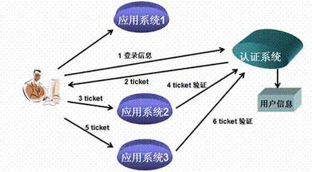
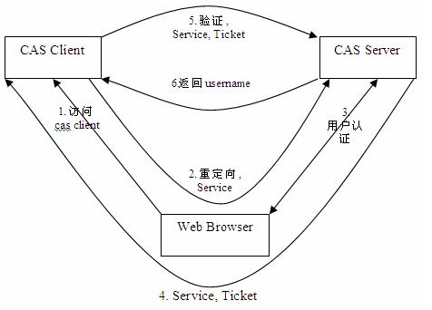
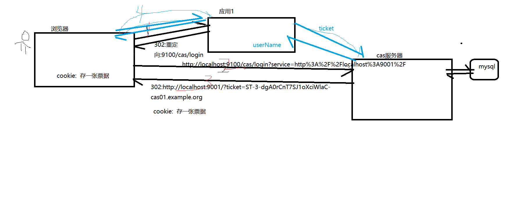

# PYG笔记_Day15
# 第1节课
## 1.1 今日知识点
```
今日知识点,单点登陆
```
## 1.2 今日目标
```

```
## 1.3课程内容
### 1.3.1 .今日目标
**视频信息**
```
视频名称: 01.今日目标
视频时长: 02:58
```
**小节内容**
```
目标1：搭建单点登录服务端，开发单点登录客户端
目标2：实现CAS 认证数据源设置
目标3：更换CAS 登录页面
目标4：掌握CAS与SpringSecurity集成 
目标5：完成用户中心单点登录功能 
```


### 1.3.2 .系统架构分析
**视频信息**
```
视频名称: 02.系统架构分析
视频时长: 05:04
```
**小节内容**
```
为什么使用单点登陆
	我们目前的系统存在诸多子系统，而这些子系统是分别部署在不同的服务器中，那么使用传统方式的session是无法解决的，我们需要使用相关的单点登录技术来解决
```
### 1.3.3 .什么是单点登录
**视频信息**
```
视频名称: 03.什么是单点登录
视频时长: 07:01
```
[单点登录](http://baike.baidu.com/item/%E5%8D%95%E7%82%B9%E7%99%BB%E5%BD%95)（Single Sign On），简称为 SSO，是目前比较流行的企业业务整合的解决方案之一。SSO的定义是在多个应用系统中，用户只需要登录一次就可以访问所有相互信任的应用系统。



### 1.3.4 .什么是CAS
**视频信息**
```
视频名称: 04.什么是CAS
视频时长: 12:58
```
**小节内容**
```
CAS 是 Yale 大学发起的一个开源项目，旨在为 Web 应用系统提供一种可靠的单点登录方法，CAS 在 2004 年 12 月正式成为 JA-SIG 的一个项目。CAS 具有以下特点：
【1】开源的企业级单点登录解决方案。
【2】CAS Server 为需要独立部署的 Web 应用。
【3】CAS Client 支持非常多的客户端(这里指单点登录系统中的各个 Web 应用)，包括 Java, .Net, PHP, Perl, Apache, uPortal, Ruby 等。

```




### 1.3.5 .CAS服务端部署

**视频信息**

```
视频名称: 05.CAS服务端部署
视频时长: 08:17
```
课堂提供给大家的服务器

### 1.3.6 .CAS服务端配置

**视频信息**
```
视频名称: 06.CAS服务端配置
视频时长: 16:13
```
**小节内容**
```
1)我们已经配置了一个solr 可以将cas 和solr 部署在同一个tomcat 中
2) 如果单独配置部署,按照文档的步骤 配置
	solr 和cas 不能同启动需要修改tomcat 端口占用如下

```
tomcat 端口修改
```
1) server.xml

22行 : <Server port="8005" shutdown="SHUTDOWN"> 改为8006
93行: <Connector port="8010" protocol="AJP/1.3" redirectPort="8443" /> 8009 改为 8010
```
### 1.3.7 .CAS客户端入门小demo
**视频信息**
```
视频名称: 07.CAS客户端入门小demo
视频时长: 18:43
```
**小节内容**
```

```
**补充**
```

```
### 1.3.8 .单点退出
**视频信息**
```
视频名称: 08.单点退出
视频时长: 07:17
```
**小节内容**
```

```
**补充**
```

```
### 1.3.9 .数据源配置
**视频信息**
```
视频名称: 09.数据源配置
视频时长: 13:40
```
**小节内容**
```
改为数据库登陆以后,发现 我们不知道数据库密码
  执行如下sql 将数据库登陆密码改为123456
  UPDATE tb_user SET PASSWORD='e10adc3949ba59abbe56e057f20f883e'

```
**补充**
```

```
### 1.3.10 .登录界面改造
**视频信息**
```
视频名称: 10.登录界面改造
视频时长: 15:26
```
**小节内容**
```

```
**补充**
```

```
### 1.3.11 .错误信息提示
**视频信息**
```
视频名称: 11.错误信息提示
视频时长: 14:12
```
**小节内容**
```
国际化:i18N
	i18n（其来源是英文单词 internationalization的首末字符i和n，18为中间的字符数）是“国际化”的简称。在资讯领域，国际化(i18n)指让产品（出版物，软件，硬件等）无需做大的改变就能够适应不同的语言和地区的需要。对程序来说，在不修改内部代码的情况下，能根据不同语言及地区显示相应的界面。 在全球化的时代，国际化尤为重要，因为产品的潜在用户可能来自世界的各个角落
	
```
**补充**
```
http://www.bejson.com/convert/unicode_chinese/
```
### 1.3.12 .搭建springSecurity工程
**视频信息**
```
视频名称: 12.搭建springSecurity工程
视频时长: 07:13
```
**小节内容**
```
权限5张表
 1)user     ----  账户名,密码等
2)user_role  
 3) Role    ---- 角色  
4) role_menu      
5) 菜单 表 menu
```
**补充**
```

```
### 1.3.13 .springSecurity与cas集成-1
**视频信息**
```
视频名称: 13.springSecurity与cas集成-1
视频时长: 11:06
```
**小节内容**
```
casProcessingFilterEntryPoint: 
  入口点引用,声明登陆功能的处理类
 
```
### 1.3.14 .springSecurity与cas集成-2
**视频信息**
```
视频名称: 14.springSecurity与cas集成-2
视频时长: 05:24
```
**小节内容**
```xml
<!-- custom-filter为过滤器， position 表示将过滤器放在指定的位置上，before表示放在指定位置之前  ，after表示放在指定的位置之后  --> 
     <!--认证过滤器 -->
        <custom-filter ref="casAuthenticationFilter"  position="CAS_FILTER" />   
     <!--单点登出认证过滤器 ,spring 配置对登出功能的增强-->
        <custom-filter ref="requestSingleLogoutFilter" before="LOGOUT_FILTER"/> 
<!--单点登出认证过滤器 ,源生,服务器端的登出-->
        <custom-filter ref="singleLogoutFilter" before="CAS_FILTER"/> 
        
CAS_FILTER,LOGOUT_FILTER 是内置好的一些过滤器
```
### 1.3.15 .springSecurity与cas集成-3
**视频信息**
```
视频名称: 15.springSecurity与cas集成-3
视频时长: 06:35
```
### 1.3.16 .springSecurity与cas集成-4
### 1.3.17 .springSecurity与cas集成-5
### 1.3.18 .springSecurity与cas集成-6
### 1.3.19 .获取当前登录名
**视频信息**
```
视频名称: 19.获取当前登录名
视频时长: 06:18
```
**小节内容**

配置和其他web 项目的配置是一样的 

```java
@RequestMapping("/findLoginUser")
	public void  findLoginUser(){
		String name = SecurityContextHolder.getContext().getAuthentication().getName();
		System.out.println(name);		
	}	

```
**补充**
```

```
### 1.3.20 .与cas集成退出登录
**视频信息**
```
视频名称: 20.与cas集成退出登录
视频时长: 05:24
```
**小节内容**
```

```
**补充**
```

```
### 1.3.21 .品优购-用户中心实现单点登录
**视频信息**
```
视频名称: 21.品优购-用户中心实现单点登录
视频时长: 14:37
```
**小节内容**
```

```
**补充**
```

```
### 1.3.22 .品优购显示登陆用户名
**视频信息**
```
视频名称: 22.品优购显示登陆用户名
视频时长: 07:58
```
**小节内容**
```

```
**补充**
```

```
### 1.3.23 .品优购-退出登录
**视频信息**
```
视频名称: 23.品优购-退出登录
视频时长: 02:24
```
**小节内容**
```

```
**补充**
```

```
