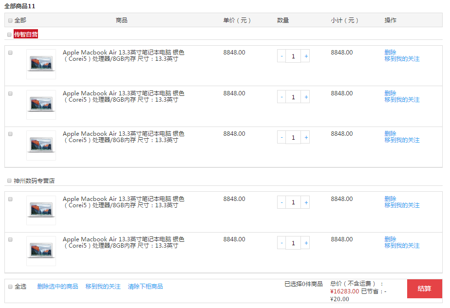
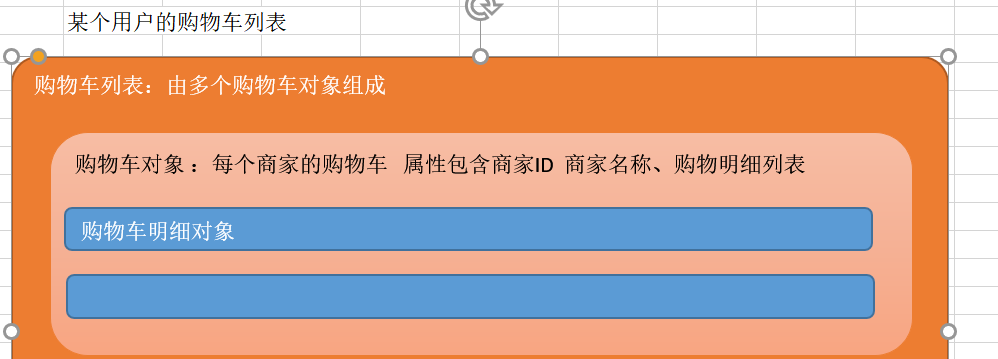
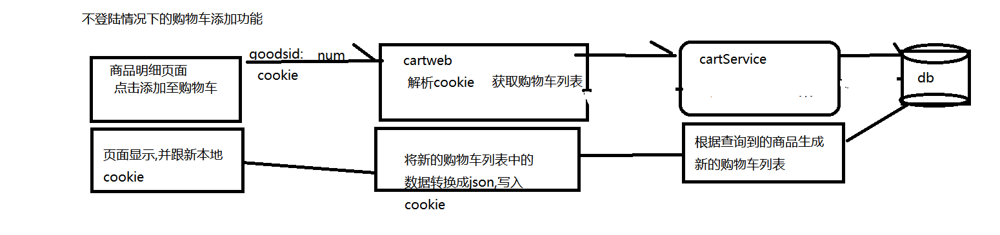
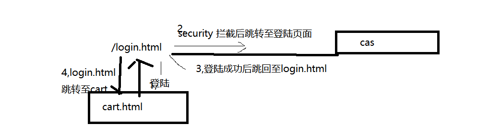

# PYG笔记_Day16
# 第1节课
## 1.1 今日知识点
```
cookies
redies
```
## 1.2 今日目标
```
目标1：说出品优购购物车的实现思路
目标2：运用Cookie存储购物车
目标3：编写购物车前端代码
目标4：运用Redis存储购物车
```
## 1.3课程内容
### 1.3.1 .今日目标
**视频信息**
```
视频名称: 01.今日目标
视频时长: 02:33
```
### 1.3.2 .需求分析
**视频信息**
```
视频名称: 02.需求分析
视频时长: 03:04
```
**小节内容**
```
1)相同商家的商品应该存储在一起
2)相同的商品数据应该累加
```

### 1.3.3 .实现思路
**视频信息**
```
视频名称: 03.实现思路
视频时长: 09:09
```
**小节内容**

```
1)相同商家的商品应该存储在一起
2)相同的商品数据应该累加

3) 当没有登陆时,购物车中的数据存储的cookie 中
2) 当用户登陆后，采用redis存储,并且要将cookie中的购物车合并到redis中，cookie 中的购物车清空


购物车数据模型
```


cartList=[{

​	sellerid:taobao

​        sellerName: 淘宝

​       orderItemList:[{

​		goodsId: 23456789;

​        	goodesName;

​        	pic:   

​       		num:

​       		price:

},{}]

},{}]


### 1.3.4 .工程搭建

**视频信息**

```
视频名称: 04.工程搭建
视频时长: 13:21
```
**小节内容**
```
（1）创建工程pinyougou-cart-interface  ，依赖pinyougou-pojo
（2）创建工程pinyougou-cart-service（WAR），依赖pinyougou-cart-interface 和pinyougou-common工程 和spring、 dubbox  等相关依赖,  添加web.xml 与spring配置文件（参照其他service工程）  tomcat插件端口设置为9007  ，dubbo端口为20887 
（3）创建工程pinyougou-cart-web  ,依赖 pinyougou-cart-interface   springsecurity 、CAS 等。添加web.xml 与spring配置文件（参照其他web工程）tomcat插件端口设置为9107 ，拷贝UserDetailServiceImpl.java  ,  拷贝页面资源
（4）将资源文件夹中 Cookie工具类拷贝到pinyougou-common工程中。需要在pinyougou-common工程引入servlet-api依赖
```
**补充**
```
CookieUtil 中的方法主要有两类:
	设置Cookie, 读取cookie 中的值
使用Cookie的注意事项	
	https://www.cnblogs.com/echohao/p/5377446.html
```
### 1.3.5 .购物车实体类
**视频信息**
```
视频名称: 05.购物车实体类
视频时长: 05:24
```
**小节内容**
```
public class Cart implements Serializable{
	private String sellerId;//商家ID
	private String sellerName;//商家名称
	private List<TbOrderItem> orderItemList;//购物车明细,这里我们使用的时购物车明细
	//getter  and setter  ......
}
```
### 1.3.6 .cookie购物车-后端代码-服务端-1
**视频信息**
```
视频名称: 06.cookie购物车-后端代码-服务端-1
视频时长: 13:52
```
```
//1.根据skuID查询商品明细SKU的对象
//2.根据SKU对象得到商家ID
//3.根据商家ID在购物车列表中查询购物车对象
//4.如果购物车列表中不存在该商家的购物车
//5.如果购物车列表中存在该商家的购物车
```




**补充**

### 1.3.7 .cookie购物车-后端代码-服务端-2
**视频信息**
```
视频名称: 07.cookie购物车-后端代码-服务端-2
视频时长: 15:50
```
**小节内容**
```

```
**补充**
```

```
### 1.3.8 .cookie购物车-后端代码-服务端-3
**视频信息**
```
视频名称: 08.cookie购物车-后端代码-服务端-3
视频时长: 12:55
```
**小节内容**
```

```
**补充**
```
BigDecimal 是 java 提供的处理大数字的工具类
	BigDecimal a= new BigDecimal(100);
        BigDecimal b= new BigDecimal(100);
        System.out.println(a.add(b));// +
        System.out.println(a.subtract(b));// -
        System.out.println(a.multiply(b));// *
        System.out.println(a.divide(b));// /
 /////
 https://www.cnblogs.com/LeoBoy/p/6056394.html
```
### 1.3.9 .cookie购物车-后端代码-控制层
**视频信息**
```
视频名称: 09.cookie购物车-后端代码-控制层
视频时长: 14:45
```
**小节内容**
```

```
**补充**
```
springmvc允许在controller类中通过@Autowired配置request、response以及requestcontext等实例对象。这种配置方法是否线程安全？答案是——这种配置方法是线程安全的
底层使用了ThreadLoal 来控制线程安全问题
```
### 1.3.10 .cookie购物车-后端代码-测试
**视频信息**
```
视频名称: 10.cookie购物车-后端代码-测试
视频时长: 05:14
```
**小节内容**
```

```
**补充**
```

```
### 1.3.11 .购物车前端-购物车列表
**视频信息**
```
视频名称: 11.购物车前端-购物车列表
视频时长: 10:28
```
**小节内容**
```

```
**补充**
```

```
### 1.3.12 .购物车前端-数量增减
**视频信息**
```
视频名称: 12.购物车前端-数量增减
视频时长: 07:24
```
**小节内容**
```

```
**补充**
```

```
### 1.3.13 .购物车前端-合计数
**视频信息**
```
视频名称: 13.购物车前端-合计数
视频时长: 14:50
```
**小节内容**
```

```
**补充**
```

```
### 1.3.14 .获取当前登录人
**视频信息**
```
视频名称: 14.获取当前登录人
视频时长: 12:37
```
**小节内容**
```
access="IS_AUTHENTICATED_ANONYMOUSLY" 用于设置资源可以在不登陆时可以访问
```
**补充**
```

```
### 1.3.15 .远程购物车存取-后端-1
**视频信息**
```
视频名称: 15.远程购物车存取-后端-1
视频时长: 06:43
```
**小节内容**
```

```
**补充**
```

```
### 1.3.16 .远程购物车存取-后端-2
**视频信息**
```
视频名称: 16.远程购物车存取-后端-2
视频时长: 03:57
```
**小节内容**

```
1)如果没有登陆则,直接从cookie中获取即可,无需操作redis
2)如果登陆了则读取需要从
```
**补充**
```

```
### 1.3.17 .远程购物车存取-测试
**视频信息**
```
视频名称: 17.远程购物车存取-测试
视频时长: 05:19
```
**小节内容**
```

```
**补充**
```

```
### 1.3.18 .跳板页
**视频信息**
```
视频名称: 18.跳板页
视频时长: 05:42
```
**小节内容**
```
<script type="text/javascript">
		location.href="cart.html";
</script>
```
**补充**跳板页逻辑



### 1.3.19 .合并购物车-1
**视频信息**
```
视频名称: 19.合并购物车-1
视频时长: 08:25
```
**小节内容**
```

```
**补充**
```

```
### 1.3.20 .合并购物车-2
**视频信息**
```
视频名称: 20.合并购物车-2
视频时长: 07:29
```
**小节内容**
```

```
**补充**
```

```
### 1.3.21 .合并购物车-测试
**视频信息**
```
视频名称: 21.合并购物车-测试
视频时长: 03:41
```
**小节内容**
```

```
**补充**
```

```
### 1.3.22 .总结
**视频信息**
```
视频名称: 22.总结
视频时长: 05:03
```
**小节内容**
```

```
**补充**
```

```
