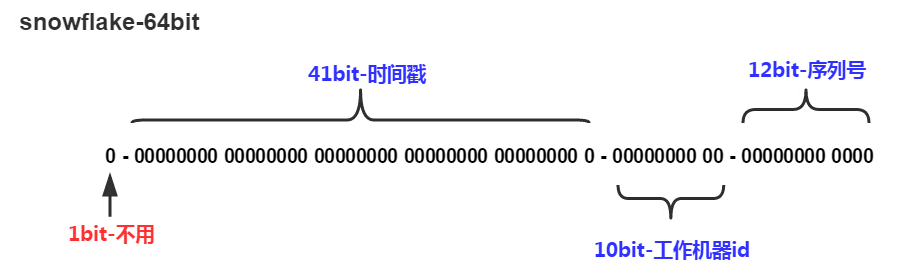

# PYG笔记_Day17
# 第1节课
## 1.1 今日知识点
```
1) 什么是跨域
2) 跨域解决方案cors
3) 分布式id
```
## 1.2 今日目标
## 1.3课程内容
### 1.3.1 .今日目标
**视频信息**
```
视频名称: 01.今日目标
视频时长: 01:58
```
**小节内容**
```
目标1：掌握跨域请求CORS解决方案
目标2：完成结算页收货人地址选择功能
目标3：完成结算页支付方式选择
目标4：完成结算页商品清单功能
目标5：完成保存订单功能
```
### 1.3.2 .JS跨域
**视频信息**
```
视频名称: 02.JS跨域
视频时长: 08:29
```
**小节内容**
```
什么是不同的域
	只要协议、域名、端口有任何一个不同，都被当作是不同的域	
	
什么是跨域
	通俗的讲,a 网站请求b 网站的资源叫做跨域
浏览器默认js是不允许跨域(Ajax)
	注意是在js 中不允许跨域,
但是可以在 或者<a href="www.baidu.com">
```
**补充**


### 1.3.3 .跨域调用测试
**视频信息**
```
视频名称: 03.跨域调用测试
视频时长: 13:46
```
**小节内容**

```
跨域会有什么问题
案例
	1)用户A访问www.aaa.com 进行登陆(开启了7天免密登陆,其实就是存储了一个cookies)然后支付,(开通了免密支付),
	2)黑客B 开发了一个网站 www.bbb.com ,
	3) (假设允许跨域:)A客户使用同一个浏览器访问B网站,B网站就可以拿到客户的cookies 信息,盗取客户A 在网站的cookies
	4) 黑客b此时就可以拿着A 的cookies 请求A 网站,畅通无阻
	
```
**补充**
```

```
### 1.3.4 .跨域资源共享CORS
**视频信息**
```
视频名称: 04.跨域资源共享CORS
视频时长: 20:50
```
**小节内容**
```
CORS是一个W3C标准，全称是"跨域资源共享"（Cross-origin resource sharing）
1) 浏览器需要支持, IE10 之前不支持
2) 浏览器端需要编码
3) 服务器端需要编码
```
复杂请求流程(post发送的是json 或者上传附件)


注意:

​	简单请求 只发起一次请求  (get/ post (提交的是普通表单数据))

()

```java

response.setHeader("Access-Control-Allow-Origin", "http://localhost:9105");//可以访问的域(当此方法不需要操作cookie)
	response.setHeader("Access-Control-Allow-Credentials", "true");//如果操作cookie，必须加上这句话

-------------------
@CrossOrigin(origins="http://localhost:9105",allowCredentials="true")
```

**补充**

```
jsonp 跨域请求解决方案
	https://www.cnblogs.com/chiangchou/p/jsonp.html
```
### 1.3.5 .收货人地址选择-需求分析与表结构
**视频信息**
```
视频名称: 05.收货人地址选择-需求分析与表结构
视频时长: 05:01
```
**小节内容**
```
tb_province : 省
tb_cities:市
tb_areas: 区/县
tb_address: 地址
```
### 1.3.6 .收货人地址选择-准备工作
**视频信息**
```
视频名称: 06.收货人地址选择-准备工作
视频时长: 04:55
```
**小节内容**
```
地址的添加与管理应该放在用户服务模块
```
### 1.3.7 .收货人地址列表
**视频信息**
```
视频名称: 07.收货人地址列表
视频时长: 15:44
```
**小节内容**
```

```
**补充**
```

```
### 1.3.8 .收货人地址选择
**视频信息**
```
视频名称: 08.收货人地址选择
视频时长: 08:01
```
**小节内容**
```

```
**补充**
```

```
### 1.3.9 .收货人地址选择后显示
**视频信息**
```
视频名称: 09.收货人地址选择后显示
视频时长: 02:03
```
**小节内容**
```

```
**补充**
```

```
### 1.3.10 .选择支付方式
**视频信息**
```
视频名称: 10.选择支付方式
视频时长: 05:20
```
**小节内容**
```

```
**补充**
```

```
### 1.3.11 .商品清单与金额显示
**视频信息**
```
视频名称: 11.商品清单与金额显示
视频时长: 07:39
```
**小节内容**
```

```
**补充**
```

```
### 1.3.12 .订单表结构分析
**视频信息**
```
视频名称: 12.订单表结构分析
视频时长: 16:25
```
**小节内容**
```
一个商家一个订单
```
**补充**
```

```
### 1.3.13 .保存订单-搭建框架
**视频信息**
```
视频名称: 13.保存订单-搭建框架
视频时长: 11:14
```
**小节内容**
```

```
**补充**
```

```
### 1.3.14 .分布式ID生成解决方案（了解）
**视频信息**
```
视频名称: 14.分布式ID生成解决方案（了解）
视频时长: 11:02
```
**小节内容**
```
1) uuid  : 订单的排序可以使用订单生成时间
2) redis
   redis命令
   INCR key
将 key 中储存的数字值增一。
```
**补充**
```

```
### 1.3.15 .推特雪花算法
**视频信息**
```
视频名称: 15.推特雪花算法
视频时长: 14:24
```
**小节内容**

时间戳+(服务组id_机器id)+ 序列号   01



### 1.3.16 .保存订单-服务层-1
**视频信息**
```
视频名称: 16.保存订单-服务层-1
视频时长: 16:22
```
**小节内容**
```

```
**补充**
```

```
### 1.3.17 .保存订单-服务层-2
**视频信息**
```
视频名称: 17.保存订单-服务层-2
视频时长: 06:34
```
**小节内容**
```

```
**补充**
```

```
### 1.3.18 .保存订单-控制层
**视频信息**
```
视频名称: 18.保存订单-控制层
视频时长: 02:41
```
**小节内容**
```

```
**补充**
```

```
### 1.3.19 .保存订单-前端
**视频信息**
```
视频名称: 19.保存订单-前端
视频时长: 05:44
```
**小节内容**
```

```
**补充**
```

```
### 1.3.20 .保存订单-测试
**视频信息**
```
视频名称: 20.保存订单-测试
视频时长: 10:02
```
**小节内容**
```

```
**补充**
```

```
### 1.3.21 .跳转到支付页
**视频信息**
```
视频名称: 21.跳转到支付页
视频时长: 06:13
```
**小节内容**
```

```
**补充**
```

```
### 1.3.22 .总结
**视频信息**
```
视频名称: 22.总结
视频时长: 02:40
```
**小节内容**

**day18**

```properties
appid=wx8397f8696b538317
partner=1473426802
partnerkey=T6m9iK73b0kn9g5v426MKfHQH7X8rKwb
```

