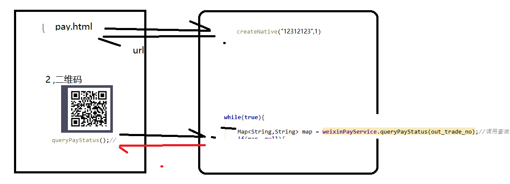

# PYG笔记_Day18
# 第1节课
## 1.1 今日知识点
```
1) 二维码
2) 微信扫码支付
```
## 1.2 今日目标
```

```
## 1.3课程内容
### 1.3.1 .今日目标
**视频信息**
```
视频名称: 01.今日目标
视频时长: 02:56
```
**小节内容**
```
目标1：掌握二维码生成插件qrious的使用
目标2：能够说出微信支付开发的整体思路
目标3：能够调用微信支付接口（统一下单）生成支付二维码
目标4：能够调用微信支付接口（查询订单）查询支付状态
目标5：实现支付日志的生成与订单状态的修改

```
### 1.3.2 .二维码简介
**视频信息**
```
视频名称: 02.二维码简介
视频时长: 05:26
```
**小节内容**


**补充**

二维码原理

​	通过黑快白块,和二进制中的0m1 对应,然后生成信息

```
信息容量大, 可以容纳多达1850个大写字母或2710个数字或500多个汉字
应用范围广, 支持文字,声音,图片,指纹等等...
容错能力强, 即使图片出现部分破损也能使用
成本低, 容易制作
```

二维码容错级别

```
L级（低） 7％的码字可以被恢复。
M级（中） 的码字的15％可以被恢复。
Q级（四分）的码字的25％可以被恢复。
H级（高） 的码字的30％可以被恢复。
```

### 1.3.3 .QRious入门

**视频信息**
```
视频名称: 03.QRious入门
视频时长: 07:22
```
**小节内容**
```
qrious是一款基于HTML5 Canvas的纯JS二维码生成插件。通过qrious.js可以快速生成各种二维码，你可以控制二维码的尺寸颜色，还可以将生成的二维码进行Base64编码

```
**qrious.js二维码插件的可用配置参数如下：**

| 参数       | 类型   | 默认值      | 描述                               |
| ---------- | ------ | ----------- | ---------------------------------- |
| background | String | "white"     | 二维码的背景颜色。                 |
| foreground | String | "black"     | 二维码的前景颜色。                 |
| level      | String | "L"         | 二维码的误差校正级别(L, M, Q, H)。 |
| mime       | String | "image/png" | 二维码输出为图片时的MIME类型。     |
| size       | Number | 100         | 二维码的尺寸，单位像素。           |
| value      | String | ""          | 需要编码为二维码的值               |

注意:

​	微信支付返回的url  如果容错率设置位 25% 则 无法识别

例如如下 url 

weixin://wxpay/bizpayurl?pr=rr7ORTI

容错设置为  25% 无法识别

容错是其他的时候可以识别

### 1.3.4 .微信支付申请流程

**视频信息**
```
视频名称: 04.微信支付申请流程
视频时长: 05:22
```
**小节内容**
```
第一步：注册公众号（类型须为：服务号）
	请根据营业执照类型选择以下主体注册：个体工商户| 企业/公司| 政府| 媒体| 其他类型。
第二步：认证公众号
	公众号认证后才可申请微信支付，认证费：300元/次。
第三步：提交资料申请微信支付
	登录公众平台，点击左侧菜单【微信支付】，开始填写资料等待审核，审核时间为1-5个工作日内。
第四步：开户成功，登录商户平台进行验证
	资料审核通过后，请登录联系人邮箱查收商户号和密码，并登录商户平台填写财付通备付金打的小额资金数额，完成账户验证。
第五步：在线签署协议
	本协议为线上电子协议，签署后方可进行交易及资金结算，签署完立即生效。
本课程已经提供好“传智播客”的微信支付账号，学员无需申请。

```
**补充**

### 1.3.5 .微信扫码支付流程
**视频信息**
```
视频名称: 05.微信扫码支付流程
视频时长: 12:08

https://pay.weixin.qq.com/wiki/doc/api/native.php?chapter=6_1
```
**小节内容**


### 1.3.6 .微信支付SDK简介
**视频信息**
```
视频名称: 06.微信支付SDK简介
视频时长: 14:15
```
**小节内容**
```
SDK 其实是官方为了我们方便开发封装好的一些工具类
案例云上有,可以直接下载无需下载安装
```
**补充**

```properties
appid=wx8397f8696b538317
partner=1473426802
partnerkey=T6m9iK73b0kn9g5v426MKfHQH7X8rKwb
```
TestDemo

```java
public class TestDemo {
    public Map createNative(String out_trade_no, String total_fee) {
        //1.参数封装
        Map param=new HashMap();
        param.put("appid", "wx8397f8696b538317");//公众账号ID
        param.put("mch_id", "1473426802");//商户
        param.put("nonce_str", WXPayUtil.generateNonceStr());//随机字符串
        param.put("body", "品优购");
        param.put("out_trade_no", out_trade_no);//交易订单号
        param.put("total_fee", total_fee);//金额（分）
        param.put("spbill_create_ip", "127.0.0.1");
        param.put("notify_url", "http://www.itcast.cn");
        param.put("trade_type", "NATIVE");//交易类型
        try {
            String xmlParam = WXPayUtil.generateSignedXml(param, "T6m9iK73b0kn9g5v426MKfHQH7X8rKwb");
            System.out.println("请求的参数："+xmlParam);
            //2.发送请求
            HttpClient httpClient=new HttpClient("https://api.mch.weixin.qq.com/pay/unifiedorder");
            httpClient.setHttps(true);
            httpClient.setXmlParam(xmlParam);
            httpClient.post();
            //3.获取结果
            String xmlResult = httpClient.getContent();
            Map<String, String> mapResult = WXPayUtil.xmlToMap(xmlResult);
            System.out.println("微信返回结果"+mapResult);
            Map map=new HashMap<>();
            map.put("code_url", mapResult.get("code_url"));//生成支付二维码的链接
            map.put("out_trade_no", out_trade_no);
            map.put("total_fee", total_fee);
            return map;
        } catch (Exception e) {
            e.printStackTrace();
            return new HashMap();
        }
    }
    public static void main(String[] args) {
        System.out.println(new TestDemo().createNative("hb0002","1"));
    }
}

```


### 1.3.7 .HttpClient工具类

**视频信息**
```
视频名称: 07.HttpClient工具类
视频时长: 04:23
```
**小节内容**
```java
HttpClient是Apache Jakarta Common下的子项目，用来提供高效的、最新的、功能丰富的支持HTTP协议的客户端编程工具包，并且它支持HTTP协议最新的版本和建议。
我们项目中又再次对 HttpClient 进行了封装,名称也叫 HttpClient,所以我们


HttpClient client=new HttpClient(请求的url地址);
client.setHttps(true);//是否是https协议
client.setXmlParam(xmlParam);//发送的xml数据
client.post();//执行post请求
String result = client.getContent(); //获取结果

```
**补充**
```

```
### 1.3.8 .工程搭建与准备工作
**视频信息**
```
视频名称: 08.工程搭建与准备工作
视频时长: 15:08
```
**小节内容**
```

```
**补充**
```

```
### 1.3.9 .微信二维码生成-后端-1
**视频信息**
```
视频名称: 09.微信二维码生成-后端-1
视频时长: 21:24
```
**小节内容**
```

```
**补充**
```

```
### 1.3.10 .微信二维码生成-后端-2
**视频信息**
```
视频名称: 10.微信二维码生成-后端-2
视频时长: 06:08
```
**小节内容**
```

```
**补充**
```

```
### 1.3.11 .微信二维码生成-后端-3
**视频信息**
```
视频名称: 11.微信二维码生成-后端-3
视频时长: 08:24
```
**小节内容**
```

```
**补充**
```

```
### 1.3.12 .微信二维码生成-前端
**视频信息**
```
视频名称: 12.微信二维码生成-前端
视频时长: 07:52
```
**小节内容**
```

```
**补充**
```

```
### 1.3.13 .查询订单状态-后端-1
**视频信息**
```
视频名称: 13.查询订单状态-后端-1
视频时长: 08:56
```
**小节内容**
```

```
**补充**
```

```
### 1.3.14 .查询订单状态-后端-2
**视频信息**
```
视频名称: 14.查询订单状态-后端-2
视频时长: 09:34
```
**小节内容**
```

```
**补充**
```

```
### 1.3.15 .查询订单状态-前端
**视频信息**
```
视频名称: 15.查询订单状态-前端
视频时长: 05:01
```
**小节内容**
```
前端访问完毕服务器端口后,服务器会一直循环,如果客户一直没有支付则前端会支付超时
此时解决方案如下:
	1) 修改tomcat 的连接的超时时间
```



### 1.3.16 .二维码超时处理
**视频信息**
```
视频名称: 16.二维码超时处理
视频时长: 07:44
```
**小节内容**
```

```
**补充**
```html
js 也可以发送定时任务
<script>
//获取时间
function mytime(){
	console.log(new Date())
}
setInterval(mytime,1000); //mytime是方法，1000表示每1秒执行一次
</script>
<body>
</body>
```
### 1.3.17 .支付成功显示金额
**视频信息**
```
视频名称: 17.支付成功显示金额
视频时长: 05:23
```
**小节内容**
```

```
**补充**
```

```
### 1.3.18 .支付日志需求及表结构
**视频信息**
```
视频名称: 18.支付日志需求及表结构
视频时长: 06:20
```
**小节内容**
```

```
**补充**
```

```
### 1.3.19 .插入日志记录
**视频信息**
```
视频名称: 19.插入日志记录
视频时长: 13:07
```
**小节内容**
```

```
**补充**
```

```
### 1.3.20 .读取支付日志
**视频信息**
```
视频名称: 20.读取支付日志
视频时长: 13:28
```
**小节内容**
```

```
**补充**
```

```
### 1.3.21 .修改订单状态
**视频信息**
```
视频名称: 21.修改订单状态
视频时长: 13:03
```
**小节内容**
```

```
**补充**
```

```
### 1.3.22 .总结
**视频信息**
```
视频名称: 22.总结
视频时长: 02:15
```
**小节内容**
```
掌握:
	技术上: 1)微信支付文档的查看
    业务:  2)超时如何处理,异常关闭如何处理
    业务:  3)订单orderid和支付交易码(out_trade_no如何关联)
```
**补充**

