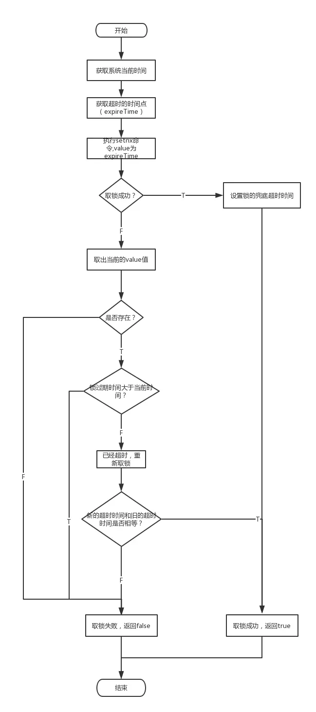

# PYG笔记_Day19
# 第1节课
## 1.1 今日知识点
```
1) interval服务
2) 秒杀业务流程描述
```
## 1.2 今日目标
```
秒杀业务是面试中常问的问题
思考:  1) 秒杀效果如何实现
      2) 秒杀高并发如何处理(效率)
      3) 多买多卖的问题如何解决: 高并发下的安全问题
```
## 1.3课程内容
### 1.3.1 .今日目标
**视频信息**
```
视频名称: 01.今日目标
视频时长: 02:07
```
**小节内容**
```
目标1：能够说出秒杀实现思路
目标2：实现秒杀频道首页功能
目标3：实现秒杀商品详细页功能
目标4：实现秒杀下单功能
目标5：实现秒杀支付功能
```
### 1.3.2 .秒杀需求分析
**视频信息**
```
视频名称: 02.秒杀需求分析
视频时长: 09:40
```
**小节内容**
```
秒杀商品通常有两种限制：库存限制、时间限制。
需求：
（1）商家提交秒杀商品申请，录入秒杀商品数据，主要包括：商品标题、原价、秒杀价、商品图片、介绍等信息
（2）运营商审核秒杀申请
（3）秒杀频道首页列出秒杀商品（进行中的）点击秒杀商品图片跳转到秒杀商品详细页。
（4）商品详细页显示秒杀商品信息，点击立即抢购实现秒杀下单，下单时扣减库存。当库存为0或不在活动期范围内时无法秒杀。
（5）秒杀下单成功，直接跳转到支付页面（微信扫码），支付成功，跳转到成功页，填写收货地址、电话、收件人等信息，完成订单。
（6）当用户秒杀下单5分钟内未支付，取消预订单，调用微信支付的关闭订单接口，恢复库存。

```
**补充**
```

```
### 1.3.3 .秒杀订单表
**视频信息**
```
视频名称: 03.秒杀订单表
视频时长: 05:40
```
**小节内容**
```
Tb_seckill_goods 秒杀商品表 	
Tb_seckill_order 秒杀订单表
```
### 1.3.4 .秒杀实现思路
**视频信息**
```
视频名称: 04.秒杀实现思路
视频时长: 02:37
```
**小节内容**
```
   秒杀技术实现核心思想是运用缓存减少数据库瞬间的访问压力！读取商品详细信息时运用缓存，当用户点击抢购时减少缓存中的库存数量，当库存数为0时或活动期结束时，同步到数据库。 产生的秒杀预订单也不会立刻写到数据库中，而是先写到缓存，当用户付款成功后再写入数据库。
```
**补充**
```

```
### 1.3.5 .工程搭建
**视频信息**
```
视频名称: 05.工程搭建
视频时长: 09:55
```
**小节内容**
```

```
**补充**
```

```
### 1.3.6 .代码生成和后台管理功能
**视频信息**
```
视频名称: 06.代码生成和后台管理功能
视频时长: 06:38
```
**小节内容**

### 商家后台

（1）秒杀商品列表

（2）秒杀商品申请

（3）秒杀订单查询

### 运营商后台

（1）待审核秒杀商品列表

（2）秒杀商品审核

（3）秒杀订单查询

****


### 1.3.7 .秒杀商品列表-列表显示
**视频信息**
```
视频名称: 07.秒杀商品列表-列表显示
视频时长: 18:38
```
**小节内容**
```
秒杀列表商品列表应该满足的条件
1审核通过
2剩余库存大于0
3开始时间小于等于当前时间
4结束时间大于当前时间
```
**补充**
```

```
### 1.3.8 .秒杀商品列表-缓存数据
**视频信息**

```
视频名称: 08.秒杀商品列表-缓存数据
视频时长: 12:35
```
**小节内容**
```

```
**补充**
```

```
### 1.3.9 .秒杀商品详细页-显示数据
**视频信息**
```
视频名称: 09.秒杀商品详细页-显示数据
视频时长: 14:22
```
**小节内容**
```

```
**补充**
```

```
### 1.3.10 .interval服务
**视频信息**
```
视频名称: 10.interval服务
视频时长: 07:52
```
**小节内容**
```js
//$interval(执行的函数,间隔的毫秒数,运行次数);
//取消执行用cancel方法
//$interval.cancel(time);

$scope.second = 10; 
	time= $interval(function(){ 
	  if($scope.second>0){ 
		$scope.second =$scope.second-1;  			
	  }else{
		  $interval.cancel(time); 		  
		  alert("秒杀服务已结束");
	  }
	},1000);
```
**补充**
```
<script>
//获取时间
function mytime(){
	console.log(new Date())
	//if(i==0){
	// clearInterval(intver);
	// }
	
}
var intver=setInterval(mytime,3000); //mytime是方法，1000表示每1秒执行一次
</script>
```
### 1.3.11 .秒杀商品详细页-倒计时读秒
**视频信息**
```
视频名称: 11.秒杀商品详细页-倒计时读秒
视频时长: 17:13
```
**小节内容**

思路:

​	1)计算秒杀结束时间和当前时间的时间差

​        2) 将上一步计算的毫秒数计算为天,时:分:秒

```
$scope.findOne=function(){	
		seckillGoodsService.findOne($location.search()['id']).success(
			function(response){
				$scope.entity= response;
				allsecond =Math.floor( (  new Date($scope.entity.endTime).getTime()- (new Date().getTime())) /1000); //总秒数
				time= $interval(function(){ 
				  if(second>0){ 
					second =second-1;
					$scope.timeString=convertTimeString(allsecond);//转换时间字符串
				  }else{
					  $interval.cancel(time); 		  
					  alert("秒杀服务已结束");
				  }
				},1000);			
			}
		);				
	}	
	
//转换秒为   天小时分钟秒格式  XXX天 10:22:33
	convertTimeString=function(allsecond){
		var days= Math.floor( allsecond/(60*60*24));//天数
		var hours= Math.floor( (allsecond-days*60*60*24)/(60*60) );//小数数
		var minutes= Math.floor(  (allsecond -days*60*60*24 - hours*60*60)/60    );//分钟数
		var seconds= allsecond -days*60*60*24 - hours*60*60 -minutes*60; //秒数
		var timeString="";
		if(days>0){
			timeString=days+"天 ";
		}
		return timeString+hours+":"+minutes+":"+seconds;
	}


```
### 1.3.12 .秒杀下单-后端服务层
**视频信息**
```
视频名称: 12.秒杀下单-后端服务层
视频时长: 17:16
```
**小节内容**
```
代码中存在多卖多买的问题:
//扣减（redis）库存		
		seckillGoods.setStockCount(seckillGoods.getStockCount()-1);
```
**补充 Reids 分布式锁解决方案 **

```
https://www.jianshu.com/p/e72baf5e5617
原理
	http://redisdoc.com/string/psetex.html
```

```java
import org.slf4j.Logger;
import org.slf4j.LoggerFactory;
import org.springframework.data.redis.core.RedisTemplate;
import org.springframework.stereotype.Component;

import javax.annotation.Resource;
//import java.time.Instant;
import java.util.concurrent.TimeUnit;

public class RedisDistributionLock {

    private static final Logger logger = LoggerFactory.getLogger(RedisDistributionLock.class);

    //key的TTL,一天
    private static final int finalDefaultTTLwithKey = 24 * 3600;

    //锁默认超时时间,20秒
    private static final long defaultExpireTime = 20 * 1000;

    private static final boolean Success = true;

    @Resource( name = "redisTemplate")
    private RedisTemplate<String, String> redisTemplateForGeneralize;

    /**
     * 加锁,锁默认超时时间20秒
     * @param resource
     * @return
     */
    public boolean lock(String resource) {
        return this.lock(resource, defaultExpireTime);
    }

    /**
     * 加锁,同时设置锁超时时间
     * @param key 分布式锁的key
     * @param expireTime 单位是ms
     * @return
     */
    public boolean lock(String key, long expireTime) {

        logger.debug("redis lock debug, start. key:[{}], expireTime:[{}]",key,expireTime);
        //long now = Instant.now().toEpochMilli();
        long now = System.currentTimeMillis();
        long lockExpireTime = now + expireTime;

        //setnx
        boolean executeResult = redisTemplateForGeneralize.opsForValue().setIfAbsent(key,String.valueOf(lockExpireTime));
        logger.debug("redis lock debug, setnx. key:[{}], expireTime:[{}], executeResult:[{}]", key, expireTime,executeResult);

        //取锁成功,为key设置expire
        if (executeResult == Success) {
            redisTemplateForGeneralize.expire(key,finalDefaultTTLwithKey, TimeUnit.SECONDS);
            return true;
        }
        //没有取到锁,继续流程
        else{
            Object valueFromRedis = this.getKeyWithRetry(key, 3);
            // 避免获取锁失败,同时对方释放锁后,造成NPE
            if (valueFromRedis != null) {
                //已存在的锁超时时间
                long oldExpireTime = Long.parseLong((String)valueFromRedis);
                logger.debug("redis lock debug, key already seted. key:[{}], oldExpireTime:[{}]",key,oldExpireTime);
                //锁过期时间小于当前时间,锁已经超时,重新取锁
                if (oldExpireTime <= now) {
                    logger.debug("redis lock debug, lock time expired. key:[{}], oldExpireTime:[{}], now:[{}]", key, oldExpireTime, now);
                    String valueFromRedis2 = redisTemplateForGeneralize.opsForValue().getAndSet(key, String.valueOf(lockExpireTime));
                    long currentExpireTime = Long.parseLong(valueFromRedis2);
                    //判断currentExpireTime与oldExpireTime是否相等
                    if(currentExpireTime == oldExpireTime){
                        //相等,则取锁成功
                        logger.debug("redis lock debug, getSet. key:[{}], currentExpireTime:[{}], oldExpireTime:[{}], lockExpireTime:[{}]", key, currentExpireTime, oldExpireTime, lockExpireTime);
                        redisTemplateForGeneralize.expire(key, finalDefaultTTLwithKey, TimeUnit.SECONDS);
                        return true;
                    }else{
                        //不相等,取锁失败
                        return false;
                    }
                }
            }
            else {
                logger.warn("redis lock,lock have been release. key:[{}]", key);
                return false;
            }
        }
        return false;
    }

    private Object getKeyWithRetry(String key, int retryTimes) {
        int failTime = 0;
        while (failTime < retryTimes) {
            try {
                return redisTemplateForGeneralize.opsForValue().get(key);
            } catch (Exception e) {
                failTime++;
                if (failTime >= retryTimes) {
                    throw e;
                }
            }
        }
        return null;
    }

    /**
     * 解锁
     * @param key
     * @return
     */
    public boolean unlock(String key) {
        logger.debug("redis unlock debug, start. resource:[{}].",key);
        redisTemplateForGeneralize.delete(key);
        return Success;
    }
}
```

测试样例

```java
@RunWith(SpringJUnit4ClassRunner.class)
@ContextConfiguration(locations="classpath:spring/applicationContext-redis.xml")
public class TestLock {
    @Autowired
    RedisDistributionLock redisDistributionLock;

    @Autowired
    RedisTemplate template;
    @Test
    public  void testDemo(){
        if(!redisDistributionLock.lock("aaaa")){
			throw new RuntimeException("系统问题,请重新抢购");
		}
         //.... 代码
        template.boundValueOps("key").set("123");
        template.boundValueOps("key").get();
        redisDistributionLock.unlock("aaaa");
    }}
```

分布式锁业务流程图




### 1.3.13 .秒杀下单-后端控制层

**视频信息**
```
视频名称: 13.秒杀下单-后端控制层
视频时长: 06:55
```
**小节内容**
```

```
**补充**
```

```
### 1.3.14 .秒杀下单-前端
**视频信息**
```
视频名称: 14.秒杀下单-前端
视频时长: 12:04
```
**小节内容**
```

```
**补充**
```

```
### 1.3.15 .秒杀支付-生成二维码-后端
**视频信息**
```
视频名称: 15.秒杀支付-生成二维码-后端
视频时长: 12:11
```
**小节内容**
```

```
**补充**
```

```
### 1.3.16 .秒杀支付-生成二维码-前端
**视频信息**
```
视频名称: 16.秒杀支付-生成二维码-前端
视频时长: 03:58
```
**小节内容**
```

```
**补充**
```

```
### 1.3.17 .秒杀支付-保存订单-后端服务层
**视频信息**
```
视频名称: 17.秒杀支付-保存订单-后端服务层
视频时长: 08:24
```
**小节内容**
```

```
**补充**
```

```
### 1.3.18 .秒杀支付-保存订单-后端控制层
**视频信息**
```
视频名称: 18.秒杀支付-保存订单-后端控制层
视频时长: 05:26
```
**小节内容**
```

```
**补充**
```

```
### 1.3.19 .秒杀支付-保存订单-测试
**视频信息**
```
视频名称: 19.秒杀支付-保存订单-测试
视频时长: 02:39
```
**小节内容**
```

```
**补充**
```

```
### 1.3.20 .秒杀支付-超时处理
**视频信息**
```
视频名称: 20.秒杀支付-超时处理
视频时长: 09:43
```
**小节内容**
```

```
**补充**
```

```
### 1.3.21 .秒杀支付-超时处理-2
**视频信息**
```
视频名称: 21.秒杀支付-超时处理-2
视频时长: 03:53
```
**小节内容**
```

```
**补充**
```

```
### 1.3.22 .秒杀支付-超时处理-3
**视频信息**
```
视频名称: 22.秒杀支付-超时处理-3
视频时长: 08:08
```
**小节内容**
```

```
**补充**
```

```
