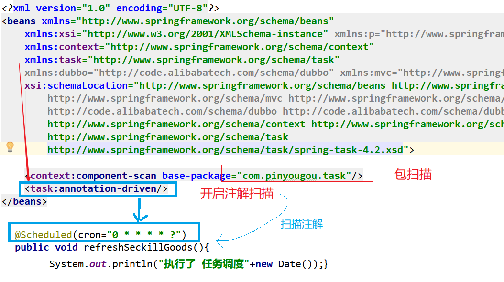
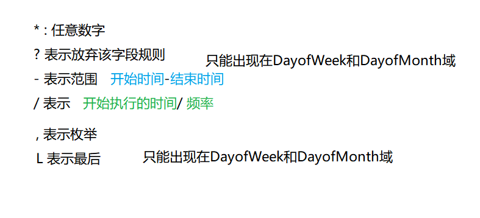
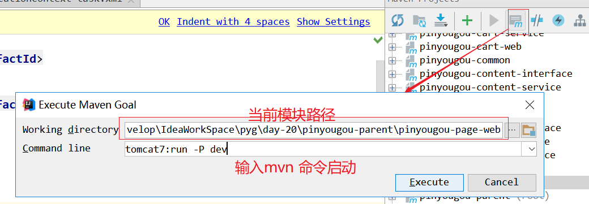
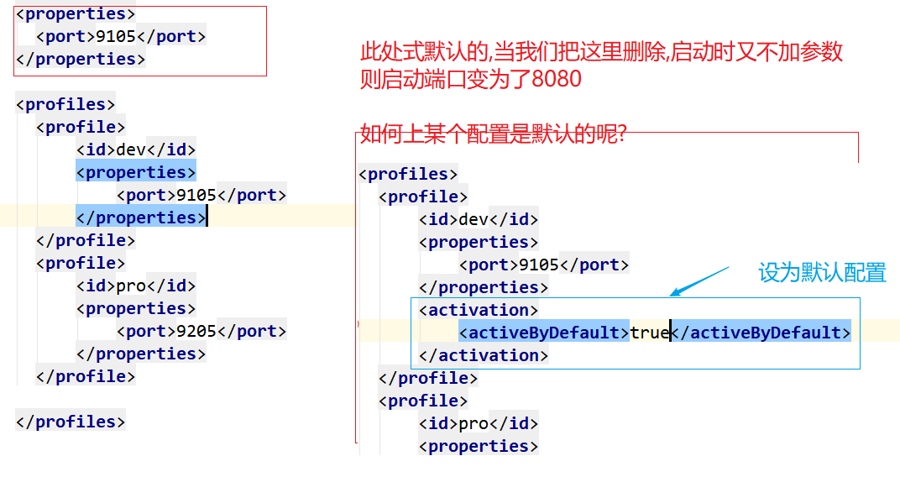
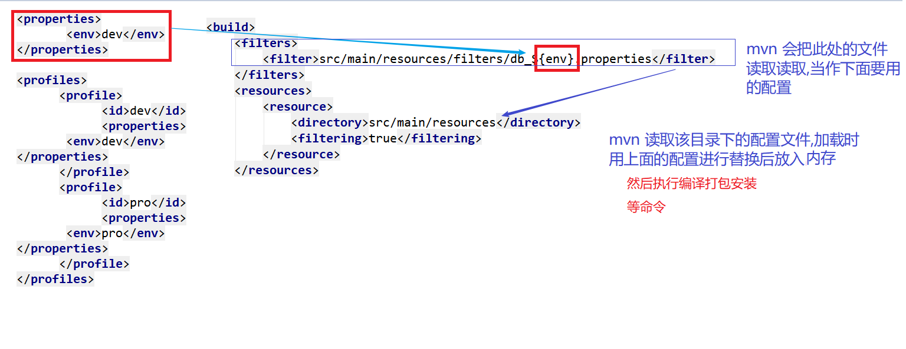
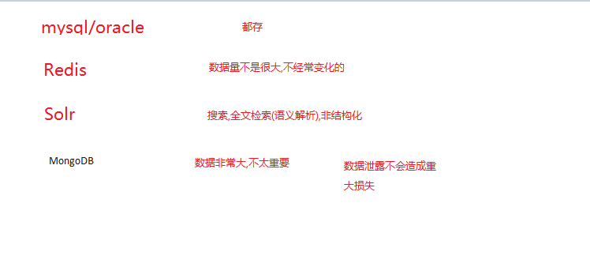

# PYG笔记_Day20
# 第1节课
## 1.1 今日知识点
```
spring-task/cron 表达式
MavenProfile
```
## 1.2 今日目标
```
目标1：运用SpringTask实现任务调度
目标2：运用MavenProfile实现开发和生产环境切换
目标3：了解MongoDB数据库的应用场景
目标4：说出其它业务功能的需求和实现思路
```
## 1.3课程内容
### 1.3.1 .今日目标
**视频信息**
```
视频名称: 01.今日目标
视频时长: 01:36
```
### 1.3.2 .什么是任务调度
**视频信息**
```
视频名称: 02.什么是任务调度
视频时长: 01:49
```
**小节内容**
```
任务调度也成定时任务
	在企业级应用中，经常会制定一些“计划任务”，即在某个时间点做某件事情，核心是以时间为关注点，即在一个特定的时间点，系统执行指定的一个操作。常见的任务调度框架有Quartz和SpringTask等。
```
### 1.3.3 .springTask入门小demo
**视频信息**
```
视频名称: 03.springTask入门小demo
视频时长: 08:34
```
**小节内容**



```java
@Scheduled 注解是spring-context 中的,所以说spring 内置了spring-task
```

### 1.3.4 .Cron表达式

**视频信息**
```
视频名称: 04.Cron表达式
视频时长: 24:22
```
**小节内容**



```
Cron表达式是一个字符串，字符串以5或6个空格隔开，分为6或7个域，每一个域代表一个含义，Cron有如下两种语法格式： 
（1）Seconds Minutes Hours DayofMonth Month DayofWeek Year
（2）Seconds Minutes Hours DayofMonth Month DayofWeek
每一个域可出现的字符如下： 
Seconds:可出现", - * /"四个字符，有效范围为0-59的整数 
Minutes:可出现", - * /"四个字符，有效范围为0-59的整数 
Hours:可出现", - * /"四个字符，有效范围为0-23的整数 
DayofMonth:可出现", - * / ? L W C"八个字符，有效范围为1-31的整数 
Month:可出现", - * /"四个字符，有效范围为1-12的整数或JAN-DEc 
DayofWeek:可出现", - * / ? L C #"四个字符，有效范围为1-7的整数或SUN-SAT两个范围。1表示星期天，2表示星期一， 依次类推 
Year:可出现", - * /"四个字符，有效范围为1970-2099年
每一个域都使用数字，但还可以出现如下特殊字符，它们的含义是： 
(1)*：表示匹配该域的任意值，假如在Minutes域使用*, 即表示每分钟都会触发事件。
(2)?:只能用在DayofMonth和DayofWeek两个域。"?" 表示放弃 该字段上的规则 

(3)-:表示范围，例如在Minutes域使用5-20，表示从5分到20分钟每分钟触发一次 
(4)/：表示起始时间开始触发，然后每隔固定时间触发一次，例如在Minutes域使用5/20,则意味着5分钟触发一次，而25，45等分别触发一次. 
(5),:表示列出枚举值值。例如：在Minutes域使用5,20，则意味着在5和20分每分钟触发一次。 
(6)L:表示最后，只能出现在DayofWeek和DayofMonth域，如果在DayofWeek域使用5L,意味着在最后的一个星期四触发。 
(7)W: 表示有效工作日(周一到周五),只能出现在DayofMonth域，系统将在离指定日期的最近的有效工作日触发事件。例如：在 DayofMonth使用5W，如果5日是星期六，则将在最近的工作日：星期五，即4日触发。如果5日是星期天，则在6日(周一)触发；如果5日在星期一 到星期五中的一天，则就在5日触发。另外一点，W的最近寻找不会跨过月份 
(8)LW:这两个字符可以连用，表示在某个月最后一个工作日，即最后一个星期五。 
(9)#:用于确定每个月第几个星期几，只能出现在DayofMonth域。例如在4#2，表示某月的第二个星期三。
1.3.2 Cron表达式例子
0 0 10,14,16 * * ? 每天上午10点，下午2点，4点 
0 0/30 9-17 * * ? 朝九晚五工作时间内每半小时 
0 0 12 ? * WED 表示每个星期三中午12点 
"0 0 12 * * ?" 每天中午12点触发 
"0 15 10 ? * *" 每天上午10:15触发 
"0 15 10 * * ?" 每天上午10:15触发 
"0 15 10 * * ? *" 每天上午10:15触发 
"0 15 10 * * ? 2005" 2005年的每天上午10:15触发 
"0 * 14 * * ?" 在每天下午2点到下午2:59期间的每1分钟触发 
"0 0/5 14 * * ?" 在每天下午2点到下午2:55期间的每5分钟触发 
"0 0/5 14,18 * * ?" 在每天下午2点到2:55期间和下午6点到6:55期间的每5分钟触发 
"0 0-5 14 * * ?" 在每天下午2点到下午2:05期间的每1分钟触发 
"0 10,44 14 ? 3 WED" 每年三月的星期三的下午2:10和2:44触发 
"0 15 10 ? * MON-FRI" 周一至周五的上午10:15触发 
"0 15 10 15 * ?" 每月15日上午10:15触发 
"0 15 10 L * ?" 每月最后一日的上午10:15触发 
"0 15 10 ? * 6L" 每月的最后一个星期五上午10:15触发 
"0 15 10 ? * 6L 2002-2005" 2002年至2005年的每月的最后一个星期五上午10:15触发 
"0 15 10 ? * 6#3" 每月的第三个星期五上午10:15触发

```
### 1.3.5 .Cron表达式测试
**视频信息**

```
视频名称: 05.Cron表达式测试
视频时长: 11:07
```
```java
		Timer timer = new Timer();
		timer.schedule(new TimerTask() {
			@Override
			public void run() {
				System.out.println(new Date());
			}
		},1000,1000);
```


补充**

1) spring- task 同一个任务 下的任务 式执行完一次之后,在执行下一次,不会并行

2) 默认,两个task并不是并发执行，而是执行完一个task才会执行另外一个

​	如果想要同时执行 不同的的方法,方案如下:

​	并给方法添加注解@Async。增加了 @Async 的方法会单独开一个线程

​	没有增加 @Async 的会共用一个线程

```java
@Scheduled(cron="* * * * * ?")
	@Async
	public void taskTest() throws InterruptedException {

		System.out.println("11111====start=======任务执行了1"+new Date());
		Thread.sleep(3000);
		System.out.println("11111====end=======任务执行结束1"+Thread.currentThread().getName() +new Date());

	}
    //
	@Scheduled(cron="* * * * * ?")
	@Async
	public void taskTest1() throws InterruptedException {
		System.out.println("========任务执行了2"+new Date());
		Thread.sleep(3000);
		System.out.println("========任务执行结束2"+Thread.currentThread().getName() +new Date());

	}
```


--------------------------------

另外一种定时任务:

​	补:Quartz入门

```
https://blog.csdn.net/noaman_wgs/article/details/80984873
```

### 1.3.6 .秒杀商品列表增量更新

**视频信息**

```
视频名称: 06.秒杀商品列表增量更新
视频时长: 19:31
```
**小节内容**
```
1) 缓存不能一性清空后,在更新
```
**补充**
```
注意
mybatis当集合为空或者长度为0 的的时候 需要判断,否则  查询到数据 
if(goodsIdList.size()>0){
			criteria.andIdNotIn(goodsIdList);//排除缓存中已经存在的商品ID集合
}
```
### 1.3.7 .过期秒杀商品的移除
**视频信息**
```
视频名称: 07.过期秒杀商品的移除
视频时长: 13:41
```
**小节内容**
```
思路:
	从redis 缓存中拿到数据,然后判断商品是否过期,若果已经过期可以从商品中移除
```
```
业务漏洞:
	加入商品式12:00 正过期, 11:59 分的时候客户购买成功, 但是12:04 才到付款的截至日期,假设客户没有付款,(如果我们12:00 整就将缓存清除), 此时商品库存回退就会有问题.保证业务规则的前后关联关
解决方案:
	可以考虑只清除 10分钟前过期的商品
```


### 1.3.8 .MavenProfile简介

**视频信息**
```
视频名称: 08.MavenProfile简介
视频时长: 04:17
```
**小节内容**
```
为了方便开发环境和测试环境配置的切换,maven 提供了一种配置方式,我们配置完毕后就
```
**补充**

### 1.3.9 .MavenProfile入门
**视频信息**
```
视频名称: 09.MavenProfile入门
视频时长: 06:29
```
**小节内容**

```

```




****



### 1.3.10 .MavenProfile更改数据库配置
**视频信息**
```
视频名称: 10.MavenProfile更改数据库配置
视频时长: 11:33
```
**小节内容**
```
maven filter可利用指定的xxx.properties中对应的key=value对资源文件中的${key}进行替换，最终把你的资源文件中的username=${key}替换成username=value 

```
****



### 1.3.11 .MavenProfile更改数据库配置-测试
**视频信息**
```
视频名称: 11.MavenProfile更改数据库配置-测试
视频时长: 09:17
```
**小节内容**
```
注意切换方式,
	其实不用每次都增加参数启动编译,可以修改配置
(修改上图红色方框部分即可)
```
### 1.3.12 .注册中心地址集中配置
**视频信息**
```
视频名称: 12.注册中心地址集中配置
视频时长: 08:46
```
**小节内容**
```
1)把每个项目中dubbo 的地址配置全部移动到 common 包
2) common 包统一配置applicationContext-dubbox.xml
		<dubbo:registry protocol="zookeeper"  address="${address}"/>
3) 
```
**补充**
```

```
### 1.3.13 .注册中心地址MavenProfile配置
**视频信息**
```
视频名称: 13.注册中心地址MavenProfile配置
视频时长: 09:38
```
### 1.3.14 .MongoDB 简介
**视频信息**
```
视频名称: 14.MongoDB 简介
视频时长: 14:25
```
**小节内容**
```
	MongoDB 是一个跨平台的，面向文档的数据库，是当前 NoSQL 数据库产品中最热门的一种。它介于关系数据库和非关系数据库之间，是非关系数据库当中功能最丰富，最像关系数据库的产品。它支持的数据结构非常松散，是类似JSON  的 BSON 格式，因此可以存储比较复杂的数据类型。
```
特点
```
具体特点总结如下：
（1）面向集合存储，易于存储对象类型的数据
（2）模式自由
（3）支持动态查询
（4）支持完全索引，包含内部对象
（5）支持复制和故障恢复
（6）使用高效的二进制数据存储，包括大型对象（如视频等）
（7）自动处理碎片，以支持云计算层次的扩展性
（8）支持 Python，PHP，Ruby，Java，C，C#，Javascript，Perl 及 C++语言的驱动程序，社区中也提供了对 Erlang 及.NET 等平台的驱动程序
（9） 文件存储格式为 BSON（一种 JSON 的扩展）

```
ORM:

​	通过配置的方法 让java pojo和数据库产生映射关系, 达到自动封装参数,返回结果自动封装成对象的目的

**MongoDb   和mysql 对比**

| MongoDb           | 关系型数据库Mysql |
| ----------------- | ----------------- |
| 数据库(databases) | 数据库(databases) |
| 集合(collections) | 表(table)         |
| 文档(document)    | 行(row)           |

**使用场景**

​	  不太重要但是数据量很大的业务 (收藏,评价,客户足迹)



### 1.3.15 .其它业务功能分析-用户中心

**视频信息**
```
视频名称: 15.其它业务功能分析-用户中心
视频时长: 11:56
```
**小节内容**

## 用户中心（WEB）

用户在首页登陆系统后会进入到用户中心首页。

### 1.1订单中心

功能需求：

（1）实现对订单的查询功能

（2）未付款订单的付款功能

（3）未付款订单的取消功能

（4）已付款提醒订单发货功能

（5）确认收货

（6）退货

（7）用户评价

（8）物流信息跟踪

### 1.2秒杀订单中心

同上。

### 1.3我的收藏

购物车中有将我的购物车商品移到我的收藏功能，在用户中心中可以查看我收藏的商品

对于这样的用户收藏数据，我们可以使用**mongoDB**来实现。

（1）我的收藏列表

（2）删除收藏

### 1.4我的足迹

（1）查看足迹列表

（2）删除我的足迹

### 1.5个人信息设置

（1）个人信息

（2）地址信息

（3）密码重置

（4）绑定手机

****


### 1.3.16 .其它业务功能分析-订单管理
**视频信息**
```
视频名称: 16.其它业务功能分析-订单管理
视频时长: 04:14
```
**小节内容**


### 1.3.17 .其它业务功能分析-评价系统
**视频信息**
```
视频名称: 17.其它业务功能分析-评价系统
视频时长: 13:55
```
**小节内容**
```

```
**补充**
```

```
### 1.3.18 .其它业务功能分析-资金结算
**视频信息**
```
视频名称: 18.其它业务功能分析-资金结算
视频时长: 17:16
```
**小节内容**
```

```
**补充**
```

```
### 1.3.19 .总结
**视频信息**
```
视频名称: 19.总结
视频时长: 06:32
```
**小节内容**
```

```
**补充**

```

```
