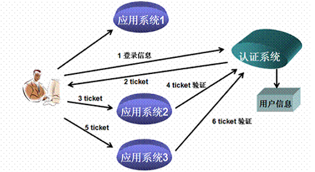

20天知识汇总

1)ssm+dubbo + 前后端分离

```
spring +springmvc+mybatis
```

```
1)什么是 IOC? 什么是 spring IOC?
	传统的new 对象的方式
        1) 开发慢,
        2) 对象管理麻烦 (一旦某个对象的名称免了,则可能是大面积修改代码)
        3) 如果代码处理不好,性能不高
	IOC把创建对象的权力交给框架或者工厂,创建对象的权力发生了反转
	spring IOC 是对IOC 思想的一个实现
2)什么是AOP? 
	已日志为例,我们想要在1000个方法上增加日志,则需要修改每个方法的代码
	1) 风险高,2) 开发周期长
	AOP: 在不修改源代码的基础上对代码的增强
	spring AOP 是对AOP 思想的一个实现
	
3) aop 的应用场景
    性能监控: 在方法调用前后记录调用时间，方法执行太长或超时报警。
    无痕埋点： 在需要埋点的地方添加对应统计代码。
    缓存代理: 缓存某方法的返回值，下次执行该方法时，直接从缓存里获取。
    记录日志: 在方法执行前后记录系统日志。
    权限验证: 方法执行前验证是否有权限执行当前方法，没有则抛出没有权限执行异常，由业务代码捕捉。
    统一事务管理:
```

springmvc 流程


mybatis 笔试和面试很少,dao层技术总结

```
mybatis 
dbutils
jdbctemplate
jpa
springdatajpa(关系图)
```


2) AngularJS 

```
四大特性
	mvc
	双向绑定
	依赖注入
	模块化设计
下拉 select2
分页 pagenation
分层 
继承 
```

3) spring-security 

```
Spring Security是一个能够为基于Spring的企业应用系统提供声明式的安全访问控制解决方案的安全框架。它提供了一组可以在Spring应用上下文中配置的Bean，充分利用了Spring IoC，DI（控制反转Inversion of Control ,DI:Dependency Injection 依赖注入）和AOP（面向切面编程）功能，为应用系统提供声明式的安全访问控制功能，减少了为企业系统安全控制编写大量重复代码的工作。
```

4) 单点登陆-cas

传统session登陆解决方案缺点:

```
在分布式环境下:每台服务器都实现(多点登陆)登陆功能的问题:
	1) session 不共享,解决方案可以时redis ,
	2) 登陆代码有多分,开发重复,维护麻烦既有可能导致登陆界面长期维护后不一致
```

[单点登录](http://baike.baidu.com/item/%E5%8D%95%E7%82%B9%E7%99%BB%E5%BD%95)

```
单点登录（Single Sign On），简称为 SSO，是目前比较流行的企业业务整合的解决方案之一。SSO的定义是在多个应用系统中，用户只需要登录一次就可以访问所有相互信任的应用系统。
```




5)fastDFS

```
1) 当文件比较多时 ,一台服务器性能慢
2) 数据丢失的问题需要处理
```


6) 富文本编辑器 Kindeditor

```
提供了一种能够在页面上编辑丰富文本格式的前端插件
```

7)  对象深克隆/js

```
详见对象的克隆
```

8) Redis/Spring Data Redis

```
缓存解决方案
  1) redis是基于内存的所以快
  2) redis是单线程的,我们可以利用这一点做分布式锁
```

9) solr/spring-data-solr 

```
solr 是基于lucene 的
lucene 解决的问题:
	1) 非结构化数据的查询 (格式不固定,长度不固定)
	2) 语义解析后的模糊搜索,并按照匹配度排序
lucene 的缺点: 代码复杂,只能是java 语言
solr : 把lucene 进行了封装,利用http+ json 的方式实现跨平台
spring-data-solr: 提供了一种让Java加简便的方式操作solr
```

10) Freemarker 网页静态化

```
为什么网页静态化?
	网页静态化后能够减少数据库的请求,提升性能
	网页静态化后能够部署到nginx 中, 提升性能
	Freemarker 能够提供一种模板技术帮助我们生成静态网页
```

12) ActiveMQ

```
消息中间件
解决了程序间的耦合问题
```

13) Spring Boot

```
提供了一种更加简便的方式使用spring
```

14) 跨域解决方案CORS

```
跨域有安全隐患,浏览器默认不允许跨域
但是在分布式环境下我们又需要快于请求,所以需要处理
有两种解决方案
CORS 和jsonp
我们使用的是 CORS
```

15) 微信扫码支付/阿里大于

```
能说出使用的流程即可,
```

16) spring-task

```
定时任务
```

17) Maven profile 

```
工作时会使用,面试一般不用
```

